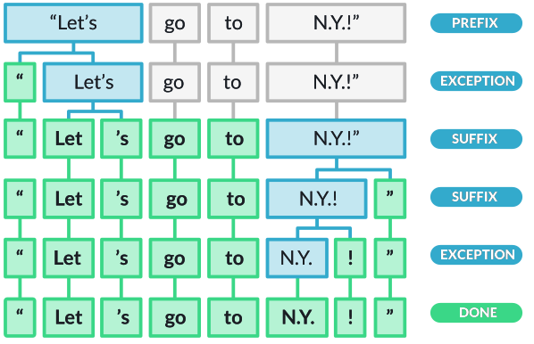
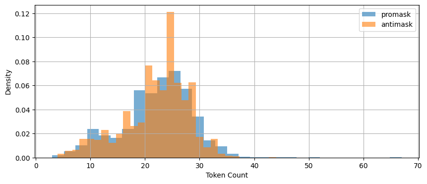
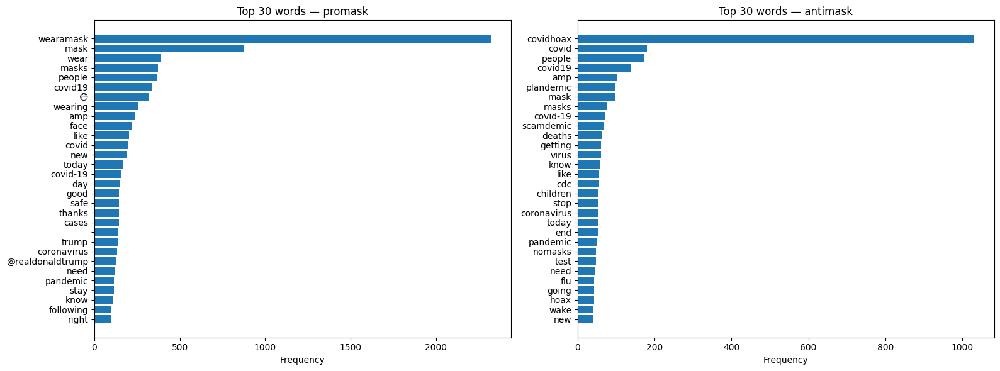
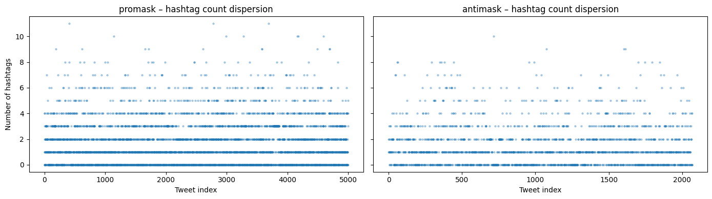
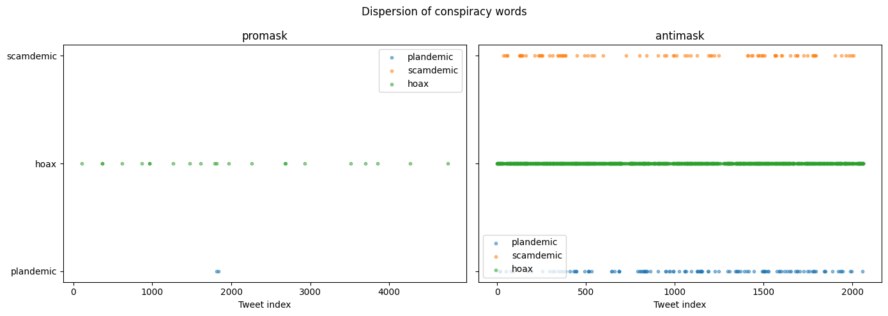

# Lab 2 - Leveraging SpaCy for Comparative Textual EDA (Part 1)


<!-- WARNING: THIS FILE WAS AUTOGENERATED! DO NOT EDIT! -->

In the last lab you learned about: - spaCy’s Doc object structure -
Token attributes (text, pos\_, lemma\_, is_stop, is_punct) - Using the
spaCy pipeline for tokenization, lemmatization, POS tagging, Parsing,
and NER - Iterating over tokens to extract linguistic features -
Exploring differences between classical NLP methods and LLM-based
methods

**Learning objectives this week:**

- **Conduct a small comparative corpus analysis**, recognizing how
  sampling decisions, labeling, and preprocessing choices affect
  downstream analysis.
- **Apply spaCy to exploratory text analysis**, using token and word
  counts.
- **Use frequency, normalization, and dispersion** to compare language
  use across groups, and explain why raw counts are often misleading.
- **Interpret lexical variety through lemmatization**, including
  calculating and reasoning about lemma–token ratios and shared
  vs. group-specific vocabulary.

**Useful References:**

- SpaCy API. https://spacy.io/api
- Jurafsky and Martin, [Chapter
  2](https://web.stanford.edu/~jurafsky/slp3/2.pdf): Words and Tokens

We’re speeding ahead into EDA early because your mid-term project will
be EDA. This lab and the next are rather long and go into much more
depth than necessary for that assignment. However, it will help you to
start thinking about this earlier, rather than later.

``` python
# If you are colab, un-comment the pip install below.
# This will not be necessary on DeepNote or your local installation

#!pip install data401_nlp
```

## Load libraries and models

``` python
# Environment (must run first)
from dotenv import load_dotenv
load_dotenv()
import data401_nlp
print(data401_nlp.__version__)

# Core libs
import os
import re
from collections import Counter

import numpy as np
import pandas as pd
import matplotlib.pyplot as plt
import math

import spacy
```

    0.0.6

``` python
# Load helpers for LLMs

from data401_nlp.helpers.env import load_env
from data401_nlp.helpers.llm import make_chat, LLM_MODELS

DEFAULT_MODEL = LLM_MODELS[0] # claude... look at helpers/01_llm.ipynb to change models. 
# If your preferred model is not present, send a pull request and I'll add it.
```

## Introduction to Corpus Design and EDA

In traditional corpus linguistics, the word **corpus** refers to a
sample of language data that strives to be representative of a
particular language variety. **Language variety** is a general term for
language that shares one or more common traits, such as dialect, genre,
or topic.

In this week’s classroom activity, you will examine corpora designed to
study distributional properties of language. Such corpora are sampled
with careful tracking of demographic and linguistic representativeness.
They are also labeled with high-quality annotations to capture
linguistic features of interest. This sampling and annotation allows for
reproducible, high-confidence analyses.

That said, designed corpora come with a great amount of exploratory data
analysis already included in metadata. For example, often included are
descriptive statistics such as number of sentences, words, etc. Thus
today, you will do EDA with basic statistics and analysis using spaCy.

Next week you will use NLP techniques such as parsing, pattern
recognition, and named entity recognition to infer labels and describe
and compare two sets of related data. What you won’t do at this point is
assess the accuracy of your labeling.

### The Purpose of EDA

**Exploratory Data Analysis (EDA)** is the process of examining and
summarizing datasets to understand their main characteristics before
applying formal modeling or hypothesis testing. For text data, EDA
involves understanding vocabulary, document lengths, word distributions,
and linguistic patterns.

Data collection and analysis serve one goal: answering questions with
data. With that in mind, EDA serves a few purposes: 1. Ensure
**representativeness** of the population or phenomenon under
consideration - to make sure that the phenomena you seek are present in
the data - to identify and account for outliers or other anomalies 2.
Reveal **characteristics of data** that might affect the
**generalizability** or **validity** of your analysis 3. Provide insight
into **features** that can be helpful in answering your data analytic
questions

### Questions to Kick-off EDA

You can start an EDA by asking some fundamental questions, such as: -
How can I make sure my data is **representative** of the people or
phenomena I want to describe? - Do I have **enough data**? - e.g., if
using a sentiment lexicon, do the words in the lexicon appear often
enough to provide a basis for analysis - What is the **structure of my
data**? - threaded conversation-like discourse with identifiable
speakers - Do I have enough information about the speakers to generalize
about them? - Do I have enough text per speaker? - news articles that
all start with a summary of new information - academic literature with a
keyword list and abstract - sports reports where I might find tables
with statistics - What **metadata** is available? - user profiles with
demographic information - topic lists - hashtags that might act like
topic or discourse labels - What **useful features can be derived** from
the data? - would grouping the data into topics make sense? - do I need
to extract person names or @mentions to answer the question at hand?

## Quick Refresher

Let’s load our dataset into doc objects

``` python
from data401_nlp.helpers.spacy import ensure_spacy_model

def get_nlp():
    return ensure_spacy_model("en_core_web_sm")
    
nlp = get_nlp()

df1 = pd.read_csv("data/covidisreal_OR_wearamask_hashtag.csv")
df2 = pd.read_csv("data/covidhoax_OR_notomasks_hashtag.csv")

df1['group'] = 'promask'
df2['group'] = 'antimask'
df = pd.concat([df1, df2], ignore_index=True)
df.groupby('group').head(4)
```

    ✅ spaCy model 'en_core_web_sm' loaded successfully

<div>
<style scoped>
    .dataframe tbody tr th:only-of-type {
        vertical-align: middle;
    }
&#10;    .dataframe tbody tr th {
        vertical-align: top;
    }
&#10;    .dataframe thead th {
        text-align: right;
    }
</style>

<table class="dataframe" data-quarto-postprocess="true" data-border="1">
<thead>
<tr style="text-align: right;">
<th data-quarto-table-cell-role="th"></th>
<th data-quarto-table-cell-role="th">created_date</th>
<th data-quarto-table-cell-role="th">hashtags</th>
<th data-quarto-table-cell-role="th">num_hashtags</th>
<th data-quarto-table-cell-role="th">tweet_length</th>
<th data-quarto-table-cell-role="th">tweet_text</th>
<th data-quarto-table-cell-role="th">group</th>
</tr>
</thead>
<tbody>
<tr>
<td data-quarto-table-cell-role="th">0</td>
<td>2020-08-31 02:08:31</td>
<td>2020sucks trumpisscar ihateithere wearamask</td>
<td>4</td>
<td>90</td>
<td>#2020sucks #trumpisscar #ihateithere #wearamas...</td>
<td>promask</td>
</tr>
<tr>
<td data-quarto-table-cell-role="th">1</td>
<td>2020-08-31 02:07:58</td>
<td>antimasker antimasking DOJ pandemic</td>
<td>4</td>
<td>137</td>
<td>This is probably one of the most ridiculous of...</td>
<td>promask</td>
</tr>
<tr>
<td data-quarto-table-cell-role="th">2</td>
<td>2020-08-31 02:07:28</td>
<td>wearamask maskuphoosiers</td>
<td>2</td>
<td>69</td>
<td>Just, like, do it. #wearamask #maskuphoosiers ...</td>
<td>promask</td>
</tr>
<tr>
<td data-quarto-table-cell-role="th">3</td>
<td>2020-08-31 02:07:16</td>
<td>NaN</td>
<td>0</td>
<td>140</td>
<td>So one day a guy will be bragging how he didn’...</td>
<td>promask</td>
</tr>
<tr>
<td data-quarto-table-cell-role="th">5000</td>
<td>2020-08-31 02:03:58</td>
<td>COVID19 covidhoax</td>
<td>2</td>
<td>125</td>
<td>6% Of all #COVID19 Deaths were from just the v...</td>
<td>antimask</td>
</tr>
<tr>
<td data-quarto-table-cell-role="th">5001</td>
<td>2020-08-31 02:03:35</td>
<td>COVID19</td>
<td>1</td>
<td>140</td>
<td>#COVID19 is a hoax. Fuck masks. If you don’t ...</td>
<td>antimask</td>
</tr>
<tr>
<td data-quarto-table-cell-role="th">5002</td>
<td>2020-08-31 02:02:55</td>
<td>COVID19 CovidHoax</td>
<td>2</td>
<td>148</td>
<td>@ProfPCDoherty There was no need to shut the b...</td>
<td>antimask</td>
</tr>
<tr>
<td data-quarto-table-cell-role="th">5003</td>
<td>2020-08-31 02:01:45</td>
<td>CovidHoax</td>
<td>1</td>
<td>140</td>
<td>#CovidHoax is over... Let's OPEN the world and...</td>
<td>antimask</td>
</tr>
</tbody>
</table>

</div>

In Lab 1, we processed individual sentences. Today: what happens when we
process thousands of tweets and compare patterns across two communities?

## Corpus-Level Overview

### Dataset Description

### Introduction

Our goal for this lab is to do exploratory data analysis on a collection
from Twitter.

Your dataset is comprised of two CSV files. They were both collected in
2020 using [Tweepy](https://www.tweepy.org/), a Python library for
accessing Twitter’s API. Two searches were conducted, with a maximum
number of English language tweets of 5000, and with retweets filtered
out during collection.

Hashtags used for search were: 1. \#covidhoax OR \#notomask 2.
\#covidisreal OR \#wearamask

This collection was created specifically for students of NLP in a prior
semester. The data is not representative of any population and is not
intended for publication or re-distribution.

We will explore and describe this dataset using descriptive statistics
first. Then we will compare the two collections using other spaCy
capabilities.

Please do not share or post these CSV files. Despite changes in Twitter
ownership, they come with licensing restrictions. In the past, I had
students collect this data individually. Since that’s no longer an easy
option, you will use pre-collected data. The [licensing restriction
applicable to the 2020 collection is documented
here](https://github.com/KatherineMichel/stanford-code-in-place-final-project/blob/master/twitter-developer-agreement-march-10.md).

> You may not “sell, rent, lease, sublicense, distribute, redistribute,
> syndicate… or otherwise transfer or provide access to… the Licensed
> Material to any third party except as expressly permitted,” which
> means you should not give students a large raw dump designed to let
> them avoid having their own relationship with the API.

> In practice, for a small academic exercise: it is acceptable to share
> a modest tweet subset with students inside your course context,
> provided it is non‑commercial, secured, not a bulk replacement for the
> API, and you honor deletion/visibility changes and the privacy and
> usage rules in the Developer Policy.

## A - Token-Level Distributions

We’ll start with basic descriptive statistics. In particular, we’re
interested in:

- hashtag counts
- token counts
- word length
- tweets (documents)
- and tweet (document) length.

Let’s take a step back and think about what we are counting when we talk
about tokens.

We already know **tokens** are a basic unit of processing—individual
instances of words, punctuation, or other text elements as they appear
in a document. A **type** is a distinct word form; it represents the
unique vocabulary item regardless of how many times it appears. In fact,
we often think of words as canonical tokens.

> **Key distinction:** If a document contains “the cat and the dog,” it
> has 5 tokens but only 4 types (since “the” appears twice).

From [spaCy documentation](https://spacy.io/api/lexeme):

- In spaCy, a **lexeme** is a *vocabulary entry* keyed by the hash of a
  string form (ORTH), representing a word type (form) with
  context‑independent attributes like casing, shape, and optional
  vector, but no token-level context such as POS or dependency.
- In spaCy, **a lexeme is “a word type, as opposed to a word token,”**
  stored in Vocab and shared by all tokens with the same ORTH (string
  hash).
- spaCy maintains a StringStore mapping each distinct string to a unique
  integer ID; the same ID (ORTH) is used to index a Lexeme in Vocab.
- When a new string appears (e.g., during tokenization or when you
  access nlp.vocab\[“word”\]), spaCy creates or retrieves the
  corresponding lexeme keyed by that ORTH value.

While there are lots of ways to think about vocabulary and count things,
you should always be careful to explain how you counted. In the function
below, we are counting objects that: - have already been pre-processed -
are lower-cased - are not whitespace characters.

**`get_vocab()`** (below) is a function builds a vocabulary set by
iterating through all texts, processing each through spaCy’s pipeline,
extracting each token’s lowercase text, and filtering out whitespace.
The result is the set of unique word forms (types) in the corpus.

``` python
def get_vocab(texts, nlp):
    """Return set of unique lowercased token strings from texts."""
    if hasattr(texts, "tolist"):
        texts = texts.tolist()
    return {
        tok.text.lower()
        for doc in nlp.pipe((t for t in texts if isinstance(t, str)))
        for tok in doc
        if not tok.is_space
    }

nlp = get_nlp()  # if you want this cell to be standalone
promask_vocab = get_vocab(df.loc[df.group == "promask", "tweet_text"], nlp)
antimask_vocab = get_vocab(df.loc[df.group == "antimask", "tweet_text"], nlp)
combined_vocab = promask_vocab | antimask_vocab

dict(
    promask=len(promask_vocab),
    antimask=len(antimask_vocab),
    combined=len(combined_vocab),
    shared=len(promask_vocab & antimask_vocab),
)
```

    ✅ spaCy model 'en_core_web_sm' loaded successfully

    {'promask': 17753, 'antimask': 8293, 'combined': 22939, 'shared': 3107}

**`compute_token_counts():`** counts the number of tokens in each
document by processing texts through spaCy and returning the length of
each resulting Doc object.

``` python
def compute_token_counts(texts):
    nlp = get_nlp()
    if hasattr(texts, "tolist"):
        texts = texts.tolist()
    return [
        len(doc)
        for doc in nlp.pipe((t for t in texts if isinstance(t, str)))
    ]

df["token_count"] = compute_token_counts(df["tweet_text"])
df["token_count"]
```

    ✅ spaCy model 'en_core_web_sm' loaded successfully

    0       13
    1       23
    2       12
    3       29
    4       25
            ..
    7064    31
    7065    23
    7066    22
    7067    28
    7068    24
    Name: token_count, Length: 7069, dtype: int64

Let’s check for missing data.

``` python
missing = df[['created_date', 'hashtags', 'num_hashtags', 'tweet_length', 'tweet_text', 'group']].isnull().sum()
missing
```

    created_date       0
    hashtags        2419
    num_hashtags       0
    tweet_length       0
    tweet_text         0
    group              0
    dtype: int64

We might not care if hashtags are missing, though it is interesting that
such a large number of tweets don’t contain them. What do you think the
absense of hashtags might indicate?

``` python
df[df.duplicated(subset='tweet_text', keep=False)].sort_values('tweet_text').head(10)
```

<div>
<style scoped>
    .dataframe tbody tr th:only-of-type {
        vertical-align: middle;
    }
&#10;    .dataframe tbody tr th {
        vertical-align: top;
    }
&#10;    .dataframe thead th {
        text-align: right;
    }
</style>

<table class="dataframe" data-quarto-postprocess="true" data-border="1">
<thead>
<tr style="text-align: right;">
<th data-quarto-table-cell-role="th"></th>
<th data-quarto-table-cell-role="th">created_date</th>
<th data-quarto-table-cell-role="th">hashtags</th>
<th data-quarto-table-cell-role="th">num_hashtags</th>
<th data-quarto-table-cell-role="th">tweet_length</th>
<th data-quarto-table-cell-role="th">tweet_text</th>
<th data-quarto-table-cell-role="th">group</th>
<th data-quarto-table-cell-role="th">token_count</th>
</tr>
</thead>
<tbody>
<tr>
<td data-quarto-table-cell-role="th">5759</td>
<td>2020-08-27 19:36:10</td>
<td>COVID CovidHoax</td>
<td>2</td>
<td>121</td>
<td>@cangal21 Forced quarantine camps now operatin...</td>
<td>antimask</td>
<td>22</td>
</tr>
<tr>
<td data-quarto-table-cell-role="th">5756</td>
<td>2020-08-27 19:37:56</td>
<td>COVID CovidHoax</td>
<td>2</td>
<td>121</td>
<td>@cangal21 Forced quarantine camps now operatin...</td>
<td>antimask</td>
<td>22</td>
</tr>
<tr>
<td data-quarto-table-cell-role="th">5489</td>
<td>2020-08-29 04:32:47</td>
<td>masksavelives wearamask masksoff</td>
<td>3</td>
<td>138</td>
<td>@jadedcreative Yes everyone please virtue-sign...</td>
<td>antimask</td>
<td>28</td>
</tr>
<tr>
<td data-quarto-table-cell-role="th">3532</td>
<td>2020-08-29 04:32:47</td>
<td>masksavelives wearamask masksoff</td>
<td>3</td>
<td>138</td>
<td>@jadedcreative Yes everyone please virtue-sign...</td>
<td>promask</td>
<td>28</td>
</tr>
<tr>
<td data-quarto-table-cell-role="th">5484</td>
<td>2020-08-29 05:48:42</td>
<td>NaN</td>
<td>0</td>
<td>140</td>
<td>@letseathh @BBCNews Can you please explain to ...</td>
<td>antimask</td>
<td>24</td>
</tr>
<tr>
<td data-quarto-table-cell-role="th">3476</td>
<td>2020-08-29 05:48:42</td>
<td>NaN</td>
<td>0</td>
<td>140</td>
<td>@letseathh @BBCNews Can you please explain to ...</td>
<td>promask</td>
<td>24</td>
</tr>
<tr>
<td data-quarto-table-cell-role="th">5488</td>
<td>2020-08-29 04:42:07</td>
<td>masksavelives wearamask masksoff covid coronav...</td>
<td>5</td>
<td>136</td>
<td>@markpoloncarz VIRTUE-SIGNALING DOES NOT SAVE ...</td>
<td>antimask</td>
<td>24</td>
</tr>
<tr>
<td data-quarto-table-cell-role="th">3528</td>
<td>2020-08-29 04:42:07</td>
<td>masksavelives wearamask masksoff covid coronav...</td>
<td>5</td>
<td>136</td>
<td>@markpoloncarz VIRTUE-SIGNALING DOES NOT SAVE ...</td>
<td>promask</td>
<td>24</td>
</tr>
<tr>
<td data-quarto-table-cell-role="th">5768</td>
<td>2020-08-27 19:32:30</td>
<td>COVID CovidHoax</td>
<td>2</td>
<td>127</td>
<td>@roccogalatilaw Forced quarantine camps now op...</td>
<td>antimask</td>
<td>22</td>
</tr>
<tr>
<td data-quarto-table-cell-role="th">5762</td>
<td>2020-08-27 19:35:14</td>
<td>COVID CovidHoax</td>
<td>2</td>
<td>127</td>
<td>@roccogalatilaw Forced quarantine camps now op...</td>
<td>antimask</td>
<td>22</td>
</tr>
</tbody>
</table>

</div>

``` python
n_duplicates = df.duplicated(subset='tweet_text').sum()
n_duplicates
```

    np.int64(17)

Based on the duplicate examples shown, some may be tweets that matched
both search queries (e.g., a tweet containing both \#wearamask and
\#covidhoax hashtags). Since the two CSV files were collected separately
using different hashtag searches, the same tweet could appear in both
collections.

Let’s start looking at tokens! Let’s add a column that shows us
tokenization with a simple split function. Recall that **spaCy’s
tokenizer handles punctuation, contractions, URLs, etc. as separate
tokens, while split() just breaks on spaces**. Let’s compare these two
approaches with our data.

``` python
def compute_split_counts(texts):
    if hasattr(texts, "tolist"):
        texts = texts.tolist()
    return [len(t.split()) if isinstance(t, str) else 0 for t in texts]

df["split_count"] = compute_split_counts(df["tweet_text"])

df.groupby("group").head(3)
```

<div>
<style scoped>
    .dataframe tbody tr th:only-of-type {
        vertical-align: middle;
    }
&#10;    .dataframe tbody tr th {
        vertical-align: top;
    }
&#10;    .dataframe thead th {
        text-align: right;
    }
</style>

<table class="dataframe" data-quarto-postprocess="true" data-border="1">
<thead>
<tr style="text-align: right;">
<th data-quarto-table-cell-role="th"></th>
<th data-quarto-table-cell-role="th">created_date</th>
<th data-quarto-table-cell-role="th">hashtags</th>
<th data-quarto-table-cell-role="th">num_hashtags</th>
<th data-quarto-table-cell-role="th">tweet_length</th>
<th data-quarto-table-cell-role="th">tweet_text</th>
<th data-quarto-table-cell-role="th">group</th>
<th data-quarto-table-cell-role="th">token_count</th>
<th data-quarto-table-cell-role="th">split_count</th>
</tr>
</thead>
<tbody>
<tr>
<td data-quarto-table-cell-role="th">0</td>
<td>2020-08-31 02:08:31</td>
<td>2020sucks trumpisscar ihateithere wearamask</td>
<td>4</td>
<td>90</td>
<td>#2020sucks #trumpisscar #ihateithere #wearamas...</td>
<td>promask</td>
<td>13</td>
<td>9</td>
</tr>
<tr>
<td data-quarto-table-cell-role="th">1</td>
<td>2020-08-31 02:07:58</td>
<td>antimasker antimasking DOJ pandemic</td>
<td>4</td>
<td>137</td>
<td>This is probably one of the most ridiculous of...</td>
<td>promask</td>
<td>23</td>
<td>18</td>
</tr>
<tr>
<td data-quarto-table-cell-role="th">2</td>
<td>2020-08-31 02:07:28</td>
<td>wearamask maskuphoosiers</td>
<td>2</td>
<td>69</td>
<td>Just, like, do it. #wearamask #maskuphoosiers ...</td>
<td>promask</td>
<td>12</td>
<td>7</td>
</tr>
<tr>
<td data-quarto-table-cell-role="th">5000</td>
<td>2020-08-31 02:03:58</td>
<td>COVID19 covidhoax</td>
<td>2</td>
<td>125</td>
<td>6% Of all #COVID19 Deaths were from just the v...</td>
<td>antimask</td>
<td>30</td>
<td>23</td>
</tr>
<tr>
<td data-quarto-table-cell-role="th">5001</td>
<td>2020-08-31 02:03:35</td>
<td>COVID19</td>
<td>1</td>
<td>140</td>
<td>#COVID19 is a hoax. Fuck masks. If you don’t ...</td>
<td>antimask</td>
<td>34</td>
<td>25</td>
</tr>
<tr>
<td data-quarto-table-cell-role="th">5002</td>
<td>2020-08-31 02:02:55</td>
<td>COVID19 CovidHoax</td>
<td>2</td>
<td>148</td>
<td>@ProfPCDoherty There was no need to shut the b...</td>
<td>antimask</td>
<td>31</td>
<td>23</td>
</tr>
</tbody>
</table>

</div>

Let’s grab one of these datasets and compare split() with spaCy
tokenization by eyeballing a few tweets.

``` python
nlp = get_nlp()

for i in range(3):
    text = df["tweet_text"].iloc[i]
    doc = nlp(text)
    print(f"Tweet {i}:")
    print(f"  split(): {text.split()}")
    print(f"  spaCy: {[tok.text for tok in doc]}")
    print()
```

    ✅ spaCy model 'en_core_web_sm' loaded successfully
    Tweet 0:
      split(): ['#2020sucks', '#trumpisscar', '#ihateithere', '#wearamask', '@', 'Black', 'In', 'America', 'https://t.co/0xJHTodSHO']
      spaCy: ['#', '2020sucks', '#', 'trumpisscar', '#', 'ihateithere', '#', 'wearamask', '@', 'Black', 'In', 'America', 'https://t.co/0xJHTodSHO']

    Tweet 1:
      split(): ['This', 'is', 'probably', 'one', 'of', 'the', 'most', 'ridiculous', 'of', 'all', '#antimasker', '#antimasking', 'excuses', 'ever', 'recorded', '#DOJ', '#pandemic…', 'https://t.co/LQ53BRJVfI']
      spaCy: ['This', 'is', 'probably', 'one', 'of', 'the', 'most', 'ridiculous', 'of', 'all', '#', 'antimasker', '#', 'antimasking', 'excuses', 'ever', 'recorded', '#', 'DOJ', '#', 'pandemic', '…', 'https://t.co/LQ53BRJVfI']

    Tweet 2:
      split(): ['Just,', 'like,', 'do', 'it.', '#wearamask', '#maskuphoosiers', 'https://t.co/uaVHCyWnu2']
      spaCy: ['Just', ',', 'like', ',', 'do', 'it', '.', '#', 'wearamask', '#', 'maskuphoosiers', 'https://t.co/uaVHCyWnu2']

Aaack! We want to keep our hashtags together! We need to look more
carefully to see what else might be a problem.

Here’s a fake tweet with a variety of text processing issues.

``` python
test_tweet = "OMG @DrFauci said #WearAMask!!! 😷🔥 But my café au lait ☕ costs $3.50... Can't breathe w/ masks 🙄 #COVID19 #NoToMasks https://t.co/fake123 RT: \"stay safe\" 👏👏👏 naïve ppl don't get it 😤"
```

This includes: - @mentions and \#hashtags - Emoji (😷🔥☕🙄😤👏) -
Accented characters (café, naïve) - Punctuation clusters (!!!, …) -
Contractions (Can’t) - Currency ($3.50) - URLs - Quoted text -
Abbreviations (RT, OMG, ppl, w/)

Try running it through spaCy and `split()` to see how each handles
these!

``` python
test_tweet = "OMG @DrFauci said #WearAMask!!! 😷🔥 But my café au lait ☕ costs $3.50... Can't breathe w/ masks 🙄 #COVID19 #NoToMasks https://t.co/fake123 RT: \"stay safe\" 👏👏👏 naïve ppl don't get it 😤"
```

``` python
test_tweet.split()
```

    ['OMG',
     '@DrFauci',
     'said',
     '#WearAMask!!!',
     '😷🔥',
     'But',
     'my',
     'café',
     'au',
     'lait',
     '☕',
     'costs',
     '$3.50...',
     "Can't",
     'breathe',
     'w/',
     'masks',
     '🙄',
     '#COVID19',
     '#NoToMasks',
     'https://t.co/fake123',
     'RT:',
     '"stay',
     'safe"',
     '👏👏👏',
     'naïve',
     'ppl',
     "don't",
     'get',
     'it',
     '😤']

``` python
nlp = get_nlp()
test_doc = nlp(test_tweet)
[word.text for word in test_doc]
```

    ✅ spaCy model 'en_core_web_sm' loaded successfully

    ['OMG',
     '@DrFauci',
     'said',
     '#',
     'WearAMask',
     '!',
     '!',
     '!',
     '😷',
     '🔥',
     'But',
     'my',
     'café',
     'au',
     'lait',
     '☕',
     'costs',
     '$',
     '3.50',
     '...',
     'Ca',
     "n't",
     'breathe',
     'w/',
     'masks',
     '🙄',
     '#',
     'COVID19',
     '#',
     'NoToMasks',
     'https://t.co/fake123',
     'RT',
     ':',
     '"',
     'stay',
     'safe',
     '"',
     '👏',
     '👏',
     '👏',
     'naïve',
     'ppl',
     'do',
     "n't",
     'get',
     'it',
     '😤']

Look through these carefully. What do you see beyond hashtags?

Here are some ideas for examining differences in tokenization:

1.  **Systematic comparison** — Find all tweets where `split()` and
    spaCy token counts differ significantly, then examine those cases

2.  **Use spaCy’s token attributes** — Check `token.is_punct`,
    `token.like_url`, `token.like_num`, etc. to see how spaCy is
    classifying things

3.  **Look at the spaCy docs** — They document known tokenization
    behaviors and special cases

4.  **Sample randomly** — Instead of crafting a test tweet, grab random
    real tweets and inspect them

Let’s pick the data-driven approach to look at documents that vary
dramatically in token counts.

``` python
required_cols = {"token_count", "split_count"}
missing = required_cols - set(df.columns)
if missing:
    raise ValueError(f"Missing required columns: {missing}")

df["token_diff"] = df["token_count"] - df["split_count"]
df.sort_values("token_diff", ascending=False).head(20)
```

<div>
<style scoped>
    .dataframe tbody tr th:only-of-type {
        vertical-align: middle;
    }
&#10;    .dataframe tbody tr th {
        vertical-align: top;
    }
&#10;    .dataframe thead th {
        text-align: right;
    }
</style>

<table class="dataframe" data-quarto-postprocess="true" data-border="1">
<thead>
<tr style="text-align: right;">
<th data-quarto-table-cell-role="th"></th>
<th data-quarto-table-cell-role="th">created_date</th>
<th data-quarto-table-cell-role="th">hashtags</th>
<th data-quarto-table-cell-role="th">num_hashtags</th>
<th data-quarto-table-cell-role="th">tweet_length</th>
<th data-quarto-table-cell-role="th">tweet_text</th>
<th data-quarto-table-cell-role="th">group</th>
<th data-quarto-table-cell-role="th">token_count</th>
<th data-quarto-table-cell-role="th">split_count</th>
<th data-quarto-table-cell-role="th">token_diff</th>
</tr>
</thead>
<tbody>
<tr>
<td data-quarto-table-cell-role="th">498</td>
<td>2020-08-30 20:44:33</td>
<td>starwars darthvader vader mask helmet</td>
<td>5</td>
<td>140</td>
<td>Dude... just wear a mask\n.\n.\n.\n___________...</td>
<td>promask</td>
<td>67</td>
<td>15</td>
<td>52</td>
</tr>
<tr>
<td data-quarto-table-cell-role="th">1985</td>
<td>2020-08-29 23:42:00</td>
<td>wearamask mask safe health healthy behappy fac...</td>
<td>8</td>
<td>140</td>
<td>Ladies ❤️👱‍♀️👩🏽‍🦰👩🏿‍🦰👩‍🦱👩‍🦳👩👩🏾❤️\n\n❤️😷🙏😷❤️\n#...</td>
<td>promask</td>
<td>51</td>
<td>12</td>
<td>39</td>
</tr>
<tr>
<td data-quarto-table-cell-role="th">4702</td>
<td>2020-08-28 17:21:14</td>
<td>NaN</td>
<td>0</td>
<td>140</td>
<td>My daily internal monologue: \n\n...it-goes-ov...</td>
<td>promask</td>
<td>44</td>
<td>6</td>
<td>38</td>
</tr>
<tr>
<td data-quarto-table-cell-role="th">4063</td>
<td>2020-08-28 22:36:46</td>
<td>WearAMask CutenessOverload doubleshotoflove</td>
<td>3</td>
<td>131</td>
<td>🐱⛱☀️⛱☀️🐱☀️⛱☀️⛱🐱\n⛱Double Weekend Cuteness⛱\n🐱⛱...</td>
<td>promask</td>
<td>47</td>
<td>9</td>
<td>38</td>
</tr>
<tr>
<td data-quarto-table-cell-role="th">975</td>
<td>2020-08-30 16:01:10</td>
<td>NaN</td>
<td>0</td>
<td>129</td>
<td>IT’S NATIONAL BEACH DAY!!!🌊\nHave sun, have fu...</td>
<td>promask</td>
<td>52</td>
<td>16</td>
<td>36</td>
</tr>
<tr>
<td data-quarto-table-cell-role="th">6700</td>
<td>2020-08-23 18:49:14</td>
<td>trump IvankaTrumpCoffins jina maga kag aAynOB1...</td>
<td>8</td>
<td>138</td>
<td>#trump 🤡🎈🇷🇺🍑🍑🤦🤦‍♂️🌴🥥 \n#IvankaTrumpCoffins⚰️⚰️...</td>
<td>antimask</td>
<td>44</td>
<td>13</td>
<td>31</td>
</tr>
<tr>
<td data-quarto-table-cell-role="th">4684</td>
<td>2020-08-28 17:27:30</td>
<td>NaN</td>
<td>0</td>
<td>134</td>
<td>"How Many😷😷😷Masks Can Ya Count in Last Night’s...</td>
<td>promask</td>
<td>38</td>
<td>14</td>
<td>24</td>
</tr>
<tr>
<td data-quarto-table-cell-role="th">2868</td>
<td>2020-08-29 15:26:32</td>
<td>playlist QuarantineLife WearAMask</td>
<td>3</td>
<td>129</td>
<td>Laleh - Some Die Young 🕊🕊🕊\n https://t.co/CJn...</td>
<td>promask</td>
<td>37</td>
<td>15</td>
<td>22</td>
</tr>
<tr>
<td data-quarto-table-cell-role="th">1021</td>
<td>2020-08-30 15:41:19</td>
<td>wearamaskchallenge WearAMask TrumpsAmerica</td>
<td>3</td>
<td>114</td>
<td>Another Trump MAGAt. 🙄M~E~L~T~D~O~W~N #wearama...</td>
<td>promask</td>
<td>32</td>
<td>10</td>
<td>22</td>
</tr>
<tr>
<td data-quarto-table-cell-role="th">6792</td>
<td>2020-08-23 12:46:45</td>
<td>CovidHoax scamdemic</td>
<td>2</td>
<td>108</td>
<td>Have you heard this?? "we're all gonna die" LM...</td>
<td>antimask</td>
<td>34</td>
<td>12</td>
<td>22</td>
</tr>
<tr>
<td data-quarto-table-cell-role="th">20</td>
<td>2020-08-31 01:58:31</td>
<td>WearAMask VMAs</td>
<td>2</td>
<td>117</td>
<td>“#WearAMask😷. It’s a sign of respect.”\n-@lady...</td>
<td>promask</td>
<td>36</td>
<td>15</td>
<td>21</td>
</tr>
<tr>
<td data-quarto-table-cell-role="th">1504</td>
<td>2020-08-30 09:59:31</td>
<td>COVID19Pandemic USA India Brazil Mexico</td>
<td>5</td>
<td>140</td>
<td>#COVID19Pandemic Top 8 death worse hit countri...</td>
<td>promask</td>
<td>38</td>
<td>17</td>
<td>21</td>
</tr>
<tr>
<td data-quarto-table-cell-role="th">5285</td>
<td>2020-08-30 02:22:45</td>
<td>DictatorDan PoliceState DanLiedPeopleDied DanM...</td>
<td>6</td>
<td>140</td>
<td>#DictatorDan \n#PoliceState \n#DanLiedPeopleDi...</td>
<td>antimask</td>
<td>32</td>
<td>11</td>
<td>21</td>
</tr>
<tr>
<td data-quarto-table-cell-role="th">4720</td>
<td>2020-08-28 17:10:27</td>
<td>BTSARMY MaskUpWithJK WearAMask BTS JUNGKOOK VMAs</td>
<td>6</td>
<td>119</td>
<td>I propose a new #BTSARMY hashtag! #MaskUpWithJ...</td>
<td>promask</td>
<td>34</td>
<td>13</td>
<td>21</td>
</tr>
<tr>
<td data-quarto-table-cell-role="th">1345</td>
<td>2020-08-30 12:29:47</td>
<td>HairyBaby WearAMask</td>
<td>2</td>
<td>130</td>
<td>👇🏻👇🏻👇🏻👇🏻👇🏻👇🏻👇🏻👇🏻👇🏻THIS THOUGH #HairyBaby #Wear...</td>
<td>promask</td>
<td>35</td>
<td>15</td>
<td>20</td>
</tr>
<tr>
<td data-quarto-table-cell-role="th">119</td>
<td>2020-08-31 01:13:07</td>
<td>WearAMask</td>
<td>1</td>
<td>125</td>
<td>Ariana Grande &amp;amp; Lady Gaga \n💜💜💜💜💜💜💜💜💜💜\n ...</td>
<td>promask</td>
<td>30</td>
<td>10</td>
<td>20</td>
</tr>
<tr>
<td data-quarto-table-cell-role="th">379</td>
<td>2020-08-30 22:03:47</td>
<td>VoteBlue2020 BidenHarrisToSaveAmerica Register...</td>
<td>4</td>
<td>115</td>
<td>@kylegriffin1 And assh*le golfs.🤬🤬\n#VoteBlue2...</td>
<td>promask</td>
<td>29</td>
<td>9</td>
<td>20</td>
</tr>
<tr>
<td data-quarto-table-cell-role="th">322</td>
<td>2020-08-30 22:55:31</td>
<td>NaN</td>
<td>0</td>
<td>147</td>
<td>@MagdaSzubanski Thank you, Magda\nYou're a nat...</td>
<td>promask</td>
<td>41</td>
<td>21</td>
<td>20</td>
</tr>
<tr>
<td data-quarto-table-cell-role="th">524</td>
<td>2020-08-30 20:24:55</td>
<td>twitchstreamer twitch wearamask covid19</td>
<td>4</td>
<td>135</td>
<td>Color coordinating? Never heard of her....\n.\...</td>
<td>promask</td>
<td>43</td>
<td>23</td>
<td>20</td>
</tr>
<tr>
<td data-quarto-table-cell-role="th">2461</td>
<td>2020-08-29 18:37:07</td>
<td>bartender</td>
<td>1</td>
<td>140</td>
<td>I was really hoping we’d get rained out so I’d...</td>
<td>promask</td>
<td>39</td>
<td>19</td>
<td>20</td>
</tr>
</tbody>
</table>

</div>

``` python
# Uncomment to view data in a spreadsheet
#df.to_csv("tweets_with_tokens.csv", index=False)
```

We’ve sorted to look where the two methods have few differences and
those with many. What patterns do you notice? Look through examples and
jot down your observations.

You can also export to a csv to make it easier to view your data.

#### Modify tokenization

It turns out that **if you want to pre-process data before it hits the
tokenizer, you need to process that data before it hits the spacy
pipeline**. We may or may not want to use this function, but I’ve
created one to do this and have added a “clean_text” column to our
dataframe. Some best practices are:

- Don’t ever delete the original data
- Save every version you create and document what you’ve done (notebooks
  are very handy for this!)
- Don’t get so tunnel visioned that you don’t question you need to
  back-track and modify assumptions later
- 

``` python
def clean_text(text):
    if not isinstance(text, str):
        return ""
    return text.lower().replace("\n", " ")

def process_tweet(text):
    nlp = get_nlp()
    return nlp(clean_text(text))
```

``` python
process_tweet(test_tweet)
```

    ✅ spaCy model 'en_core_web_sm' loaded successfully

    omg @drfauci said #wearamask!!! 😷🔥 but my café au lait ☕ costs $3.50... can't breathe w/ masks 🙄 #covid19 #notomasks https://t.co/fake123 rt: "stay safe" 👏👏👏 naïve ppl don't get it 😤

``` python
df["clean_text"] = df["tweet_text"].apply(clean_text)
```

``` python
df.groupby('group').head(3)
```

<div>
<style scoped>
    .dataframe tbody tr th:only-of-type {
        vertical-align: middle;
    }
&#10;    .dataframe tbody tr th {
        vertical-align: top;
    }
&#10;    .dataframe thead th {
        text-align: right;
    }
</style>

<table class="dataframe" data-quarto-postprocess="true" data-border="1">
<thead>
<tr style="text-align: right;">
<th data-quarto-table-cell-role="th"></th>
<th data-quarto-table-cell-role="th">created_date</th>
<th data-quarto-table-cell-role="th">hashtags</th>
<th data-quarto-table-cell-role="th">num_hashtags</th>
<th data-quarto-table-cell-role="th">tweet_length</th>
<th data-quarto-table-cell-role="th">tweet_text</th>
<th data-quarto-table-cell-role="th">group</th>
<th data-quarto-table-cell-role="th">token_count</th>
<th data-quarto-table-cell-role="th">split_count</th>
<th data-quarto-table-cell-role="th">token_diff</th>
<th data-quarto-table-cell-role="th">clean_text</th>
</tr>
</thead>
<tbody>
<tr>
<td data-quarto-table-cell-role="th">0</td>
<td>2020-08-31 02:08:31</td>
<td>2020sucks trumpisscar ihateithere wearamask</td>
<td>4</td>
<td>90</td>
<td>#2020sucks #trumpisscar #ihateithere #wearamas...</td>
<td>promask</td>
<td>13</td>
<td>9</td>
<td>4</td>
<td>#2020sucks #trumpisscar #ihateithere #wearamas...</td>
</tr>
<tr>
<td data-quarto-table-cell-role="th">1</td>
<td>2020-08-31 02:07:58</td>
<td>antimasker antimasking DOJ pandemic</td>
<td>4</td>
<td>137</td>
<td>This is probably one of the most ridiculous of...</td>
<td>promask</td>
<td>23</td>
<td>18</td>
<td>5</td>
<td>this is probably one of the most ridiculous of...</td>
</tr>
<tr>
<td data-quarto-table-cell-role="th">2</td>
<td>2020-08-31 02:07:28</td>
<td>wearamask maskuphoosiers</td>
<td>2</td>
<td>69</td>
<td>Just, like, do it. #wearamask #maskuphoosiers ...</td>
<td>promask</td>
<td>12</td>
<td>7</td>
<td>5</td>
<td>just, like, do it. #wearamask #maskuphoosiers ...</td>
</tr>
<tr>
<td data-quarto-table-cell-role="th">5000</td>
<td>2020-08-31 02:03:58</td>
<td>COVID19 covidhoax</td>
<td>2</td>
<td>125</td>
<td>6% Of all #COVID19 Deaths were from just the v...</td>
<td>antimask</td>
<td>30</td>
<td>23</td>
<td>7</td>
<td>6% of all #covid19 deaths were from just the v...</td>
</tr>
<tr>
<td data-quarto-table-cell-role="th">5001</td>
<td>2020-08-31 02:03:35</td>
<td>COVID19</td>
<td>1</td>
<td>140</td>
<td>#COVID19 is a hoax. Fuck masks. If you don’t ...</td>
<td>antimask</td>
<td>34</td>
<td>25</td>
<td>9</td>
<td>#covid19 is a hoax. fuck masks. if you don’t ...</td>
</tr>
<tr>
<td data-quarto-table-cell-role="th">5002</td>
<td>2020-08-31 02:02:55</td>
<td>COVID19 CovidHoax</td>
<td>2</td>
<td>148</td>
<td>@ProfPCDoherty There was no need to shut the b...</td>
<td>antimask</td>
<td>31</td>
<td>23</td>
<td>8</td>
<td>@profpcdoherty there was no need to shut the b...</td>
</tr>
</tbody>
</table>

</div>

Now we want to adjust tokenization to leave the “\#” connected to the
hashtag.

**How the spaCy tokenizer works:**

The spaCy tokenizer follows a three-step process: 1. First, the
tokenizer splits the text on whitespace similar to the split() function.
2. Then the tokenizer checks whether the substring matches the tokenizer
exception rules. For example, “don’t” does not contain whitespace, but
should be split into two tokens, “do” and “n’t”, while “N.Y.” should
remain one token. 3. Then, it checks for a prefix, suffix, or infix in a
substring; these include commas, periods, hyphens, or quotes. If it
matches, the substring is split into two tokens.

Here’s an illustration of how this works from:
https://spacy.io/usage/spacy-101#annotations-token



This tutorial has excellent examples:
<https://machinelearningknowledge.ai/complete-guide-to-spacy-tokenizer-with-examples/>

SpaCy’s tokenizer doesn’t handle hashtags… which makes sense if your
data has ‘\#’ for other purposes! But you can modify tokenization
behavior, if you need to.

Below is a simple algorithm for **`make_hashtag_friendly_nlp():`** This
function modifies spaCy’s default tokenizer by removing “\#” from the
list of prefix characters. By default, spaCy treats “\#” as a prefix and
splits it from the following word. After modification, hashtags like
“\#wearamask” remain as single tokens instead of being split into “\#”
and “wearamask”.

We aren’t using this function with our dataset because we were given a
csv with hashtags broken out. But imagine you didn’t have them broken
out!

``` python
from spacy.util import compile_prefix_regex

def make_hashtag_friendly_nlp():
    nlp = get_nlp()
    prefixes = [p for p in nlp.Defaults.prefixes if p != "#"]
    prefix_regex = compile_prefix_regex(prefixes)
    nlp.tokenizer.prefix_search = prefix_regex.search
    return nlp

htag_test = "This is a hashtag #testmyhashtag."

# Default behavior
nlp_default = get_nlp()
print("Default tokenized text:")
for tok in nlp_default(htag_test):
    print(tok)

# Modified behavior
nlp_hashtag = make_hashtag_friendly_nlp()
print("\nText after removing the # prefix:")
for tok in nlp_hashtag(htag_test):
    print(tok)
```

    ✅ spaCy model 'en_core_web_sm' loaded successfully
    Default tokenized text:
    This
    is
    a
    hashtag
    #
    testmyhashtag
    .
    ✅ spaCy model 'en_core_web_sm' loaded successfully

    Text after removing the # prefix:
    This
    is
    a
    hashtag
    #testmyhashtag
    .

#### Gather some statistics

Now let’s gather more statistics! - Number of tweets (documents) -
Average length in tokens (with histogram and percentile table) -
Identify documents that are unusually short or long using spaCy’s token
counts - Look for outliers in document length (bottom 1% and top 1%)

Then we’ll look at some of our hashtags.

Again, it’s really useful to export to a CSV file to examine in Excel or
whatever you use for viewing structured data if you need to look at your
data more carefully.

``` python
df.groupby('group').size()
```

    group
    antimask    2069
    promask     5000
    dtype: int64

The number of documents between groups is not equal; we’ll need to keep
this in mind for some kinds of comparisons.

``` python
df.groupby('group')['token_count'].mean()
```

    group
    antimask    21.899952
    promask     22.209600
    Name: token_count, dtype: float64

Let’s find documents that are unusually short or long using spaCy’s
token counts. We’re going to look for **outliers in document
length**(bottom 1% and top 1%).

``` python
if "token_count" not in df.columns:
    raise ValueError("token_count column is missing; run token count computation first.")

p1, p99 = df["token_count"].quantile([0.01, 0.99]).values

short = df[df["token_count"] <= p1]
long = df[df["token_count"] >= p99]

dict(p1=p1, p99=p99, n_short=len(short), n_long=len(long))
```

    {'p1': np.float64(7.0), 'p99': np.float64(34.0), 'n_short': 120, 'n_long': 123}

``` python
long.sample(5)[['tweet_text', 'token_count', 'group']]
```

<div>
<style scoped>
    .dataframe tbody tr th:only-of-type {
        vertical-align: middle;
    }
&#10;    .dataframe tbody tr th {
        vertical-align: top;
    }
&#10;    .dataframe thead th {
        text-align: right;
    }
</style>

<table class="dataframe" data-quarto-postprocess="true" data-border="1">
<thead>
<tr style="text-align: right;">
<th data-quarto-table-cell-role="th"></th>
<th data-quarto-table-cell-role="th">tweet_text</th>
<th data-quarto-table-cell-role="th">token_count</th>
<th data-quarto-table-cell-role="th">group</th>
</tr>
</thead>
<tbody>
<tr>
<td data-quarto-table-cell-role="th">29</td>
<td>#RwOT If your glasses "fog" when you’re wearin...</td>
<td>34</td>
<td>promask</td>
</tr>
<tr>
<td data-quarto-table-cell-role="th">5610</td>
<td>@Aspies123 Maybe they know something you don't...</td>
<td>34</td>
<td>antimask</td>
</tr>
<tr>
<td data-quarto-table-cell-role="th">2049</td>
<td>#WhyRepublicansAreJumpingShip\n- BC the RIOTS ...</td>
<td>34</td>
<td>promask</td>
</tr>
<tr>
<td data-quarto-table-cell-role="th">4456</td>
<td>Given that all the leftists in NZ, Aus, Canada...</td>
<td>36</td>
<td>promask</td>
</tr>
<tr>
<td data-quarto-table-cell-role="th">6069</td>
<td>"Science changes" when you want it to! It's su...</td>
<td>34</td>
<td>antimask</td>
</tr>
</tbody>
</table>

</div>

``` python
short.sample(5)[['tweet_text', 'token_count', 'group']]
```

<div>
<style scoped>
    .dataframe tbody tr th:only-of-type {
        vertical-align: middle;
    }
&#10;    .dataframe tbody tr th {
        vertical-align: top;
    }
&#10;    .dataframe thead th {
        text-align: right;
    }
</style>

<table class="dataframe" data-quarto-postprocess="true" data-border="1">
<thead>
<tr style="text-align: right;">
<th data-quarto-table-cell-role="th"></th>
<th data-quarto-table-cell-role="th">tweet_text</th>
<th data-quarto-table-cell-role="th">token_count</th>
<th data-quarto-table-cell-role="th">group</th>
</tr>
</thead>
<tbody>
<tr>
<td data-quarto-table-cell-role="th">5176</td>
<td>Major boom #covidHoax https://t.co/LfZx84JyQh</td>
<td>5</td>
<td>antimask</td>
</tr>
<tr>
<td data-quarto-table-cell-role="th">53</td>
<td>Lady Gaga #WearAMask \n#LadyGaga</td>
<td>7</td>
<td>promask</td>
</tr>
<tr>
<td data-quarto-table-cell-role="th">2344</td>
<td>I agree...#WearAMask #leadersgiveexample https...</td>
<td>7</td>
<td>promask</td>
</tr>
<tr>
<td data-quarto-table-cell-role="th">63</td>
<td>Facts. #WearAMask https://t.co/tPsE35rIf5</td>
<td>5</td>
<td>promask</td>
</tr>
<tr>
<td data-quarto-table-cell-role="th">3748</td>
<td>I miss coaching ball #WearAMask</td>
<td>6</td>
<td>promask</td>
</tr>
</tbody>
</table>

</div>

What we can see is that the shortest 1% of tweets have 7 or fewer
tokens. The longest 1% have 34+ tokens and may contain a lot of emoji or
punctuation that spaCy splits up.

#### Hashtags

Let’s think about hashtags now. If we want to compare counts across
groups we’ll need to normalize them. We already know the groups are not
the same size. Raw counts would simply reflect a greater opportunity for
hashtags to appear—not a stronger association with the group.

When we normalize hashtag frequencies, we can ask questions such as *how
characteristic is this hashtag (per group) relative to the overall
group’s hashtag activity?* We can think of this as an analysis of
hashtag **saliency** (the degree to which something stands out or is
prominent) rather than volume.

To normalize, we’ll count how often each hashtag appears in the group
and then divide by the total. This is a **relative frequency**. This
answers the question: *Out of all the hashtags used by this group, how
prominent is this one?*

**Hashtag normalization:**

The code below: - explodes the hashtag column so each hashtag gets its
own row - counts occurrences per group - computes the total hashtags per
group, and - divides each hashtag count by the group total to get
relative frequency.

``` python
# explode hashtags into one-per-row
hashtags = (
    df.dropna(subset=["hashtags"])
      .assign(hashtag=df["hashtags"].str.split())
      .explode("hashtag")
)

# count hashtags per group
hashtag_counts = (
    hashtags.groupby(["group", "hashtag"])
            .size()
            .rename("count")
            .reset_index()
)

# total hashtags per group
total_hashtags = (
    hashtag_counts.groupby("group")["count"]
                   .sum()
                   .rename("total")
)

# join and normalize
hashtag_norm = (
    hashtag_counts
        .merge(total_hashtags, on="group")
        .assign(rel_freq=lambda d: d["count"] / d["total"])
        .sort_values(["group", "rel_freq"], ascending=[True, False])
)

# inspect top normalized hashtags
hashtag_norm.groupby("group").head(10)
```

<div>
<style scoped>
    .dataframe tbody tr th:only-of-type {
        vertical-align: middle;
    }
&#10;    .dataframe tbody tr th {
        vertical-align: top;
    }
&#10;    .dataframe thead th {
        text-align: right;
    }
</style>

<table class="dataframe" data-quarto-postprocess="true" data-border="1">
<thead>
<tr style="text-align: right;">
<th data-quarto-table-cell-role="th"></th>
<th data-quarto-table-cell-role="th">group</th>
<th data-quarto-table-cell-role="th">hashtag</th>
<th data-quarto-table-cell-role="th">count</th>
<th data-quarto-table-cell-role="th">total</th>
<th data-quarto-table-cell-role="th">rel_freq</th>
</tr>
</thead>
<tbody>
<tr>
<td data-quarto-table-cell-role="th">139</td>
<td>antimask</td>
<td>CovidHoax</td>
<td>707</td>
<td>2982</td>
<td>0.237089</td>
</tr>
<tr>
<td data-quarto-table-cell-role="th">642</td>
<td>antimask</td>
<td>covidhoax</td>
<td>218</td>
<td>2982</td>
<td>0.073105</td>
</tr>
<tr>
<td data-quarto-table-cell-role="th">71</td>
<td>antimask</td>
<td>COVID19</td>
<td>110</td>
<td>2982</td>
<td>0.036888</td>
</tr>
<tr>
<td data-quarto-table-cell-role="th">70</td>
<td>antimask</td>
<td>COVID</td>
<td>47</td>
<td>2982</td>
<td>0.015761</td>
</tr>
<tr>
<td data-quarto-table-cell-role="th">370</td>
<td>antimask</td>
<td>NoMasks</td>
<td>40</td>
<td>2982</td>
<td>0.013414</td>
</tr>
<tr>
<td data-quarto-table-cell-role="th">635</td>
<td>antimask</td>
<td>covidHOAX</td>
<td>40</td>
<td>2982</td>
<td>0.013414</td>
</tr>
<tr>
<td data-quarto-table-cell-role="th">797</td>
<td>antimask</td>
<td>plandemic</td>
<td>40</td>
<td>2982</td>
<td>0.013414</td>
</tr>
<tr>
<td data-quarto-table-cell-role="th">627</td>
<td>antimask</td>
<td>coronavirus</td>
<td>37</td>
<td>2982</td>
<td>0.012408</td>
</tr>
<tr>
<td data-quarto-table-cell-role="th">407</td>
<td>antimask</td>
<td>Plandemic</td>
<td>36</td>
<td>2982</td>
<td>0.012072</td>
</tr>
<tr>
<td data-quarto-table-cell-role="th">466</td>
<td>antimask</td>
<td>Scamdemic</td>
<td>34</td>
<td>2982</td>
<td>0.011402</td>
</tr>
<tr>
<td data-quarto-table-cell-role="th">2229</td>
<td>promask</td>
<td>WearAMask</td>
<td>1893</td>
<td>7790</td>
<td>0.243004</td>
</tr>
<tr>
<td data-quarto-table-cell-role="th">3521</td>
<td>promask</td>
<td>wearamask</td>
<td>419</td>
<td>7790</td>
<td>0.053787</td>
</tr>
<tr>
<td data-quarto-table-cell-role="th">1059</td>
<td>promask</td>
<td>COVID19</td>
<td>262</td>
<td>7790</td>
<td>0.033633</td>
</tr>
<tr>
<td data-quarto-table-cell-role="th">2275</td>
<td>promask</td>
<td>WritingCommunity</td>
<td>88</td>
<td>7790</td>
<td>0.011297</td>
</tr>
<tr>
<td data-quarto-table-cell-role="th">1950</td>
<td>promask</td>
<td>StayAtHomeSaveLives</td>
<td>86</td>
<td>7790</td>
<td>0.011040</td>
</tr>
<tr>
<td data-quarto-table-cell-role="th">1085</td>
<td>promask</td>
<td>COVIDー19</td>
<td>79</td>
<td>7790</td>
<td>0.010141</td>
</tr>
<tr>
<td data-quarto-table-cell-role="th">2226</td>
<td>promask</td>
<td>WearADamnMask</td>
<td>67</td>
<td>7790</td>
<td>0.008601</td>
</tr>
<tr>
<td data-quarto-table-cell-role="th">2490</td>
<td>promask</td>
<td>coronavirus</td>
<td>63</td>
<td>7790</td>
<td>0.008087</td>
</tr>
<tr>
<td data-quarto-table-cell-role="th">3513</td>
<td>promask</td>
<td>washyourhands</td>
<td>53</td>
<td>7790</td>
<td>0.006804</td>
</tr>
<tr>
<td data-quarto-table-cell-role="th">2934</td>
<td>promask</td>
<td>mask</td>
<td>47</td>
<td>7790</td>
<td>0.006033</td>
</tr>
</tbody>
</table>

</div>

Glaringly obvious now is that we haven’t attempted to normalize case or
spelling of hashtags.

**Always remember that these seemingly mundane details of preprocessing
can have substantial impact on your analysis.** Imagine what would
happen to a sentiment analysis program that removed negation (e.g. not
and n’t) - how would it differentiate between not happy and happy?!

And, while we just normalized total hashtags, you could also normalize
across the number of tweets.

Let’s look at a side-by-side table of our group’s normalized frequencies

``` python
# pivot to side-by-side table
hashtag_pivot = (
    hashtag_norm
        .pivot(index="hashtag", columns="group", values="rel_freq")
        .fillna(0)
)

(
# show hashtags that are prominent in either group
hashtag_pivot
    .assign(max_freq=lambda d: d.max(axis=1))
    .sort_values("max_freq", ascending=False)
    .drop(columns="max_freq")
    .head(15)
)
```

<div>
<style scoped>
    .dataframe tbody tr th:only-of-type {
        vertical-align: middle;
    }
&#10;    .dataframe tbody tr th {
        vertical-align: top;
    }
&#10;    .dataframe thead th {
        text-align: right;
    }
</style>

<table class="dataframe" data-quarto-postprocess="true" data-border="1">
<thead>
<tr style="text-align: right;">
<th data-quarto-table-cell-role="th">group</th>
<th data-quarto-table-cell-role="th">antimask</th>
<th data-quarto-table-cell-role="th">promask</th>
</tr>
<tr>
<th data-quarto-table-cell-role="th">hashtag</th>
<th data-quarto-table-cell-role="th"></th>
<th data-quarto-table-cell-role="th"></th>
</tr>
</thead>
<tbody>
<tr>
<td data-quarto-table-cell-role="th">WearAMask</td>
<td>0.000671</td>
<td>0.243004</td>
</tr>
<tr>
<td data-quarto-table-cell-role="th">CovidHoax</td>
<td>0.237089</td>
<td>0.000000</td>
</tr>
<tr>
<td data-quarto-table-cell-role="th">covidhoax</td>
<td>0.073105</td>
<td>0.000128</td>
</tr>
<tr>
<td data-quarto-table-cell-role="th">wearamask</td>
<td>0.001006</td>
<td>0.053787</td>
</tr>
<tr>
<td data-quarto-table-cell-role="th">COVID19</td>
<td>0.036888</td>
<td>0.033633</td>
</tr>
<tr>
<td data-quarto-table-cell-role="th">COVID</td>
<td>0.015761</td>
<td>0.004236</td>
</tr>
<tr>
<td data-quarto-table-cell-role="th">covidHOAX</td>
<td>0.013414</td>
<td>0.000000</td>
</tr>
<tr>
<td data-quarto-table-cell-role="th">plandemic</td>
<td>0.013414</td>
<td>0.000257</td>
</tr>
<tr>
<td data-quarto-table-cell-role="th">NoMasks</td>
<td>0.013414</td>
<td>0.000257</td>
</tr>
<tr>
<td data-quarto-table-cell-role="th">coronavirus</td>
<td>0.012408</td>
<td>0.008087</td>
</tr>
<tr>
<td data-quarto-table-cell-role="th">Plandemic</td>
<td>0.012072</td>
<td>0.000000</td>
</tr>
<tr>
<td data-quarto-table-cell-role="th">Scamdemic</td>
<td>0.011402</td>
<td>0.000000</td>
</tr>
<tr>
<td data-quarto-table-cell-role="th">WritingCommunity</td>
<td>0.000335</td>
<td>0.011297</td>
</tr>
<tr>
<td data-quarto-table-cell-role="th">StayAtHomeSaveLives</td>
<td>0.000000</td>
<td>0.011040</td>
</tr>
<tr>
<td data-quarto-table-cell-role="th">COVIDHOAX</td>
<td>0.010396</td>
<td>0.000000</td>
</tr>
</tbody>
</table>

</div>

Some directions you could go with this:

Which hashtags appear strongly associated with one group but nearly
absent in the other?

Which hashtags appear in both groups, but with very different relative
frequencies?

How does normalization change your interpretation compared to raw
counts?

Even accounting for case differences and aggregrating counts where there
are spelling differences, stylistic choices will still fragment the
signal.

A **discriminative** analytical approach would move you towards looking
at what hashtags are most characteristic (or disproportionately
associated with) each group.

#### Emojis

Another kind of “word” you could look at are emojis. As you go through
this analysis, think about what emoji mean. Do they participate in
irony, sarcasm? Do they indicate mood, feelings? What are the many ways
people use emoji in short-form text like this?

In the cell below, we are using the regex library to find a pattern with
the unicode property. means “match any character with this unicode
property.” If you are already familiar with regular expressions,
**Regex** has much better support for unicode than **re**.

``` python
import regex as re

#EMOJI_PATTERN = re.compile(r"\p{Emoji}")
# Gets rid of most stray # and digits
EMOJI_PATTERN = re.compile(r"\p{Emoji_Presentation}")
def get_emoji(text):
    return EMOJI_PATTERN.findall(text)
```

``` python
def extract_emojis(text):
    if not isinstance(text, str):
        return []
    return get_emoji(text)

df["emojis"] = df["tweet_text"].apply(extract_emojis)
df["emoji_count"] = df["emojis"].apply(len)

df[["tweet_text", "emojis", "emoji_count"]].tail()
```

<div>
<style scoped>
    .dataframe tbody tr th:only-of-type {
        vertical-align: middle;
    }
&#10;    .dataframe tbody tr th {
        vertical-align: top;
    }
&#10;    .dataframe thead th {
        text-align: right;
    }
</style>

<table class="dataframe" data-quarto-postprocess="true" data-border="1">
<thead>
<tr style="text-align: right;">
<th data-quarto-table-cell-role="th"></th>
<th data-quarto-table-cell-role="th">tweet_text</th>
<th data-quarto-table-cell-role="th">emojis</th>
<th data-quarto-table-cell-role="th">emoji_count</th>
</tr>
</thead>
<tbody>
<tr>
<td data-quarto-table-cell-role="th">7064</td>
<td>@bombmunchkin Stop giving away MY Dating secre...</td>
<td>[]</td>
<td>0</td>
</tr>
<tr>
<td data-quarto-table-cell-role="th">7065</td>
<td>Advertisers only advertise when they want mark...</td>
<td>[]</td>
<td>0</td>
</tr>
<tr>
<td data-quarto-table-cell-role="th">7066</td>
<td>@robowen18 @annieow81 @4dannyboy @mattletiss7 ...</td>
<td>[]</td>
<td>0</td>
</tr>
<tr>
<td data-quarto-table-cell-role="th">7067</td>
<td>Another amusing musical video from Media Bear ...</td>
<td>[🤣, 👍, 😂]</td>
<td>3</td>
</tr>
<tr>
<td data-quarto-table-cell-role="th">7068</td>
<td>#Republicans say the #RadicalLeft #LiberalismI...</td>
<td>[]</td>
<td>0</td>
</tr>
</tbody>
</table>

</div>

``` python
df.groupby("group")["emoji_count"].describe()
```

<div>
<style scoped>
    .dataframe tbody tr th:only-of-type {
        vertical-align: middle;
    }
&#10;    .dataframe tbody tr th {
        vertical-align: top;
    }
&#10;    .dataframe thead th {
        text-align: right;
    }
</style>

<table class="dataframe" data-quarto-postprocess="true" data-border="1">
<thead>
<tr style="text-align: right;">
<th data-quarto-table-cell-role="th"></th>
<th data-quarto-table-cell-role="th">count</th>
<th data-quarto-table-cell-role="th">mean</th>
<th data-quarto-table-cell-role="th">std</th>
<th data-quarto-table-cell-role="th">min</th>
<th data-quarto-table-cell-role="th">25%</th>
<th data-quarto-table-cell-role="th">50%</th>
<th data-quarto-table-cell-role="th">75%</th>
<th data-quarto-table-cell-role="th">max</th>
</tr>
<tr>
<th data-quarto-table-cell-role="th">group</th>
<th data-quarto-table-cell-role="th"></th>
<th data-quarto-table-cell-role="th"></th>
<th data-quarto-table-cell-role="th"></th>
<th data-quarto-table-cell-role="th"></th>
<th data-quarto-table-cell-role="th"></th>
<th data-quarto-table-cell-role="th"></th>
<th data-quarto-table-cell-role="th"></th>
<th data-quarto-table-cell-role="th"></th>
</tr>
</thead>
<tbody>
<tr>
<td data-quarto-table-cell-role="th">antimask</td>
<td>2069.0</td>
<td>0.17593</td>
<td>0.810939</td>
<td>0.0</td>
<td>0.0</td>
<td>0.0</td>
<td>0.0</td>
<td>14.0</td>
</tr>
<tr>
<td data-quarto-table-cell-role="th">promask</td>
<td>5000.0</td>
<td>0.31700</td>
<td>1.149598</td>
<td>0.0</td>
<td>0.0</td>
<td>0.0</td>
<td>0.0</td>
<td>22.0</td>
</tr>
</tbody>
</table>

</div>

``` python
from collections import Counter

emoji_counts = (
    df
    .explode("emojis")
    .dropna(subset=["emojis"])
    .groupby("group")["emojis"]
    .apply(lambda x: Counter(x).most_common(20))
)

emoji_counts
```

    group
    antimask    [(👇, 35), (💥, 27), (😂, 22), (🤣, 20), (👏, 20), ...
    promask     [(😷, 317), (🏻, 46), (👇, 43), (🙏, 35), (🏾, 33),...
    Name: emojis, dtype: object

You may see some empty square boxes when you start digging into emoji
and other unicode characters.

When we decided to look at emojis as Unicode, we picked up standalone
characters that are designed to combine with a base emoji. Skin-tone
modifiers combine with other characters, though when by themselves they
are rendered as placeholders. They were split off from their base emoji.
To fix further, we would need to treat them together and use another
approach to extract them.

Consider the following questions:

Which emojis appear strongly associated with one group?

Which emojis appear in both groups but with very different relative
frequencies?

How do emoji patterns compare to hashtags in terms of emotional tone or
stance?

**Stance** refers to the speaker’s or writer’s position, attitude, or
point of view toward a topic, idea, or other participants in discourse.
It’s clear that emojis are rich signals that communicate affect
(feelings), opinions, social cues such as solidarity, and more. We’ll
look at **stance** more next week.

### Section A Summary: Token-Level Distributions

In this section, you learned how to: - **Build vocabulary sets** and
count unique word types across different groups - **Compare tokenization
methods** (simple `split()` vs. spaCy) and understand why they produce
different results - **Identify tokenization challenges** in social media
text: hashtags, emoji, punctuation, contractions, and special
characters - **Customize spaCy’s tokenizer** by modifying prefix rules
to keep hashtags intact - **Calculate descriptive statistics** including
document counts, token counts, and percentile distributions -
**Normalize frequency counts** to enable fair comparisons between groups
of different sizes - **Recognize preprocessing pitfalls** such as case
sensitivity and the impact of seemingly minor decisions on downstream
analysis

The key takeaway is that tokenization choices directly affect your
vocabulary size and frequency counts—always document your preprocessing
decisions and be prepared to revisit them.

### Reflection

1.  Is a dataset created with hashtags such (#covidhoax OR \#notomask)
    and (#covidisreal OR \#wearmask) *representative* of the breadth of
    conversation on Twitter regarding Covid-19 (at that time)? Why or
    why not?

2.  How might you go about expanding coverage on the topic? In thinking
    about this, consider how you would address representativeness
    vs. balance for some imagined task, such as assessing public
    sentiment about covid or about wearing masks?

``` python
q1_answer = "Do you think these datasets are representative of Twitter conversation about Covid-19 (at that time)? Why or why not?"
```

``` python
q2_answer = "How might you expand coverage to address representativeness vs balance on some particular task such as public sentiment?"
```

## B - Visualize

#### Document length distribution

Let’s start with the average length of document (tweet) as measured by
token count. This plot shows how length is distributed.

``` python
fig, ax = plt.subplots(figsize=(10, 4))

for grp in ['promask', 'antimask']:
    df[df.group == grp]['token_count'].hist(
        bins=30,
        density=True,
        alpha=0.6,
        label=grp,
        ax=ax
    )

ax.legend()
ax.set_xlabel('Token Count')
ax.set_ylabel('Density')

plt.show()

df.groupby('group')['token_count'].describe(
    percentiles=[.01, .05, .25, .5, .75, .95, .99]
)
```



<div>
<style scoped>
    .dataframe tbody tr th:only-of-type {
        vertical-align: middle;
    }
&#10;    .dataframe tbody tr th {
        vertical-align: top;
    }
&#10;    .dataframe thead th {
        text-align: right;
    }
</style>

<table class="dataframe" data-quarto-postprocess="true" data-border="1">
<thead>
<tr style="text-align: right;">
<th data-quarto-table-cell-role="th"></th>
<th data-quarto-table-cell-role="th">count</th>
<th data-quarto-table-cell-role="th">mean</th>
<th data-quarto-table-cell-role="th">std</th>
<th data-quarto-table-cell-role="th">min</th>
<th data-quarto-table-cell-role="th">1%</th>
<th data-quarto-table-cell-role="th">5%</th>
<th data-quarto-table-cell-role="th">25%</th>
<th data-quarto-table-cell-role="th">50%</th>
<th data-quarto-table-cell-role="th">75%</th>
<th data-quarto-table-cell-role="th">95%</th>
<th data-quarto-table-cell-role="th">99%</th>
<th data-quarto-table-cell-role="th">max</th>
</tr>
<tr>
<th data-quarto-table-cell-role="th">group</th>
<th data-quarto-table-cell-role="th"></th>
<th data-quarto-table-cell-role="th"></th>
<th data-quarto-table-cell-role="th"></th>
<th data-quarto-table-cell-role="th"></th>
<th data-quarto-table-cell-role="th"></th>
<th data-quarto-table-cell-role="th"></th>
<th data-quarto-table-cell-role="th"></th>
<th data-quarto-table-cell-role="th"></th>
<th data-quarto-table-cell-role="th"></th>
<th data-quarto-table-cell-role="th"></th>
<th data-quarto-table-cell-role="th"></th>
<th data-quarto-table-cell-role="th"></th>
</tr>
</thead>
<tbody>
<tr>
<td data-quarto-table-cell-role="th">antimask</td>
<td>2069.0</td>
<td>21.899952</td>
<td>5.977403</td>
<td>4.0</td>
<td>6.0</td>
<td>10.0</td>
<td>19.0</td>
<td>23.0</td>
<td>26.0</td>
<td>30.0</td>
<td>33.0</td>
<td>44.0</td>
</tr>
<tr>
<td data-quarto-table-cell-role="th">promask</td>
<td>5000.0</td>
<td>22.209600</td>
<td>6.435336</td>
<td>3.0</td>
<td>7.0</td>
<td>10.0</td>
<td>18.0</td>
<td>23.0</td>
<td>27.0</td>
<td>31.0</td>
<td>35.0</td>
<td>67.0</td>
</tr>
</tbody>
</table>

</div>

These are very similar.

Both groups: - exhibit right-skewed token count distributions - have
similar central tendencies

This is useful because differences in our observations will be unlikely
due to document length.

It probably won’t be practical to visualize all the words in our corpus,
so let’s start by showing the top 30 after filtering out stopwords,
punctuation, numbers, and spaces.

It probably won’t be practical to visualize all the words in our corpus,
so let’s start by showing the top 30 after filtering out stopwords,
punctuation, numbers, and spaces.

The code below processes each tweet through spaCy, filters tokens to
exclude stopwords, punctuation, numbers, and whitespace, counts the
remaining tokens, and displays the top 30 most frequent words as
horizontal bar charts for each group.

``` python
num_to_plot = 30
fig, axes = plt.subplots(1, 2, figsize=(16, 6))

for ax, group in zip(axes, ['promask', 'antimask']):
    texts = df[df['group'] == group]['clean_text']
    word_counts = Counter()

    # batch processing with spaCy. nlp.pipe() is 10-50x faster
    # on real corpora. EDA on text is often bottlenecked by NLP
    # pipelines not analysis in pandas
    for doc in nlp.pipe(texts, batch_size=1000):
        for token in doc:
            if (
                not token.is_stop
                and not token.is_punct
                and not token.like_num
                and not token.is_space
            ):
                word_counts[token.text] += 1

    top_words = word_counts.most_common(num_to_plot)
    words, counts = zip(*top_words)

    ax.barh(words[::-1], counts[::-1])
    ax.set_xlabel('Frequency')
    ax.set_title(f'Top {num_to_plot} words — {group}')

plt.tight_layout()
plt.show()
```



#### Keyword-in-Context

The function below is known as a **“keyword in context” (KWIC)**
visualization, or **concordance**. A concordance is a traditional corpus
linguistics tool that displays all occurrences of a word along with its
surrounding context, allowing analysts to see patterns in how words are
actually used.

The **`kwic_spacy():`** function below works in three steps: 1. **Loop
through texts** — For each tweet, create a spaCy Doc 2. **Find matches**
— Loop through tokens, check if each matches the keyword
(case-insensitive) 3. **Extract context** — When a match is found, grab
*window* tokens before and after

The key is getting the context window so your keyword is lined up nicely
with token context:

`doc[max(0, i-window):i]` — slice of tokens before the match (using
max(0,…) to avoid negative indices)

`doc[i+1:i+1+window]` — slice of tokens after the match

The `:>40` in the f-string right-aligns the left context to 40
characters, so the keyword lines up nicely in a column.

``` python
def kwic_spacy(texts, keyword, window=5, n=20):
    results = []

    for doc in nlp.pipe(texts, batch_size=1000):
        for i, token in enumerate(doc):
            if token.text.lower() == keyword.lower():
                left = doc[max(0, i-window):i].text.replace('\n', ' ')
                right = doc[i+1:i+1+window].text.replace('\n', ' ')
                results.append(f"{left:>40} [{token.text}] {right}")

                if len(results) >= n:
                    return results

    return results
```

We’ve got a weird “amp” in our list. This looks suspiciously like poorly
handled html codes. Let’s explore that hypothesis with a quick
concordance(key word in context or kwic) view.

``` python
nlp = get_nlp()
kwic_spacy(df['clean_text'],"amp")
```

    ✅ spaCy model 'en_core_web_sm' loaded successfully

    ["                ordered your semper fi & [amp] ; america's fund face",
     '                         on now. darcy & [amp] ; stacey. #darceyandstacey',
     '                     does not fit well & [amp] ; too much… https://t.co/oumpor5r0k',
     '              #staysafe #speakyourmind & [amp] ; #wearamask 😷 https://t.co/ml01hrikiz',
     '          : 25,378,371 confirmed cases & [amp] ; 850,163 deaths 90 countries',
     '                          if @ladygaga & [amp] ; her team can completely',
     '                     tweeps. take care & [amp] ; stay safe! #',
     '           good to see @usembassynepal & [amp] ; @usambnepal promoting #wearamask',
     '      @usambnepal promoting #wearamask & [amp] ; #maskchallenge even when',
     '          greg armstrong, epidemiology & [amp] ; cancer control.  ',
     '                         ariana grande & [amp] ; lady gaga  💜',
     '                   all over the states & [amp] ; continuing to spread…',
     '                      if @arianagrande & [amp] ; @ladygaga can do a',
     '                             if ariana & [amp] ; lady gaga can wear',
     "                  don't want @nzpolice & [amp] ; us compan… https://t.co/ibicw9qv8k",
     '                mask that protects you & [amp] ;… https://t.co/fr5v3fazo9',
     '            congratulations, @ladygaga & [amp] ; @arianagrande!  that',
     '               pneumonia. many friends & [amp] ; family have brought meals',
     '                  to keep your friends & [amp] ; family safe and healthy',
     '                      love you to bits & [amp] ; back ❤️💚']

To fix the “amp” issue (and other html artifacts), we could add this
right after we created clean_text.

    import html

    df['clean_text'] = df['clean_text'].apply(html.unescape)

While kwic is very useful for analysis – it’s also handy for EDA!

#### Reflection

1.  Why can a term be very frequent but still uninformative about group
    stance? Give an example from the hashtag or emoji analyses.

2.  What does dispersion tell you that raw frequency cannot? In what
    situations would you trust dispersion more than frequency?

3.  Choose one hashtag or emoji that appears in both groups. Based on
    KWIC or examples, does it appear to serve the same communicative
    function in each group?

``` python
q3_answer = "Give an example of a frequent but uninformative term about group stance."
```

``` python
q4_answer = "What does dispersion tell you that raw frequency cannot?"
```

``` python
q5_answer = "Hashtag or emoji.. Based on KWIC or examples, does it serve the same communicative function?"
```

## B - Distributional Patterns

Frequency alone is inadequate for revealing patterns of use. Let’s look
for high-frequency, low-dispersion terms. **Dispersion** measures how
evenly or unevenly a word (or linguistic structure) is spread across
different parts of a text corpus or dataset. Dispersion complements
frequency by showing *where* observations occur rather than *how often*.

For example, a small number of users in our Twitter data could be
responsible for boosting the frequency of specific terms. These could
matter since they might reveal: - Bot activity - Coordinated messaging
campaigns - Copy-paste patterns - Influential user amplification

**Distributional analysis** in NLP is a method that finds word meanings
by analyzing their surrounding contexts. It gets at “patterns of use”
rather than isolated metrics. We’ll dig in much more deeply into
distributional analysis because it is one of the most important concepts
in both NLP and LLMs.

Let’s look at hashtags. We can plot in a variety of ways, though for our
purposes it would be fun to compare between groups.

Let’s look at hashtags. We can plot in a variety of ways, though for our
purposes it would be fun to compare between groups.

``` python
fig, axes = plt.subplots(1, 2, figsize=(14, 4), sharey=True)

for ax, group in zip(axes, ['promask', 'antimask']):
    subset = df[df['group'] == group].reset_index()

    ax.scatter(
        subset.index,
        subset['num_hashtags'],
        alpha=0.3,
        s=5
    )

    ax.set_xlabel('Tweet index')
    ax.set_title(f'{group} – hashtag count dispersion')

axes[0].set_ylabel('Number of hashtags')

plt.tight_layout()
plt.show()
```



This plot is about **dispersion**. It shows a dense cluster of 0-4
hashtags but with some sparse outliers in each group.

It looks like it’s common to have up to about 4 hashtags. What do
samples containing 8 more more look like?

``` python
# Let's expand our display so we can see the entire tweet text
pd.set_option('display.max_colwidth', None)
```

``` python
# Inspect the extreme tail of the hashtag distribution (unusually hashtag-dense tweets)
df[df["num_hashtags"] >= 8][
    ["tweet_text", "num_hashtags", "group"]
].head(10)
```

<div>
<style scoped>
    .dataframe tbody tr th:only-of-type {
        vertical-align: middle;
    }
&#10;    .dataframe tbody tr th {
        vertical-align: top;
    }
&#10;    .dataframe thead th {
        text-align: right;
    }
</style>

<table class="dataframe" data-quarto-postprocess="true" data-border="1">
<thead>
<tr style="text-align: right;">
<th data-quarto-table-cell-role="th"></th>
<th data-quarto-table-cell-role="th">tweet_text</th>
<th data-quarto-table-cell-role="th">num_hashtags</th>
<th data-quarto-table-cell-role="th">group</th>
</tr>
</thead>
<tbody>
<tr>
<td data-quarto-table-cell-role="th">193</td>
<td>#startup #healthcare #stayhome #staysafe #hopeforthebest #wearamask
#washyourhands #protectyourself #protectothers…
https://t.co/DGOFzacYD4</td>
<td>9</td>
<td>promask</td>
</tr>
<tr>
<td data-quarto-table-cell-role="th">342</td>
<td>#sundayinspiration got mask? \n.\n.\n.\n#gotmask #covid19nyc
#covidharlem #pandemic #itsnotover #staysafer #wearamask…
https://t.co/Wr24AO2sqq</td>
<td>8</td>
<td>promask</td>
</tr>
<tr>
<td data-quarto-table-cell-role="th">405</td>
<td>#Calling all #CoastlineCollege #students! Want a chance to #WIN
#free #staycation #swag? Send us a #selfie wearing…
https://t.co/bwDWdu2Eiq</td>
<td>8</td>
<td>promask</td>
</tr>
<tr>
<td data-quarto-table-cell-role="th">408</td>
<td>#quote #quoteoftheday #quotetoliveby #monday #inaworld #world
#beanything #anything #bekind #kind #kindness…
https://t.co/FRokelPXFL</td>
<td>11</td>
<td>promask</td>
</tr>
<tr>
<td data-quarto-table-cell-role="th">588</td>
<td>Mask up Washington 😷 \n.\n.\n.\n#maskup #maskupwashington
#wearamask #wearyourmask #mask #selfie #maskselfie #hike…
https://t.co/kv5QVJX4cp</td>
<td>8</td>
<td>promask</td>
</tr>
<tr>
<td data-quarto-table-cell-role="th">619</td>
<td>#sevenmile #sunday #wearamask l went with the #murdershewrote
#jessicafletcher #angelalansbury #mask #NRC #NIKE…
https://t.co/WMPfYNtBrG</td>
<td>9</td>
<td>promask</td>
</tr>
<tr>
<td data-quarto-table-cell-role="th">655</td>
<td>welcome to the Party #Nov3 #WearAMask #JoeBiden #VoteBlue #resist
#CoronaVirus #NotMyPresident #VoteByMail… https://t.co/vuyCboZ1jV</td>
<td>8</td>
<td>promask</td>
</tr>
<tr>
<td data-quarto-table-cell-role="th">825</td>
<td>This is terrifying. #WearAMask #TakeCare #ByKind #Beach #BeachLife
#Sunday #SundayFunDay #BeachMask https://t.co/4Vw3GnRzoz</td>
<td>8</td>
<td>promask</td>
</tr>
<tr>
<td data-quarto-table-cell-role="th">1004</td>
<td>#BidenHarris #BidenHarris2020 #NastyWoman #RidinWithBiden
#NastyWomanForBiden #Masks #WearAMask #StopTheSpread…
https://t.co/wemxjE0LQY</td>
<td>8</td>
<td>promask</td>
</tr>
<tr>
<td data-quarto-table-cell-role="th">1040</td>
<td>#sneezing with your #mask on feels like shitting your pants with
your face! #funny #COVID19 #WearAMask #maskdebate #coronavirus
#rona</td>
<td>8</td>
<td>promask</td>
</tr>
</tbody>
</table>

</div>

The hyperlinks in the tweet_text still link to X (Twitter). Can you look
at some and guess which are real people and which aren’t?

Let’s play around with dispersions on other sorts of words!

``` python
# list some of the words we want to examine

pandemic_words =   ["pandemic", "CDC", "cure", "science", "vaccine", "virus", "guidelines", "mask", "masks", "FDA"]
conspiracy_words = ["plandemic", "scamdemic", "hoax"]
search_words = pandemic_words
moral_words = ["like", "love", "adore", "dislike", "hate", "abhor", "detest", "sickening"]
some_stopwords = ["for","a", "the", "and"]
```

``` python
fig, axes = plt.subplots(1, 2, figsize=(14, 5), sharey=True)

for ax, group in zip(axes, ['promask', 'antimask']):
    subset = df[df['group'] == group]['clean_text'].reset_index(drop=True)

    for word in conspiracy_words:
        positions = [
            i for i, text in enumerate(subset)
            if word.lower() in text.lower()
        ]
        ax.scatter(
            positions,
            [word] * len(positions),
            alpha=0.5,
            s=10,
            label=word
        )

    ax.set_xlabel('Tweet index')
    ax.set_title(group)
    ax.legend()

plt.suptitle('Dispersion of conspiracy words')
plt.tight_layout()
plt.show()
```



This plot is very cool! It shows where words occur… not how often. Try
some yourself!

In this section, you learned: - **Dispersion** complements frequency by
showing where words occur across a corpus, not just how often - High
frequency with low dispersion may indicate bot activity, coordinated
campaigns, or copy-paste behavior - **KWIC (Keyword in Context)**
concordances let you inspect the actual usage contexts of words - HTML
artifacts (like `&amp;`) are common in web-scraped text and should be
unescaped during preprocessing - **Dispersion plots** visualize word
occurrence across document indices, revealing clustering patterns -
Different word categories (pandemic terms, conspiracy terms,
moral/emotional terms) show distinct distributional signatures across
groups

The key insight is that *where* words appear can be as informative as
*how often* they appear—distributional analysis is foundational to
understanding meaning in both classical NLP and modern LLMs.

#### Reflection

- Two groups can have similar averages but very different distributions.
  What kinds of linguistic or social processes could produce that
  situation?

- What does dispersion reveal that frequency hides? In what scenario
  would dispersion be more trustworthy than frequency?

- What patterns in the dispersion plots might indicate coordinated
  behavior, automation, or amplification rather than organic language
  use?

``` python
q6_answer = "Linguistic or social processes similar averages different distributions"
```

``` python
q7_answer = "Scenario where dispersion is more trustworthy than frequency"
```

``` python
q8_answer = "Pattern that might indicate a coordinated / automated behavior"
```

## C - Lexical Variety Through Lemmatization

In Sections A and B, we analyzed surface tokens — what people literally
typed. In this section, we ask a different question: how much lexical
variety exists once we collapse inflectional variants that express the
same underlying word?

Lemmatization lets us approximate **semantic diversity** rather than
**stylistic variation**.

Examples of lexical variation across word forms approximating the same
meaning:

- mask, masks, masked, masking
- lie, lies, lying, lied
- die, dies, dying, died

Are these different ideas, or different realizations of the same idea?

What can we see if we lemmatize our data. Will we see a condensed
semantic representation of discourse?

``` python
# Build spaCy Docs (again). We're using a batch size to to help normalize
nlp = get_nlp()

docs_promask = list(nlp.pipe(
    df[df["group"] == "promask"]["clean_text"],
    batch_size=1000
))

docs_antimask = list(nlp.pipe(
    df[df["group"] == "antimask"]["clean_text"],
    batch_size=1000
))
```

    ✅ spaCy model 'en_core_web_sm' loaded successfully

The function below iterates over spaCy docs (already lemmatized) and
filters to “content” words. It keeps words that are alphabetic and not
stopwords. It then stores them in a set so each lemma is counted once.

``` python
def get_unique_lemmas(docs):
    """
    Extract unique content-word lemmas from pre-parsed spaCy Docs.
    """
    lemmas = set()

    for doc in docs:
        for tok in doc:
            if (
                tok.is_alpha
                and not tok.is_stop
            ):
                lemmas.add(tok.lemma_.lower())

    return lemmas
```

Let’s get unique lemmas for both promask and antimask, and also those
that are shared.

``` python
promask_lemmas = get_unique_lemmas(docs_promask)
antimask_lemmas = get_unique_lemmas(docs_antimask)

unique_to_promask_lemmas = promask_lemmas - antimask_lemmas
unique_to_antimask_lemmas = antimask_lemmas - promask_lemmas
shared_lemmas = promask_lemmas & antimask_lemmas

(len(promask_lemmas), len(antimask_lemmas), len(shared_lemmas))
```

    (8104, 3961, 2135)

Now let’s count tokens using the same filters. We’ll need this to
calculate a lemma-to-token ratio.

``` python
def count_content_tokens(docs):
    total = 0
    for doc in docs:
        for tok in doc:
            if tok.is_alpha and not tok.is_stop:
                total += 1
    return total

promask_token_total = count_content_tokens(docs_promask)
antimask_token_total = count_content_tokens(docs_antimask)
```

``` python
# Lemma-to-token ratio (lexical variety)

lemma_token_ratios = {
    "promask": len(promask_lemmas) / promask_token_total,
    "antimask": len(antimask_lemmas) / antimask_token_total,
}

lemma_token_ratios
```

    {'promask': 0.20993187058000673, 'antimask': 0.261296919321855}

The lemma-to-token ratio (LTR) is a way to quantify **lexical variety**
after normalization for meaning. It answers a more precise question than
raw vocabulary size.

Here’s we’re asking: *How many distinct underlying words are used per
content word produced.*

We calculate:

- Tokens as alphabetic, non-stopword tokens
- Lemmas as tokens collapsed to their base form (mask, not
  masks/masking/masked)

When we look at it here, it looks like antimask as a higher ratio of
content words – but we can’t really say that because we have different
dataset sizes for promask and antimask. We’d have to sample to compare
more directly.

Now let’s take a look at how overlapping lemmas are.

``` python
# Proportion of shared vs. group-specific lemmas

lemma_overlap_stats = {
    "shared_lemmas": len(shared_lemmas),
    "promask_unique": len(unique_to_promask_lemmas),
    "antimask_unique": len(unique_to_antimask_lemmas),
    "promask_total": len(promask_lemmas),
    "antimask_total": len(antimask_lemmas),
}

lemma_overlap_stats
```

    {'shared_lemmas': 2135,
     'promask_unique': 5969,
     'antimask_unique': 1826,
     'promask_total': 8104,
     'antimask_total': 3961}

``` python
# Normalize to proportions

lemma_overlap_ratios = {
    "promask_shared_prop": len(shared_lemmas) / len(promask_lemmas),
    "antimask_shared_prop": len(shared_lemmas) / len(antimask_lemmas),
    "promask_unique_prop": len(unique_to_promask_lemmas) / len(promask_lemmas),
    "antimask_unique_prop": len(unique_to_antimask_lemmas) / len(antimask_lemmas),
}

lemma_overlap_ratios
```

    {'promask_shared_prop': 0.2634501480750247,
     'antimask_shared_prop': 0.5390053016914921,
     'promask_unique_prop': 0.7365498519249754,
     'antimask_unique_prop': 0.460994698308508}

Let’s put all of this together…

``` python
lemma_summary = pd.DataFrame.from_dict(
    {
        "promask": {
            "content_tokens": promask_token_total,
            "unique_lemmas": len(promask_lemmas),
            "lemma_token_ratio": len(promask_lemmas) / promask_token_total,
            "shared_lemma_prop": len(shared_lemmas) / len(promask_lemmas),
            "unique_lemma_prop": len(unique_to_promask_lemmas) / len(promask_lemmas),
        },
        "antimask": {
            "content_tokens": antimask_token_total,
            "unique_lemmas": len(antimask_lemmas),
            "lemma_token_ratio": len(antimask_lemmas) / antimask_token_total,
            "shared_lemma_prop": len(shared_lemmas) / len(antimask_lemmas),
            "unique_lemma_prop": len(unique_to_antimask_lemmas) / len(antimask_lemmas),
        },
    }
).T

lemma_summary
```

<div>
<style scoped>
    .dataframe tbody tr th:only-of-type {
        vertical-align: middle;
    }
&#10;    .dataframe tbody tr th {
        vertical-align: top;
    }
&#10;    .dataframe thead th {
        text-align: right;
    }
</style>

<table class="dataframe" data-quarto-postprocess="true" data-border="1">
<thead>
<tr style="text-align: right;">
<th data-quarto-table-cell-role="th"></th>
<th data-quarto-table-cell-role="th">content_tokens</th>
<th data-quarto-table-cell-role="th">unique_lemmas</th>
<th data-quarto-table-cell-role="th">lemma_token_ratio</th>
<th data-quarto-table-cell-role="th">shared_lemma_prop</th>
<th data-quarto-table-cell-role="th">unique_lemma_prop</th>
</tr>
</thead>
<tbody>
<tr>
<td data-quarto-table-cell-role="th">promask</td>
<td>38603.0</td>
<td>8104.0</td>
<td>0.209932</td>
<td>0.263450</td>
<td>0.736550</td>
</tr>
<tr>
<td data-quarto-table-cell-role="th">antimask</td>
<td>15159.0</td>
<td>3961.0</td>
<td>0.261297</td>
<td>0.539005</td>
<td>0.460995</td>
</tr>
</tbody>
</table>

</div>

The table compares lexical variety after lemmatization between the
pro-mask and anti-mask groups, controlling for stopwords and
non-alphabetic tokens.

1.  Corpus size vs. vocabulary size

- Pro-mask tweets contain many more content tokens overall.
- They also contain more unique lemmas in absolute terms.

But… a larger corpus naturally accumulates more distinct words. So this
is not surprising.

2.  Lemma–token ratio (lexical variety) - Anti-mask has a higher
    lemma-to-token ratio than pro-mask.

This could mean that anti-mask discourse discourse uses fewer total
words, but those words are less repetitious. It seems pro-mask discourse
repeats the same lemmas more often. With more effort and great attention
to tokenization, you could dig deeper and derive some real insights.

Now let’s look at lemmas! Are we seeing themes, clusters of conversation
around particular institutions, people, emotions, etc?

``` python
from collections import Counter

def count_lemma_frequencies(docs, target_lemmas=None):
    """
    Count lemma frequencies in spaCy Docs.

    Parameters
    ----------
    docs : iterable of spacy.tokens.Doc
        Pre-parsed spaCy documents.
    target_lemmas : set[str] or None
        If provided, only lemmas in this set are counted.

    Returns
    -------
    Counter
        Mapping from lemma -> frequency.
    """
    counts = Counter()

    for doc in docs:
        for tok in doc:
            if (
                tok.is_alpha
                and not tok.is_stop
            ):
                lemma = tok.lemma_.lower()

                if target_lemmas is None or lemma in target_lemmas:
                    counts[lemma] += 1

    return counts
```

``` python
# Top 20 lemmas promask

promask_top20 = count_lemma_frequencies(
    docs_promask,
    unique_to_promask_lemmas
).most_common(20)


print("Top 20 Promask-unique lemmas:")
for lemma, count in promask_top20:
    print(f"{lemma:<20} {count}")
```

    Top 20 Promask-unique lemmas:
    stayathomesavelive   86
    staysafe             74
    washyourhand         71
    cotton               68
    morning              64
    layer                49
    sunday               45
    stayhome             43
    challenge            43
    covidisreal          32
    wash                 27
    vma                  26
    nominate             24
    cont                 23
    foot                 23
    flower               23
    gaga                 22
    cool                 21
    practice             21
    art                  20

``` python
# Top 20 lemmas unique antimask

antimask_top20 = count_lemma_frequencies(
    docs_antimask,
    unique_to_antimask_lemmas
).most_common(20)

print("\nTop 20 Antimask-unique lemmas:")
for lemma, count in antimask_top20:
    print(f"{lemma:<20} {count}")
```


    Top 20 Antimask-unique lemmas:
    scamdemic            67
    notomask             37
    evid                 19
    newspaper            18
    bill                 16
    awake                14
    keepbritainfree      14
    nwo                  13
    quietly              12
    entity               12
    globalist            10
    ableg                10
    logical              10
    cdnpoli              9
    abpoli               9
    legally              9
    covidscam            8
    standupx             8
    fakepandemic         8
    pcr                  8

``` python
# Count shared lemma frequencies per group
shared_promask = count_lemma_frequencies(
    docs_promask,
    target_lemmas=shared_lemmas
)

shared_antimask = count_lemma_frequencies(
    docs_antimask,
    target_lemmas=shared_lemmas
)

# Build comparison table
shared_df = (
    pd.DataFrame({
        "lemma": list(shared_lemmas),
        "promask_rate_per_1k": [
            shared_promask.get(l, 0) / promask_token_total * 1000
            for l in shared_lemmas
        ],
        "antimask_rate_per_1k": [
            shared_antimask.get(l, 0) / antimask_token_total * 1000
            for l in shared_lemmas
        ],
    })
    .assign(max_rate=lambda d: d[["promask_rate_per_1k", "antimask_rate_per_1k"]].max(axis=1))
    .sort_values("max_rate", ascending=False)
    .drop(columns="max_rate")
    .head(20)
)

shared_df
```

<div>
<style scoped>
    .dataframe tbody tr th:only-of-type {
        vertical-align: middle;
    }
&#10;    .dataframe tbody tr th {
        vertical-align: top;
    }
&#10;    .dataframe thead th {
        text-align: right;
    }
</style>

<table class="dataframe" data-quarto-postprocess="true" data-border="1">
<thead>
<tr style="text-align: right;">
<th data-quarto-table-cell-role="th"></th>
<th data-quarto-table-cell-role="th">lemma</th>
<th data-quarto-table-cell-role="th">promask_rate_per_1k</th>
<th data-quarto-table-cell-role="th">antimask_rate_per_1k</th>
</tr>
</thead>
<tbody>
<tr>
<td data-quarto-table-cell-role="th">1670</td>
<td>covidhoax</td>
<td>0.025905</td>
<td>68.078369</td>
</tr>
<tr>
<td data-quarto-table-cell-role="th">2016</td>
<td>wearamask</td>
<td>60.176670</td>
<td>0.329837</td>
</tr>
<tr>
<td data-quarto-table-cell-role="th">2058</td>
<td>mask</td>
<td>32.717664</td>
<td>11.742199</td>
</tr>
<tr>
<td data-quarto-table-cell-role="th">259</td>
<td>wear</td>
<td>17.330259</td>
<td>4.815621</td>
</tr>
<tr>
<td data-quarto-table-cell-role="th">132</td>
<td>covid</td>
<td>5.129135</td>
<td>11.940102</td>
</tr>
<tr>
<td data-quarto-table-cell-role="th">550</td>
<td>people</td>
<td>9.532938</td>
<td>11.478330</td>
</tr>
<tr>
<td data-quarto-table-cell-role="th">192</td>
<td>amp</td>
<td>6.217133</td>
<td>6.662709</td>
</tr>
<tr>
<td data-quarto-table-cell-role="th">1087</td>
<td>plandemic</td>
<td>0.051809</td>
<td>6.530774</td>
</tr>
<tr>
<td data-quarto-table-cell-role="th">2124</td>
<td>test</td>
<td>1.347046</td>
<td>6.266904</td>
</tr>
<tr>
<td data-quarto-table-cell-role="th">1730</td>
<td>death</td>
<td>2.098283</td>
<td>6.134969</td>
</tr>
<tr>
<td data-quarto-table-cell-role="th">694</td>
<td>face</td>
<td>6.061705</td>
<td>1.385316</td>
</tr>
<tr>
<td data-quarto-table-cell-role="th">397</td>
<td>thank</td>
<td>5.932181</td>
<td>0.923544</td>
</tr>
<tr>
<td data-quarto-table-cell-role="th">1886</td>
<td>get</td>
<td>4.041137</td>
<td>5.673197</td>
</tr>
<tr>
<td data-quarto-table-cell-role="th">41</td>
<td>like</td>
<td>5.310468</td>
<td>3.760142</td>
</tr>
<tr>
<td data-quarto-table-cell-role="th">1193</td>
<td>day</td>
<td>5.284563</td>
<td>2.770631</td>
</tr>
<tr>
<td data-quarto-table-cell-role="th">121</td>
<td>new</td>
<td>5.025516</td>
<td>2.704664</td>
</tr>
<tr>
<td data-quarto-table-cell-role="th">701</td>
<td>know</td>
<td>3.134471</td>
<td>4.947556</td>
</tr>
<tr>
<td data-quarto-table-cell-role="th">430</td>
<td>go</td>
<td>3.626661</td>
<td>4.815621</td>
</tr>
<tr>
<td data-quarto-table-cell-role="th">1283</td>
<td>good</td>
<td>4.766469</td>
<td>2.044990</td>
</tr>
<tr>
<td data-quarto-table-cell-role="th">1667</td>
<td>need</td>
<td>4.118851</td>
<td>4.617719</td>
</tr>
</tbody>
</table>

</div>

Lemmatization can reduce vocabulary size while preserving meaning, which
directly affects model sparsity, generalization, and interpretability.
That said, it’s most useful if your focus on is on meaning such as
**topic modeling**, **keyword extraction**, and **search**. It can also
be helpful for bag-of-word ML classifiers such as logistic regression,
naive bayes, and SVMs.

## Summary

- **Text preprocessing** involves many analytic decisions. Every
  decision affects downstream analyses such as vocabulary, frequency
  counts, and analyses.
- **Raw frequency** is rarely informative on its own; normalization and
  relative measures are necessary to compare groups of different sizes
  meaningfully.
- **Dispersion** complements frequency by showing where language
  appears, helping distinguish widespread usage from repetition,
  coordination, or amplification.
- **Keyword-in-context (KWIC)** analysis grounds statistics in real
  language use, revealing how the same word can serve different
  functions across groups and exposing preprocessing artifacts.
- **Lemmatization** shifts analysis from surface form to meaning,
  reducing sparsity and enabling clearer comparisons of lexical variety
  and shared vs. group-specific vocabulary.
- **Lexical variety metrics** (e.g., lemma-to-token ratio) reveal
  differences in repetition and semantic breadth that are not visible in
  raw counts.

Multiple perspectives are essential: meaningful text analysis emerges
from combining frequency, normalization, dispersion, and contextual
inspection rather than relying on any single metric.

## Reflection

1.  Does lemmatization change your interpretation of lexical diversity
    compared to raw token counts?

2.  Do you think lemmatization would help or hurt a stance classifier
    trained on this data? Why?

3.  What did you find most interesting from this lab?

4.  What did you find most surprising from this lab?

``` python
q9_answer = "Does lemmatization change your interpretation of lexical diversity compared to raw token counts?"
```

``` python
q10_answer = "Can you tell which group appears to rely more on repeated lexical items"
```

``` python
q11_answer = "What did you find most interesting from this lab?"
```

``` python
q12_answer = "What did you find most surprising from this lab?"
```

``` python
NOTEBOOK_PATH = "02_eda_spacy.ipynb"

from data401_nlp.helpers.submit import review_answers, submit_answers

review_answers(path=NOTEBOOK_PATH)
```


    📝 REVIEW: Answers detected in this notebook
    ============================================================
    q1_answer: 'Do you think these datasets are representative of Twitter conversation about Covid-19 (at that time)? Why or why not?'
    q2_answer: 'How might you expand coverage to address representativeness vs balance on some particular task such as public sentiment?'
    q3_answer: 'Give an example of a frequent but uninformative term about group stance.'
    q4_answer: 'What does dispersion tell you that raw frequency cannot?'
    q5_answer: 'Hashtag or emoji.. Based on KWIC or examples, does it serve the same communicative function?'
    q6_answer: 'Linguistic or social processes similar averages different distributions'
    q7_answer: 'Scenario where dispersion is more trustworthy than frequency'
    q8_answer: 'Pattern that might indicate a coordinated / automated behavior'
    q9_answer: 'Does lemmatization change your interpretation of lexical diversity compared to raw token counts?'
    q10_answer: 'Can you tell which group appears to rely more on repeated lexical items'
    q11_answer: 'What did you find most interesting from this lab?'
    q12_answer: 'What did you find most surprising from this lab?'
    ============================================================
    ⚠️  Nothing has been submitted.

    {'q1_answer': 'Do you think these datasets are representative of Twitter conversation about Covid-19 (at that time)? Why or why not?',
     'q2_answer': 'How might you expand coverage to address representativeness vs balance on some particular task such as public sentiment?',
     'q3_answer': 'Give an example of a frequent but uninformative term about group stance.',
     'q4_answer': 'What does dispersion tell you that raw frequency cannot?',
     'q5_answer': 'Hashtag or emoji.. Based on KWIC or examples, does it serve the same communicative function?',
     'q6_answer': 'Linguistic or social processes similar averages different distributions',
     'q7_answer': 'Scenario where dispersion is more trustworthy than frequency',
     'q8_answer': 'Pattern that might indicate a coordinated / automated behavior',
     'q9_answer': 'Does lemmatization change your interpretation of lexical diversity compared to raw token counts?',
     'q10_answer': 'Can you tell which group appears to rely more on repeated lexical items',
     'q11_answer': 'What did you find most interesting from this lab?',
     'q12_answer': 'What did you find most surprising from this lab?'}

``` python
ALLOW_SUBMISSION = False  # student must change intentionally

def submit_for_credit(student_id):
    if not os.getenv("SUBMIT_API_KEY"):
        raise RuntimeError(
            "SUBMIT_API_KEY not found. Did you run the environment setup cell at the top of the notebook?"
        )
    
    if not ALLOW_SUBMISSION:
        raise RuntimeError(
            "⚠️ Submission is currently disabled.\n\n"
            "To submit:\n"
            "  1. Review your answers\n"
            "  2. Set ALLOW_SUBMISSION = True\n"
            "  3. Re-run this cell"
        )

    submit_answers(
        student_id=student_id,
        path=NOTEBOOK_PATH,
    )

# Don't forget to edit with your name
submit_for_credit("your name")
```

    RuntimeError: ⚠️ Submission is currently disabled.

    To submit:
      1. Review your answers
      2. Set ALLOW_SUBMISSION = True
      3. Re-run this cell
    ---------------------------------------------------------------------------
    RuntimeError                              Traceback (most recent call last)
    Cell In[67], line 26
         20     submit_answers(
         21         student_id=student_id,
         22         path=NOTEBOOK_PATH,
         23     )
         25 # Don't forget to edit with your name
    ---> 26 submit_for_credit("your name")

    Cell In[67], line 12, in submit_for_credit(student_id)
          7     raise RuntimeError(
          8         "SUBMIT_API_KEY not found. Did you run the environment setup cell at the top of the notebook?"
          9     )
         11 if not ALLOW_SUBMISSION:
    ---> 12     raise RuntimeError(
         13         "⚠️ Submission is currently disabled.\n\n"
         14         "To submit:\n"
         15         "  1. Review your answers\n"
         16         "  2. Set ALLOW_SUBMISSION = True\n"
         17         "  3. Re-run this cell"
         18     )
         20 submit_answers(
         21     student_id=student_id,
         22     path=NOTEBOOK_PATH,
         23 )

    RuntimeError: ⚠️ Submission is currently disabled.

    To submit:
      1. Review your answers
      2. Set ALLOW_SUBMISSION = True
      3. Re-run this cell
