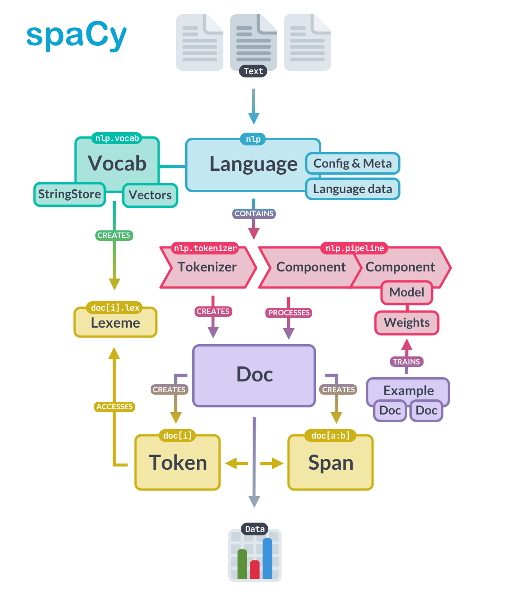
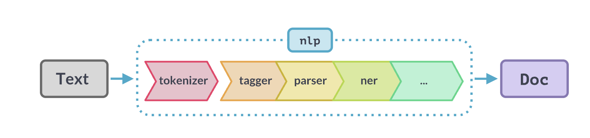
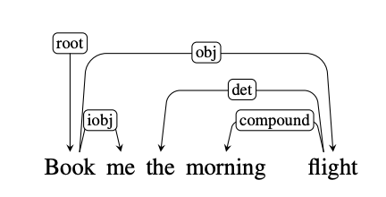
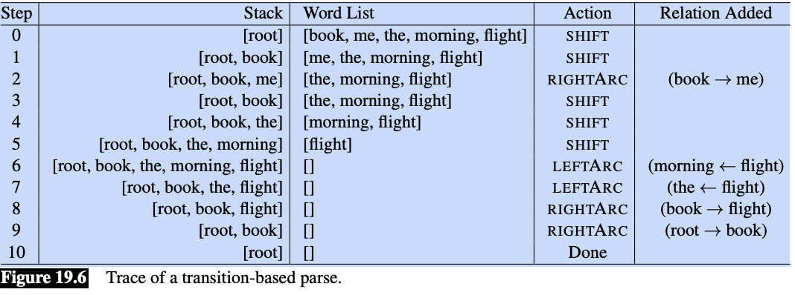

# Lab 1 - Introduction to the SpaCy Pipeline


<!-- WARNING: THIS FILE WAS AUTOGENERATED! DO NOT EDIT! -->

## Preface

Welcome to your first hands-on experience with Natural Language
Processing! This notebook takes a different approach from traditional
NLP courses. Rather than starting with abstract theory, we will learn
NLP concepts by working directly with spaCy, a powerful library used by
data scientists and engineers in real-world applications.

Why this approach? Learning NLP can be overwhelming. Textbooks like
Jurafsky and Martin’s *Speech and Language Processing* are comprehensive
but dense. By grounding our learning in spaCy, you will build practical
skills while gaining conceptual understanding. Every term we introduce
connects to something you can see and manipulate in code.

**What is spaCy?** [SpaCy v.3](https://spacy.io) is an
industrial-strength NLP library for Python. Companies use it to build
everything from chatbots to document analysis systems. When you learn
spaCy, you are learning a tool that employers expect data scientists to
know. It processes text quickly, integrates well with other Python
libraries, and handles the complex details of language analysis for you.

This notebook provides a whirlwind tour of spaCy’s capabilities. We will
work with two fundamental objects: the **Doc** (a processed text
document) and **Token** (individual pieces of text like words and
punctuation). By the end, you will understand how spaCy breaks text
apart, labels it, and identifies relationships between words.

Do not worry if everything does not click immediately. This is an
introduction. We will revisit these concepts throughout the course, and
each time they will become clearer. The goal today is familiarity, not
mastery.

We will also begin exploring how traditional NLP methods relate to Large
Language Models (LLMs). Traditional methods (like those in spaCy) are
fast, predictable, and transparent. LLMs (like ChatGPT) are flexible and
capture nuance but are slower and less explainable. Understanding when
to use each is a key skill for modern NLP practitioners.

**Related resources** - This is a very thorough overview of SpaCy worth
skimming!
https://deepnote.com/blog/ultimate-guide-to-the-spacy-library-in-python. -
You will also be working your way through the spaCy tutorial here
(https://course.spacy.io/en) over the first half of this course.

**Learning objectives**

- Introduction to core NLP components and spaCy pipeline
- Introduction to tokens and their attributes
- Introduction to language models as probability distributions
  - Bigram models
  - Neural language models
- Thought exercise - Traditional NLP vs LLMs
  - Sentiment analysis
  - Summarization
- Demonstration of flexible SpaCy pipelines incorporating LLM components

## How to Use This Notebook

**Your goal** is to read the notes and code in this notebook, and answer
questions. This is what you will do in each notebook in this class. I
used AI copiously to give you a sense of how you might use AI to learn a
new library.

If there is code you don’t understand (and that could be most of it!),
ask AI to explain it cell-by-cell. Part of your goal is to become fluent
in reading code. Make small changes and experiment. If you write code,
make tiny, iterative changes and test. Get familiar with the patterns of
what must be done and why.

As a student, **you are responsible for answering all questions in the
reflection sections and running the last cell in the notebook to submit
your answers**. They are ungraded, though we’ll talk about your thoughts
and questions in class.

Note: you will see cells marked with **\#| eval: false** throughout
these notebooks. These are directives that tell the nbdev framework used
by this repository not to test during continuous integration. Since the
code in these notebooks are not part of the library, most, if not, all
will be marked \#| eval: false. You can delete them in your own
notebooks, if you like.

## Load Libraries and Models

Before we can work with spaCy, we need to import the necessary
libraries. Think of this as gathering your tools before starting a
project.

``` python
# If you are colab, un-comment the pip install below.
# This will not be necessary on DeepNote or your local installation

#!pip install data401_nlp
```

``` python
# Environment (must run first)
from dotenv import load_dotenv
load_dotenv()
import data401_nlp
print(data401_nlp.__version__)

# Core libs
import os
import sys

# ML libs
import pandas as pd

# NLP libs
import spacy
import nltk

# Tools libs
import json
import fastcore.tools as fc
import orjson
```

    0.0.6

### Loading a spaCy Language Model

SpaCy does not analyze text on its own. It needs a **language model**—a
pre-trained set of rules and patterns for a specific language. We are
using `en_core_web_sm`, a small English model optimized for CPU
processing. The “sm” stands for “small,” meaning it downloads quickly
and runs fast, though larger models exist for more demanding
applications.

When you visit the [model
documentation](https://spacy.io/models/en#en_core_web_sm), you will find
details about what text it was trained on, what components it includes,
and how accurate it is. We will explore most of these components over
the coming weeks.

``` python
# load spacy
# This helper ensures it will automatically download if not present

from data401_nlp.helpers.spacy import ensure_spacy_model

def get_nlp():
    return ensure_spacy_model("en_core_web_sm")
```

### Setting Up LLM Access

Later in this notebook, we will compare traditional NLP methods with
LLM-based approaches. The code below sets up access to an LLM through
our helper functions. Do not worry about the details here—just know that
this gives us a way to ask questions to an AI model like Claude or GPT.

Your model is currently set to Claude, though you can change it to
OpenAI by modifying `LLM_MODELS[0]`. It is easy to extend the helper to
accommodate others and send a [pull
request](https://github.com/su-dataAI/data401-nlp/pulls) to me, if you
use a different model that you’d like added.

``` python
from data401_nlp.helpers.env import load_env
from data401_nlp.helpers.llm import make_chat, LLM_MODELS

load_env()
chat = make_chat(LLM_MODELS[0])
```

The [listette library](https://lisette.answer.ai) wraps the litellm
library and makes it possible for us to add models with API keys to this
notebook. I’ve included it in helper functions behind the scenes.

You don’t need a subscription or API access, if you don’t have it
already. Use these notebooks as “read-only” for those sections. But if
you do have a key, do use it!

1.  **Use Colab or Deepnote’s Secrets feature** (recommended) - store
    keys in Colab’s built-in secrets manager
2.  **Set environment variables** manually in your notebook
3.  **Use a `.env` file** in your local environment

## Part A: Exploring the SpaCy Pipeline (Tokens, POS, NER, and Parse Trees)

In this section, you will learn how spaCy transforms raw text into
structured data. This is the foundation of all NLP work: taking
unstructured text and adding labels, categories, and relationships that
computers can work with.

### The Doc Object: Your Container for Processed Text

A **Doc** object is a smart container for data. When you give text to
spaCy, it returns a Doc containing your original text plus all the
analysis spaCy performs. Every word gets labeled, entities get
identified, and grammatical relationships get mapped out—all stored in
this single object.

The **nlp** object is what does the work. When you call `nlp(text)`,
spaCy runs your text through a series of processing steps called a
**pipeline**. Each step adds different information: one step breaks text
into words, another identifies parts of speech, another finds named
entities, and so on.

In practice, you create one Doc per document. An Amazon review would be
one Doc. A news article would be one Doc. This organization helps when
you are processing many documents at once.

The image below captures a high-level overview of the [spaCy
API](https://spacy.io/api). Here you can see that text is processed by
the **nlp pipeline** which runs the tokenizer. The Doc object itself has
Token and Span objects. Let’s look at tokens below. (We’ll hold off on
spans till we have a use for them.)



``` python
# Sample text with multiple entities and interesting linguistic features
sample_text = """Dr. Sarah Chen joined Anthropic in San Francisco on January 15, 2024. She previously worked at Google Brain, where she led a team developing language models that could process over 100,000 tokens per second."""

# Process with spaCy
# We're going to call nlp inside a function so that we don't rely on a global nlp object
# for demos

nlp = get_nlp()  
doc = nlp(sample_text)
doc
```

    ✅ spaCy model 'en_core_web_sm' loaded successfully

    Dr. Sarah Chen joined Anthropic in San Francisco on January 15, 2024. She previously worked at Google Brain, where she led a team developing language models that could process over 100,000 tokens per second.

``` python
[word.text for word in doc]
```

    ['Dr.',
     'Sarah',
     'Chen',
     'joined',
     'Anthropic',
     'in',
     'San',
     'Francisco',
     'on',
     'January',
     '15',
     ',',
     '2024',
     '.',
     'She',
     'previously',
     'worked',
     'at',
     'Google',
     'Brain',
     ',',
     'where',
     'she',
     'led',
     'a',
     'team',
     'developing',
     'language',
     'models',
     'that',
     'could',
     'process',
     'over',
     '100,000',
     'tokens',
     'per',
     'second',
     '.']

Notice how spaCy split the text into individual pieces. “Dr.” stays
together as one piece. “San Francisco” becomes two separate pieces.
Punctuation marks like commas and periods each become their own piece.
This process of splitting text into pieces is called **tokenization**,
and each piece is called a **token**.

### Tokens and Their Attributes

A **token** is the basic unit of text in NLP. At its simplest, a token
is just a piece of text that has been assigned a number (so computers
can work with it). But in spaCy, tokens carry much more: part-of-speech
labels, grammatical relationships, and other linguistic information.

We will spend significant time on tokenization in the coming weeks
because how you split text dramatically affects NLP performance.
**Tokenization** has enormous impact on the performance on NLP tasks.

For now, just understand that tokens are the building blocks we work
with.

Each token has many **attributes**—pieces of information attached to it.
The [spaCy token documentation](https://spacy.io/api/token#attributes)
lists all available attributes, or you can use Python’s help function:

``` python
# At this point, it can be helpful to look at API documentation. 
# This is one way to do it. Uncomment the line below line.

# help(doc[0])
```

``` python
for token in doc:
    print(token.text, token.dep_, token.head.text, token.head.pos_,
            [child for child in token.children])
```

    Dr. compound Chen PROPN []
    Sarah compound Chen PROPN []
    Chen nsubj joined VERB [Dr., Sarah]
    joined ROOT joined VERB [Chen, Anthropic, in, on, .]
    Anthropic dobj joined VERB []
    in prep joined VERB [Francisco]
    San compound Francisco PROPN []
    Francisco pobj in ADP [San]
    on prep joined VERB [January]
    January pobj on ADP [15, ,, 2024]
    15 nummod January PROPN []
    , punct January PROPN []
    2024 nummod January PROPN []
    . punct joined VERB []
    She nsubj worked VERB []
    previously advmod worked VERB []
    worked ROOT worked VERB [She, previously, at, .]
    at prep worked VERB [Brain]
    Google compound Brain PROPN []
    Brain pobj at ADP [Google, ,, led]
    , punct Brain PROPN []
    where advmod led VERB []
    she nsubj led VERB []
    led relcl Brain PROPN [where, she, team]
    a det team NOUN []
    team dobj led VERB [a, developing]
    developing acl team NOUN [models]
    language compound models NOUN []
    models dobj developing VERB [language, process]
    that nsubj process VERB []
    could aux process VERB []
    process relcl models NOUN [that, could, tokens]
    over quantmod 100,000 NUM []
    100,000 nummod tokens NOUN [over]
    tokens dobj process VERB [100,000, per]
    per prep tokens NOUN [second]
    second pobj per ADP []
    . punct worked VERB []

This output is dense! Do not worry about understanding every detail. The
key insight is that each token carries information about its grammatical
role (dep\_), what word it relates to (head), and what words depend on
it (children). We will explore these relationships more in the
dependency parsing section.

Let us view this information in a cleaner format using a pandas
DataFrame, and add a few more commonly used attributes:

``` python
token_data = []
for token in doc:
    token_data.append({
        "Token": token.text,
        "Lemma": token.lemma_,
        "Lower": token.lower_,
        "Shape": token.shape_,
        "POS": token.pos_,
        "Tag": token.tag_,
        "Dep": token.dep_,
        "Is_Stop": token.is_stop,
        "Is_Punct": token.is_punct,
        "Is_Digit": token.is_digit,
        "Is_Alpha": token.is_alpha
    })

token_df = pd.DataFrame(token_data)
print(token_df.head(15).to_string(index=False))
```

        Token     Lemma     Lower Shape   POS Tag      Dep  Is_Stop  Is_Punct  Is_Digit  Is_Alpha
          Dr.       Dr.       dr.   Xx. PROPN NNP compound    False     False     False     False
        Sarah     Sarah     sarah Xxxxx PROPN NNP compound    False     False     False      True
         Chen      Chen      chen  Xxxx PROPN NNP    nsubj    False     False     False      True
       joined      join    joined  xxxx  VERB VBD     ROOT    False     False     False      True
    Anthropic Anthropic anthropic Xxxxx PROPN NNP     dobj    False     False     False      True
           in        in        in    xx   ADP  IN     prep     True     False     False      True
          San       San       san   Xxx PROPN NNP compound    False     False     False      True
    Francisco Francisco francisco Xxxxx PROPN NNP     pobj    False     False     False      True
           on        on        on    xx   ADP  IN     prep     True     False     False      True
      January   January   january Xxxxx PROPN NNP     pobj    False     False     False      True
           15        15        15    dd   NUM  CD   nummod    False     False      True     False
            ,         ,         ,     , PUNCT   ,    punct    False      True     False     False
         2024      2024      2024  dddd   NUM  CD   nummod    False     False      True     False
            .         .         .     . PUNCT   .    punct    False      True     False     False
          She       she       she   Xxx  PRON PRP    nsubj     True     False     False      True

Here are some observations from the first 15 lines of this token
analysis: - Notice how ‘joined’ has lemma ‘join’ (verb normalization -
‘Dr.’ is tagged as NNP (proper noun) despite the period” - Stop words
like ‘in’, ‘on’, ‘a’ are marked True for Is_Stop”

For now, think of a token as a basic unit that you will focus on in NLP.
**A token is simply a piece of text that can be represented as an
integer.** The first stage in a spaCy pipeline is tokenization to break
up text into the smaller bits that we process. As objects, they have the
potential to carry a lot of information. We’re going to briefly look at
the sorts of information they carry in this lab. Don’t worry about the
details… this is an introduction to terms you will become more familiar
with.

Now let’s look at each type of annotation! What are they, and what might
we do with them.

### Lemmas and Stopwords

Two of the most useful token attributes are **lemmas** and **stopword
flags**. Understanding these will help you see why preprocessing matters
in NLP.

**Lemmas** are the base or dictionary form of a word. For example: -
“joined” → “join” - “running” → “run”  
- “better” → “good”

This normalization is useful because it lets you treat different forms
of the same word as equivalent. For instance, if you’re analyzing
sentiment in reviews, you’d want “loved,” “loving,” and “loves” to all
be recognized as the same concept.

**Stop words** are common words that often don’t carry much meaning on
their own, like “the,” “is,” “at,” “in,” “a.” You can see in your token
table that words like “in” and “on” are marked as stop words.

They’re often filtered out in tasks like: - Document classification
(where “the” appears everywhere and doesn’t help distinguish topics) -
Keyword extraction (you want meaningful words, not “and” or “of”)

However, stop words ARE very important for some tasks—like machine
translation or question answering, where “not” or “who” can completely
change meaning!

Looking at your sample text, can you spot why lemmatization might be
helpful for analyzing this text? What if you wanted to count how many
times people “work” at different companies across many documents?

### Part-of-Speech Tagging

**Part-of-speech (POS) tagging** assigns grammatical categories to each
word. Is “book” a noun (I read a book) or a verb (I will book a flight)?
POS tags help answer this question based on context.

SpaCy uses two types of POS tags:

1.  **Coarse-grained tags** (`token.pos_`) - Universal POS tags from the
    Universal Dependencies project. These are standardized across
    languages (like NOUN, VERB, ADJ, etc.)

2.  **Fine-grained tags** (`token.tag_`) - Language-specific tags. For
    English, these are Penn Treebank tags (like NNP, VBD, JJ, etc.)

The best references are:

- [**Universal POS tags**](https://universaldependencies.org/u/pos/)
- [**Penn Treebank
  tags**](https://www.ling.upenn.edu/courses/Fall_2003/ling001/penn_treebank_pos.html)
- [**SpaCy’s own
  documentation**](https://spacy.io/api/annotation#pos-tagging)

You can also see what tags are available in your loaded model by
checking `nlp.get_pipe("tagger").labels`.

Here’s a quick reference for the tags appearing in our token data above:

**POS Tags (Universal):** - `PROPN` - Proper noun (Sarah, Chen,
Anthropic, San Francisco) - `VERB` - Verb (joined) - `ADP` -
Adposition/preposition (in, on) - `NUM` - Number (15, 2024) - `PUNCT` -
Punctuation (., ,) - `PRON` - Pronoun (She)

**Penn Treebank Tags (detailed):** - `NNP` - Proper noun, singular (Dr.,
Sarah, Chen) - `VBD` - Verb, past tense (joined) - `IN` - Preposition or
subordinating conjunction (in, on) - `CD` - Cardinal number (15, 2024) -
`PRP` - Personal pronoun (She)

**Dependency Labels:** - `nsubj` - Nominal subject (Chen is the subject
of “joined”) - `dobj` - Direct object (Anthropic is what was joined) -
`compound` - Compound modifier (Dr. + Sarah + Chen) - `prep` -
Prepositional modifier (in, on) - `pobj` - Object of preposition
(Francisco, January) - `nummod` - Numeric modifier (15 modifies
January) - `ROOT` - Root of the sentence (joined)

SpaCy’s POS tagger uses a neural network model trained on annotated text
data. Here’s how it works:

**Training:** The model learns patterns from large corpora (like
OntoNotes for English) where words are already tagged with their parts
of speech. It learns contextual clues—for example, that a word after
“the” is likely a noun.

**Prediction:** When you process text with `nlp(text)`, the tagger looks
at each token in context (surrounding words, word shape,
prefixes/suffixes) and predicts the most likely POS tag using the
trained neural network.

**Architecture:** Modern SpaCy models (v3+) use transformer-based or
CNN-based architectures. The small model you’re using (`en_core_web_sm`)
uses a more compact architecture for speed.

The tagger is one component in the processing pipeline. You can see your
pipeline components with:

``` python
nlp = get_nlp()
nlp.pipe_names
```

    ✅ spaCy model 'en_core_web_sm' loaded successfully

    ['tok2vec', 'tagger', 'parser', 'attribute_ruler', 'lemmatizer', 'ner']

This shows the six processing steps that run when you call `nlp(text)`:

1.  **tok2vec** - Converts tokens into numerical vectors (we will cover
    this later)
2.  **tagger** - Assigns POS tags
3.  **parser** - Analyzes grammatical structure (dependency parsing)
4.  **attribute_ruler** - Applies rule-based attribute assignments
5.  **lemmatizer** - Computes lemmas (base forms of words)
6.  **ner** - Named Entity Recognition

Notice that tok2vec comes first. It creates vector representations that
other components (like the tagger and parser) use as input. This shared
representation is one of spaCy’s clever design features—multiple
components benefit from the same underlying analysis.

As you will inuit over time, even if we didn’t use spaCy, we would need
an nlp pipeline. In general terms, an NLP pipeline is a sequence of
processing steps that transform raw text into increasingly structured
representations, where each step adds or refines information that later
steps can use.

Conceptually:

- Input starts as unstructured text
- Each component performs a specific analysis (e.g., tokenization,
  tagging, parsing)
- The output is a layered annotation of the same text, not a replacement
- Later components can depend on the results of earlier ones

The key idea is modularity: complex language understanding is built by
composing simple, specialized stages rather than solving everything at
once. As we will see later, we can add new components to this pipeline…
which makes it possible for us to create hybrid NLP solutions using
traditional ML with representation and generative models!

Below is a visual depiction of a spaCy pipeline.



We’ve looked a bit at tokenization, lemmas, and part of speech - let’s
move on to NER.

### Named Entities

**Named Entity Recognition (NER)** identifies and classifies real-world
objects in text: people, organizations, locations, dates, and more. This
is one of the most practically useful NLP tasks—imagine automatically
extracting all company names from thousands of news articles.

According to the [SpaCy model reference](https://spacy.io/models), the
NER component also uses vectors as input. It is configurable to use its
own Tok2Vec model, though by default, uses the pipeline Tok2Vec model.
SpaCy is extremely configurable and you can turn components on and off,
as long as you are paying attention to dependencies.

NER uses all sorts of features as context. For example, it uses
punctuation to signal clause boundaries, abbreviations, etc. It also
uses lexical features and contextual token features such as neighboring
tokens, subword patterns, and other contextual clues. It does not rely
on POS tags or dependency parses.

``` python
# Visualize entities (Colab-friendly)
from spacy import displacy
from IPython.display import display, HTML

# Render entities
html = displacy.render(doc, style="ent", jupyter=False)
display(HTML(html))
```

<div class="entities" style="line-height: 2.5; direction: ltr">Dr. 
<mark class="entity" style="background: #aa9cfc; padding: 0.45em 0.6em; margin: 0 0.25em; line-height: 1; border-radius: 0.35em;">
    Sarah Chen
    <span style="font-size: 0.8em; font-weight: bold; line-height: 1; border-radius: 0.35em; vertical-align: middle; margin-left: 0.5rem">PERSON</span>
</mark>
 joined Anthropic in 
<mark class="entity" style="background: #feca74; padding: 0.45em 0.6em; margin: 0 0.25em; line-height: 1; border-radius: 0.35em;">
    San Francisco
    <span style="font-size: 0.8em; font-weight: bold; line-height: 1; border-radius: 0.35em; vertical-align: middle; margin-left: 0.5rem">GPE</span>
</mark>
 on 
<mark class="entity" style="background: #bfe1d9; padding: 0.45em 0.6em; margin: 0 0.25em; line-height: 1; border-radius: 0.35em;">
    January 15, 2024
    <span style="font-size: 0.8em; font-weight: bold; line-height: 1; border-radius: 0.35em; vertical-align: middle; margin-left: 0.5rem">DATE</span>
</mark>
. She previously worked at 
<mark class="entity" style="background: #9cc9cc; padding: 0.45em 0.6em; margin: 0 0.25em; line-height: 1; border-radius: 0.35em;">
    Google Brain
    <span style="font-size: 0.8em; font-weight: bold; line-height: 1; border-radius: 0.35em; vertical-align: middle; margin-left: 0.5rem">FAC</span>
</mark>
, where she led a team developing language models that could process over 
<mark class="entity" style="background: #e4e7d2; padding: 0.45em 0.6em; margin: 0 0.25em; line-height: 1; border-radius: 0.35em;">
    100,000
    <span style="font-size: 0.8em; font-weight: bold; line-height: 1; border-radius: 0.35em; vertical-align: middle; margin-left: 0.5rem">CARDINAL</span>
</mark>
 tokens per 
<mark class="entity" style="background: #e4e7d2; padding: 0.45em 0.6em; margin: 0 0.25em; line-height: 1; border-radius: 0.35em;">
    second
    <span style="font-size: 0.8em; font-weight: bold; line-height: 1; border-radius: 0.35em; vertical-align: middle; margin-left: 0.5rem">ORDINAL</span>
</mark>
.</div>

POS tags are useful building blocks for many NLP tasks:

**1. Information Extraction** - You can filter for specific patterns.
For example, finding all noun phrases (sequences of adjectives + nouns)
to extract key concepts, or finding verb-object pairs to understand
actions.

**2. Text Preprocessing** - You might keep only nouns and verbs for
topic modeling, or remove everything except proper nouns to find names
and places.

**3. Disambiguation** - The word “book” could be a noun (read a book) or
verb (book a flight). POS tags help distinguish meaning.

**4. Feature Engineering** - For classification tasks, POS tag
distributions can be features. Academic writing has different POS
patterns than casual speech.

Looking at your `doc`, what if you wanted to extract just the
organizations mentioned? You could filter for proper nouns (`PROPN`),
but notice “Google Brain” is tagged as `FAC` (facility) in the NER
output.

``` python
# You can use spacy.explain categories that are unfamiliar.

spacy.explain("FAC")
```

    'Buildings, airports, highways, bridges, etc.'

Let’s play around with ‘Google Brain’ to look at some other sentences.
We want to experiment and see under what sentence contexts it is tagged
correctly as an ORG.

``` python
doc1 = nlp("She joined Google Brain as an engineer")

# Render entities
html = displacy.render(doc1, style="ent", jupyter=False)
display(HTML(html))
```

<div class="entities" style="line-height: 2.5; direction: ltr">She joined 
<mark class="entity" style="background: #7aecec; padding: 0.45em 0.6em; margin: 0 0.25em; line-height: 1; border-radius: 0.35em;">
    Google Brain
    <span style="font-size: 0.8em; font-weight: bold; line-height: 1; border-radius: 0.35em; vertical-align: middle; margin-left: 0.5rem">ORG</span>
</mark>
 as an engineer</div>

``` python
doc2 = nlp("Google Brain is a research organization")

# Render entities
html = displacy.render(doc2, style="ent", jupyter=False)
display(HTML(html))
```

<div class="entities" style="line-height: 2.5; direction: ltr">
<mark class="entity" style="background: #7aecec; padding: 0.45em 0.6em; margin: 0 0.25em; line-height: 1; border-radius: 0.35em;">
    Google Brain
    <span style="font-size: 0.8em; font-weight: bold; line-height: 1; border-radius: 0.35em; vertical-align: middle; margin-left: 0.5rem">ORG</span>
</mark>
 is a research organization</div>

``` python
doc3 = nlp("She worked at the company Google Brain")

# Render entities
html = displacy.render(doc3, style="ent", jupyter=False)
display(HTML(html))
```

<div class="entities" style="line-height: 2.5; direction: ltr">She worked at the company 
<mark class="entity" style="background: #7aecec; padding: 0.45em 0.6em; margin: 0 0.25em; line-height: 1; border-radius: 0.35em;">
    Google Brain
    <span style="font-size: 0.8em; font-weight: bold; line-height: 1; border-radius: 0.35em; vertical-align: middle; margin-left: 0.5rem">ORG</span>
</mark>
</div>

### Part A Summary

In this section, you learned:

- **Doc and Token objects** are spaCy’s fundamental building blocks. A
  Doc holds processed text; Tokens are individual pieces with attached
  information.
- **Tokenization** splits text into pieces. How this happens affects
  everything downstream.
- **Token attributes** include lemmas (base forms), POS tags
  (grammatical categories), and stopword flags.
- **Named Entity Recognition** identifies real-world objects but depends
  heavily on context and sometimes makes mistakes.
- **The spaCy pipeline** runs multiple processing steps in sequence,
  with each step adding information to the Doc.

## Part B: Dependency Parsing

So far, we have looked at individual tokens in isolation. But language
is about relationships—subjects perform actions on objects, adjectives
modify nouns, prepositions connect phrases. **Dependency parsing**
captures these relationships by connecting each word to the word it
depends on.

You have been given some [basic study material on a theory of language
structure based on “X-bar”
theory](https://socialsci.libretexts.org/Courses/Canada_College/ENGL_LING_200%3A_Introduction_to_Linguistics/05%3A_Phrases-_Syntax/5.03%3A_Phrase_Structure_Rules_X-Bar_Theory_and_Constituency),
which is the theory behind **constituent parsing**. This kind of parsing
has a lot of positives. It can tell you about where noun and verb
phrases begin and end because it has rich, hierarchical structure. You
can plugin a constituent parser into spaCy, but it’s not the default.

SpaCy chose to implement dependency parsing because it’s faster (linear
time), low memory, robust token-centric, and works across many languages
(i.e. cross-lingual). Like constituent parsing, it’s also usedful for
downstream tasks. Your linguistics book doesn’t talk about dependency
parsing, so we’ll draw from Jurafsky and Martin and touch on it in this
notebook.

Note, it’s not important to know the details here. Focus on why SpaCy
has a dependency parser out of the box – why it might be useful – and
that it works at the token level.

``` python
# Visualize entities (Colab-friendly)
from spacy import displacy
from IPython.display import display, HTML

options = {
    "distance": 90,   # arc length
    "compact": False,
    "bg": "#ffffff",
    "color": "#000000",
    "font": "Arial"
}

# Render entities. We need to break out by sentence since this will take a lot of horizontal space, otherwise.
html = displacy.render(
    list(doc.sents),   # important: avoids cramped multi-sentence trees
    style="dep",
    options=options,
    jupyter=False
)
display(HTML(html))
```

<svg xmlns="http://www.w3.org/2000/svg" xmlns:xlink="http://www.w3.org/1999/xlink" xml:lang="en" id="84ab3f580a844df5a9f54dc98b32ef50-0" class="displacy" width="1130" height="272.0" direction="ltr" style="max-width: none; height: 272.0px; color: #000000; background: #ffffff; font-family: Arial; direction: ltr">
<text class="displacy-token" fill="currentColor" text-anchor="middle" y="182.0">
    <tspan class="displacy-word" fill="currentColor" x="50">Dr.</tspan>
    <tspan class="displacy-tag" dy="2em" fill="currentColor" x="50">PROPN</tspan>
</text>
&#10;<text class="displacy-token" fill="currentColor" text-anchor="middle" y="182.0">
    <tspan class="displacy-word" fill="currentColor" x="140">Sarah</tspan>
    <tspan class="displacy-tag" dy="2em" fill="currentColor" x="140">PROPN</tspan>
</text>
&#10;<text class="displacy-token" fill="currentColor" text-anchor="middle" y="182.0">
    <tspan class="displacy-word" fill="currentColor" x="230">Chen</tspan>
    <tspan class="displacy-tag" dy="2em" fill="currentColor" x="230">PROPN</tspan>
</text>
&#10;<text class="displacy-token" fill="currentColor" text-anchor="middle" y="182.0">
    <tspan class="displacy-word" fill="currentColor" x="320">joined</tspan>
    <tspan class="displacy-tag" dy="2em" fill="currentColor" x="320">VERB</tspan>
</text>
&#10;<text class="displacy-token" fill="currentColor" text-anchor="middle" y="182.0">
    <tspan class="displacy-word" fill="currentColor" x="410">Anthropic</tspan>
    <tspan class="displacy-tag" dy="2em" fill="currentColor" x="410">PROPN</tspan>
</text>
&#10;<text class="displacy-token" fill="currentColor" text-anchor="middle" y="182.0">
    <tspan class="displacy-word" fill="currentColor" x="500">in</tspan>
    <tspan class="displacy-tag" dy="2em" fill="currentColor" x="500">ADP</tspan>
</text>
&#10;<text class="displacy-token" fill="currentColor" text-anchor="middle" y="182.0">
    <tspan class="displacy-word" fill="currentColor" x="590">San</tspan>
    <tspan class="displacy-tag" dy="2em" fill="currentColor" x="590">PROPN</tspan>
</text>
&#10;<text class="displacy-token" fill="currentColor" text-anchor="middle" y="182.0">
    <tspan class="displacy-word" fill="currentColor" x="680">Francisco</tspan>
    <tspan class="displacy-tag" dy="2em" fill="currentColor" x="680">PROPN</tspan>
</text>
&#10;<text class="displacy-token" fill="currentColor" text-anchor="middle" y="182.0">
    <tspan class="displacy-word" fill="currentColor" x="770">on</tspan>
    <tspan class="displacy-tag" dy="2em" fill="currentColor" x="770">ADP</tspan>
</text>
&#10;<text class="displacy-token" fill="currentColor" text-anchor="middle" y="182.0">
    <tspan class="displacy-word" fill="currentColor" x="860">January</tspan>
    <tspan class="displacy-tag" dy="2em" fill="currentColor" x="860">PROPN</tspan>
</text>
&#10;<text class="displacy-token" fill="currentColor" text-anchor="middle" y="182.0">
    <tspan class="displacy-word" fill="currentColor" x="950">15,</tspan>
    <tspan class="displacy-tag" dy="2em" fill="currentColor" x="950">NUM</tspan>
</text>
&#10;<text class="displacy-token" fill="currentColor" text-anchor="middle" y="182.0">
    <tspan class="displacy-word" fill="currentColor" x="1040">2024.</tspan>
    <tspan class="displacy-tag" dy="2em" fill="currentColor" x="1040">NUM</tspan>
</text>
&#10;<g class="displacy-arrow">
    <path class="displacy-arc" id="arrow-84ab3f580a844df5a9f54dc98b32ef50-0-0" stroke-width="2px" d="M70,137.0 C70,47.0 225.0,47.0 225.0,137.0" fill="none" stroke="currentColor"/>
    <text dy="1.25em" style="font-size: 0.8em; letter-spacing: 1px">
        <textPath xlink:href="#arrow-84ab3f580a844df5a9f54dc98b32ef50-0-0" class="displacy-label" startOffset="50%" side="left" fill="currentColor" text-anchor="middle">compound</textPath>
    </text>
    <path class="displacy-arrowhead" d="M70,139.0 L62,127.0 78,127.0" fill="currentColor"/>
</g>
&#10;<g class="displacy-arrow">
    <path class="displacy-arc" id="arrow-84ab3f580a844df5a9f54dc98b32ef50-0-1" stroke-width="2px" d="M160,137.0 C160,92.0 220.0,92.0 220.0,137.0" fill="none" stroke="currentColor"/>
    <text dy="1.25em" style="font-size: 0.8em; letter-spacing: 1px">
        <textPath xlink:href="#arrow-84ab3f580a844df5a9f54dc98b32ef50-0-1" class="displacy-label" startOffset="50%" side="left" fill="currentColor" text-anchor="middle">compound</textPath>
    </text>
    <path class="displacy-arrowhead" d="M160,139.0 L152,127.0 168,127.0" fill="currentColor"/>
</g>
&#10;<g class="displacy-arrow">
    <path class="displacy-arc" id="arrow-84ab3f580a844df5a9f54dc98b32ef50-0-2" stroke-width="2px" d="M250,137.0 C250,92.0 310.0,92.0 310.0,137.0" fill="none" stroke="currentColor"/>
    <text dy="1.25em" style="font-size: 0.8em; letter-spacing: 1px">
        <textPath xlink:href="#arrow-84ab3f580a844df5a9f54dc98b32ef50-0-2" class="displacy-label" startOffset="50%" side="left" fill="currentColor" text-anchor="middle">nsubj</textPath>
    </text>
    <path class="displacy-arrowhead" d="M250,139.0 L242,127.0 258,127.0" fill="currentColor"/>
</g>
&#10;<g class="displacy-arrow">
    <path class="displacy-arc" id="arrow-84ab3f580a844df5a9f54dc98b32ef50-0-3" stroke-width="2px" d="M340,137.0 C340,92.0 400.0,92.0 400.0,137.0" fill="none" stroke="currentColor"/>
    <text dy="1.25em" style="font-size: 0.8em; letter-spacing: 1px">
        <textPath xlink:href="#arrow-84ab3f580a844df5a9f54dc98b32ef50-0-3" class="displacy-label" startOffset="50%" side="left" fill="currentColor" text-anchor="middle">dobj</textPath>
    </text>
    <path class="displacy-arrowhead" d="M400.0,139.0 L408.0,127.0 392.0,127.0" fill="currentColor"/>
</g>
&#10;<g class="displacy-arrow">
    <path class="displacy-arc" id="arrow-84ab3f580a844df5a9f54dc98b32ef50-0-4" stroke-width="2px" d="M340,137.0 C340,47.0 495.0,47.0 495.0,137.0" fill="none" stroke="currentColor"/>
    <text dy="1.25em" style="font-size: 0.8em; letter-spacing: 1px">
        <textPath xlink:href="#arrow-84ab3f580a844df5a9f54dc98b32ef50-0-4" class="displacy-label" startOffset="50%" side="left" fill="currentColor" text-anchor="middle">prep</textPath>
    </text>
    <path class="displacy-arrowhead" d="M495.0,139.0 L503.0,127.0 487.0,127.0" fill="currentColor"/>
</g>
&#10;<g class="displacy-arrow">
    <path class="displacy-arc" id="arrow-84ab3f580a844df5a9f54dc98b32ef50-0-5" stroke-width="2px" d="M610,137.0 C610,92.0 670.0,92.0 670.0,137.0" fill="none" stroke="currentColor"/>
    <text dy="1.25em" style="font-size: 0.8em; letter-spacing: 1px">
        <textPath xlink:href="#arrow-84ab3f580a844df5a9f54dc98b32ef50-0-5" class="displacy-label" startOffset="50%" side="left" fill="currentColor" text-anchor="middle">compound</textPath>
    </text>
    <path class="displacy-arrowhead" d="M610,139.0 L602,127.0 618,127.0" fill="currentColor"/>
</g>
&#10;<g class="displacy-arrow">
    <path class="displacy-arc" id="arrow-84ab3f580a844df5a9f54dc98b32ef50-0-6" stroke-width="2px" d="M520,137.0 C520,47.0 675.0,47.0 675.0,137.0" fill="none" stroke="currentColor"/>
    <text dy="1.25em" style="font-size: 0.8em; letter-spacing: 1px">
        <textPath xlink:href="#arrow-84ab3f580a844df5a9f54dc98b32ef50-0-6" class="displacy-label" startOffset="50%" side="left" fill="currentColor" text-anchor="middle">pobj</textPath>
    </text>
    <path class="displacy-arrowhead" d="M675.0,139.0 L683.0,127.0 667.0,127.0" fill="currentColor"/>
</g>
&#10;<g class="displacy-arrow">
    <path class="displacy-arc" id="arrow-84ab3f580a844df5a9f54dc98b32ef50-0-7" stroke-width="2px" d="M340,137.0 C340,2.0 770.0,2.0 770.0,137.0" fill="none" stroke="currentColor"/>
    <text dy="1.25em" style="font-size: 0.8em; letter-spacing: 1px">
        <textPath xlink:href="#arrow-84ab3f580a844df5a9f54dc98b32ef50-0-7" class="displacy-label" startOffset="50%" side="left" fill="currentColor" text-anchor="middle">prep</textPath>
    </text>
    <path class="displacy-arrowhead" d="M770.0,139.0 L778.0,127.0 762.0,127.0" fill="currentColor"/>
</g>
&#10;<g class="displacy-arrow">
    <path class="displacy-arc" id="arrow-84ab3f580a844df5a9f54dc98b32ef50-0-8" stroke-width="2px" d="M790,137.0 C790,92.0 850.0,92.0 850.0,137.0" fill="none" stroke="currentColor"/>
    <text dy="1.25em" style="font-size: 0.8em; letter-spacing: 1px">
        <textPath xlink:href="#arrow-84ab3f580a844df5a9f54dc98b32ef50-0-8" class="displacy-label" startOffset="50%" side="left" fill="currentColor" text-anchor="middle">pobj</textPath>
    </text>
    <path class="displacy-arrowhead" d="M850.0,139.0 L858.0,127.0 842.0,127.0" fill="currentColor"/>
</g>
&#10;<g class="displacy-arrow">
    <path class="displacy-arc" id="arrow-84ab3f580a844df5a9f54dc98b32ef50-0-9" stroke-width="2px" d="M880,137.0 C880,92.0 940.0,92.0 940.0,137.0" fill="none" stroke="currentColor"/>
    <text dy="1.25em" style="font-size: 0.8em; letter-spacing: 1px">
        <textPath xlink:href="#arrow-84ab3f580a844df5a9f54dc98b32ef50-0-9" class="displacy-label" startOffset="50%" side="left" fill="currentColor" text-anchor="middle">nummod</textPath>
    </text>
    <path class="displacy-arrowhead" d="M940.0,139.0 L948.0,127.0 932.0,127.0" fill="currentColor"/>
</g>
&#10;<g class="displacy-arrow">
    <path class="displacy-arc" id="arrow-84ab3f580a844df5a9f54dc98b32ef50-0-10" stroke-width="2px" d="M880,137.0 C880,47.0 1035.0,47.0 1035.0,137.0" fill="none" stroke="currentColor"/>
    <text dy="1.25em" style="font-size: 0.8em; letter-spacing: 1px">
        <textPath xlink:href="#arrow-84ab3f580a844df5a9f54dc98b32ef50-0-10" class="displacy-label" startOffset="50%" side="left" fill="currentColor" text-anchor="middle">nummod</textPath>
    </text>
    <path class="displacy-arrowhead" d="M1035.0,139.0 L1043.0,127.0 1027.0,127.0" fill="currentColor"/>
</g>
</svg>
&#10;<svg xmlns="http://www.w3.org/2000/svg" xmlns:xlink="http://www.w3.org/1999/xlink" xml:lang="en" id="84ab3f580a844df5a9f54dc98b32ef50-1" class="displacy" width="2030" height="272.0" direction="ltr" style="max-width: none; height: 272.0px; color: #000000; background: #ffffff; font-family: Arial; direction: ltr">
<text class="displacy-token" fill="currentColor" text-anchor="middle" y="182.0">
    <tspan class="displacy-word" fill="currentColor" x="50">She</tspan>
    <tspan class="displacy-tag" dy="2em" fill="currentColor" x="50">PRON</tspan>
</text>
&#10;<text class="displacy-token" fill="currentColor" text-anchor="middle" y="182.0">
    <tspan class="displacy-word" fill="currentColor" x="140">previously</tspan>
    <tspan class="displacy-tag" dy="2em" fill="currentColor" x="140">ADV</tspan>
</text>
&#10;<text class="displacy-token" fill="currentColor" text-anchor="middle" y="182.0">
    <tspan class="displacy-word" fill="currentColor" x="230">worked</tspan>
    <tspan class="displacy-tag" dy="2em" fill="currentColor" x="230">VERB</tspan>
</text>
&#10;<text class="displacy-token" fill="currentColor" text-anchor="middle" y="182.0">
    <tspan class="displacy-word" fill="currentColor" x="320">at</tspan>
    <tspan class="displacy-tag" dy="2em" fill="currentColor" x="320">ADP</tspan>
</text>
&#10;<text class="displacy-token" fill="currentColor" text-anchor="middle" y="182.0">
    <tspan class="displacy-word" fill="currentColor" x="410">Google</tspan>
    <tspan class="displacy-tag" dy="2em" fill="currentColor" x="410">PROPN</tspan>
</text>
&#10;<text class="displacy-token" fill="currentColor" text-anchor="middle" y="182.0">
    <tspan class="displacy-word" fill="currentColor" x="500">Brain,</tspan>
    <tspan class="displacy-tag" dy="2em" fill="currentColor" x="500">PROPN</tspan>
</text>
&#10;<text class="displacy-token" fill="currentColor" text-anchor="middle" y="182.0">
    <tspan class="displacy-word" fill="currentColor" x="590">where</tspan>
    <tspan class="displacy-tag" dy="2em" fill="currentColor" x="590">SCONJ</tspan>
</text>
&#10;<text class="displacy-token" fill="currentColor" text-anchor="middle" y="182.0">
    <tspan class="displacy-word" fill="currentColor" x="680">she</tspan>
    <tspan class="displacy-tag" dy="2em" fill="currentColor" x="680">PRON</tspan>
</text>
&#10;<text class="displacy-token" fill="currentColor" text-anchor="middle" y="182.0">
    <tspan class="displacy-word" fill="currentColor" x="770">led</tspan>
    <tspan class="displacy-tag" dy="2em" fill="currentColor" x="770">VERB</tspan>
</text>
&#10;<text class="displacy-token" fill="currentColor" text-anchor="middle" y="182.0">
    <tspan class="displacy-word" fill="currentColor" x="860">a</tspan>
    <tspan class="displacy-tag" dy="2em" fill="currentColor" x="860">DET</tspan>
</text>
&#10;<text class="displacy-token" fill="currentColor" text-anchor="middle" y="182.0">
    <tspan class="displacy-word" fill="currentColor" x="950">team</tspan>
    <tspan class="displacy-tag" dy="2em" fill="currentColor" x="950">NOUN</tspan>
</text>
&#10;<text class="displacy-token" fill="currentColor" text-anchor="middle" y="182.0">
    <tspan class="displacy-word" fill="currentColor" x="1040">developing</tspan>
    <tspan class="displacy-tag" dy="2em" fill="currentColor" x="1040">VERB</tspan>
</text>
&#10;<text class="displacy-token" fill="currentColor" text-anchor="middle" y="182.0">
    <tspan class="displacy-word" fill="currentColor" x="1130">language</tspan>
    <tspan class="displacy-tag" dy="2em" fill="currentColor" x="1130">NOUN</tspan>
</text>
&#10;<text class="displacy-token" fill="currentColor" text-anchor="middle" y="182.0">
    <tspan class="displacy-word" fill="currentColor" x="1220">models</tspan>
    <tspan class="displacy-tag" dy="2em" fill="currentColor" x="1220">NOUN</tspan>
</text>
&#10;<text class="displacy-token" fill="currentColor" text-anchor="middle" y="182.0">
    <tspan class="displacy-word" fill="currentColor" x="1310">that</tspan>
    <tspan class="displacy-tag" dy="2em" fill="currentColor" x="1310">PRON</tspan>
</text>
&#10;<text class="displacy-token" fill="currentColor" text-anchor="middle" y="182.0">
    <tspan class="displacy-word" fill="currentColor" x="1400">could</tspan>
    <tspan class="displacy-tag" dy="2em" fill="currentColor" x="1400">AUX</tspan>
</text>
&#10;<text class="displacy-token" fill="currentColor" text-anchor="middle" y="182.0">
    <tspan class="displacy-word" fill="currentColor" x="1490">process</tspan>
    <tspan class="displacy-tag" dy="2em" fill="currentColor" x="1490">VERB</tspan>
</text>
&#10;<text class="displacy-token" fill="currentColor" text-anchor="middle" y="182.0">
    <tspan class="displacy-word" fill="currentColor" x="1580">over</tspan>
    <tspan class="displacy-tag" dy="2em" fill="currentColor" x="1580">ADP</tspan>
</text>
&#10;<text class="displacy-token" fill="currentColor" text-anchor="middle" y="182.0">
    <tspan class="displacy-word" fill="currentColor" x="1670">100,000</tspan>
    <tspan class="displacy-tag" dy="2em" fill="currentColor" x="1670">NUM</tspan>
</text>
&#10;<text class="displacy-token" fill="currentColor" text-anchor="middle" y="182.0">
    <tspan class="displacy-word" fill="currentColor" x="1760">tokens</tspan>
    <tspan class="displacy-tag" dy="2em" fill="currentColor" x="1760">NOUN</tspan>
</text>
&#10;<text class="displacy-token" fill="currentColor" text-anchor="middle" y="182.0">
    <tspan class="displacy-word" fill="currentColor" x="1850">per</tspan>
    <tspan class="displacy-tag" dy="2em" fill="currentColor" x="1850">ADP</tspan>
</text>
&#10;<text class="displacy-token" fill="currentColor" text-anchor="middle" y="182.0">
    <tspan class="displacy-word" fill="currentColor" x="1940">second.</tspan>
    <tspan class="displacy-tag" dy="2em" fill="currentColor" x="1940">NOUN</tspan>
</text>
&#10;<g class="displacy-arrow">
    <path class="displacy-arc" id="arrow-84ab3f580a844df5a9f54dc98b32ef50-1-0" stroke-width="2px" d="M70,137.0 C70,47.0 225.0,47.0 225.0,137.0" fill="none" stroke="currentColor"/>
    <text dy="1.25em" style="font-size: 0.8em; letter-spacing: 1px">
        <textPath xlink:href="#arrow-84ab3f580a844df5a9f54dc98b32ef50-1-0" class="displacy-label" startOffset="50%" side="left" fill="currentColor" text-anchor="middle">nsubj</textPath>
    </text>
    <path class="displacy-arrowhead" d="M70,139.0 L62,127.0 78,127.0" fill="currentColor"/>
</g>
&#10;<g class="displacy-arrow">
    <path class="displacy-arc" id="arrow-84ab3f580a844df5a9f54dc98b32ef50-1-1" stroke-width="2px" d="M160,137.0 C160,92.0 220.0,92.0 220.0,137.0" fill="none" stroke="currentColor"/>
    <text dy="1.25em" style="font-size: 0.8em; letter-spacing: 1px">
        <textPath xlink:href="#arrow-84ab3f580a844df5a9f54dc98b32ef50-1-1" class="displacy-label" startOffset="50%" side="left" fill="currentColor" text-anchor="middle">advmod</textPath>
    </text>
    <path class="displacy-arrowhead" d="M160,139.0 L152,127.0 168,127.0" fill="currentColor"/>
</g>
&#10;<g class="displacy-arrow">
    <path class="displacy-arc" id="arrow-84ab3f580a844df5a9f54dc98b32ef50-1-2" stroke-width="2px" d="M250,137.0 C250,92.0 310.0,92.0 310.0,137.0" fill="none" stroke="currentColor"/>
    <text dy="1.25em" style="font-size: 0.8em; letter-spacing: 1px">
        <textPath xlink:href="#arrow-84ab3f580a844df5a9f54dc98b32ef50-1-2" class="displacy-label" startOffset="50%" side="left" fill="currentColor" text-anchor="middle">prep</textPath>
    </text>
    <path class="displacy-arrowhead" d="M310.0,139.0 L318.0,127.0 302.0,127.0" fill="currentColor"/>
</g>
&#10;<g class="displacy-arrow">
    <path class="displacy-arc" id="arrow-84ab3f580a844df5a9f54dc98b32ef50-1-3" stroke-width="2px" d="M430,137.0 C430,92.0 490.0,92.0 490.0,137.0" fill="none" stroke="currentColor"/>
    <text dy="1.25em" style="font-size: 0.8em; letter-spacing: 1px">
        <textPath xlink:href="#arrow-84ab3f580a844df5a9f54dc98b32ef50-1-3" class="displacy-label" startOffset="50%" side="left" fill="currentColor" text-anchor="middle">compound</textPath>
    </text>
    <path class="displacy-arrowhead" d="M430,139.0 L422,127.0 438,127.0" fill="currentColor"/>
</g>
&#10;<g class="displacy-arrow">
    <path class="displacy-arc" id="arrow-84ab3f580a844df5a9f54dc98b32ef50-1-4" stroke-width="2px" d="M340,137.0 C340,47.0 495.0,47.0 495.0,137.0" fill="none" stroke="currentColor"/>
    <text dy="1.25em" style="font-size: 0.8em; letter-spacing: 1px">
        <textPath xlink:href="#arrow-84ab3f580a844df5a9f54dc98b32ef50-1-4" class="displacy-label" startOffset="50%" side="left" fill="currentColor" text-anchor="middle">pobj</textPath>
    </text>
    <path class="displacy-arrowhead" d="M495.0,139.0 L503.0,127.0 487.0,127.0" fill="currentColor"/>
</g>
&#10;<g class="displacy-arrow">
    <path class="displacy-arc" id="arrow-84ab3f580a844df5a9f54dc98b32ef50-1-5" stroke-width="2px" d="M610,137.0 C610,47.0 765.0,47.0 765.0,137.0" fill="none" stroke="currentColor"/>
    <text dy="1.25em" style="font-size: 0.8em; letter-spacing: 1px">
        <textPath xlink:href="#arrow-84ab3f580a844df5a9f54dc98b32ef50-1-5" class="displacy-label" startOffset="50%" side="left" fill="currentColor" text-anchor="middle">advmod</textPath>
    </text>
    <path class="displacy-arrowhead" d="M610,139.0 L602,127.0 618,127.0" fill="currentColor"/>
</g>
&#10;<g class="displacy-arrow">
    <path class="displacy-arc" id="arrow-84ab3f580a844df5a9f54dc98b32ef50-1-6" stroke-width="2px" d="M700,137.0 C700,92.0 760.0,92.0 760.0,137.0" fill="none" stroke="currentColor"/>
    <text dy="1.25em" style="font-size: 0.8em; letter-spacing: 1px">
        <textPath xlink:href="#arrow-84ab3f580a844df5a9f54dc98b32ef50-1-6" class="displacy-label" startOffset="50%" side="left" fill="currentColor" text-anchor="middle">nsubj</textPath>
    </text>
    <path class="displacy-arrowhead" d="M700,139.0 L692,127.0 708,127.0" fill="currentColor"/>
</g>
&#10;<g class="displacy-arrow">
    <path class="displacy-arc" id="arrow-84ab3f580a844df5a9f54dc98b32ef50-1-7" stroke-width="2px" d="M520,137.0 C520,2.0 770.0,2.0 770.0,137.0" fill="none" stroke="currentColor"/>
    <text dy="1.25em" style="font-size: 0.8em; letter-spacing: 1px">
        <textPath xlink:href="#arrow-84ab3f580a844df5a9f54dc98b32ef50-1-7" class="displacy-label" startOffset="50%" side="left" fill="currentColor" text-anchor="middle">relcl</textPath>
    </text>
    <path class="displacy-arrowhead" d="M770.0,139.0 L778.0,127.0 762.0,127.0" fill="currentColor"/>
</g>
&#10;<g class="displacy-arrow">
    <path class="displacy-arc" id="arrow-84ab3f580a844df5a9f54dc98b32ef50-1-8" stroke-width="2px" d="M880,137.0 C880,92.0 940.0,92.0 940.0,137.0" fill="none" stroke="currentColor"/>
    <text dy="1.25em" style="font-size: 0.8em; letter-spacing: 1px">
        <textPath xlink:href="#arrow-84ab3f580a844df5a9f54dc98b32ef50-1-8" class="displacy-label" startOffset="50%" side="left" fill="currentColor" text-anchor="middle">det</textPath>
    </text>
    <path class="displacy-arrowhead" d="M880,139.0 L872,127.0 888,127.0" fill="currentColor"/>
</g>
&#10;<g class="displacy-arrow">
    <path class="displacy-arc" id="arrow-84ab3f580a844df5a9f54dc98b32ef50-1-9" stroke-width="2px" d="M790,137.0 C790,47.0 945.0,47.0 945.0,137.0" fill="none" stroke="currentColor"/>
    <text dy="1.25em" style="font-size: 0.8em; letter-spacing: 1px">
        <textPath xlink:href="#arrow-84ab3f580a844df5a9f54dc98b32ef50-1-9" class="displacy-label" startOffset="50%" side="left" fill="currentColor" text-anchor="middle">dobj</textPath>
    </text>
    <path class="displacy-arrowhead" d="M945.0,139.0 L953.0,127.0 937.0,127.0" fill="currentColor"/>
</g>
&#10;<g class="displacy-arrow">
    <path class="displacy-arc" id="arrow-84ab3f580a844df5a9f54dc98b32ef50-1-10" stroke-width="2px" d="M970,137.0 C970,92.0 1030.0,92.0 1030.0,137.0" fill="none" stroke="currentColor"/>
    <text dy="1.25em" style="font-size: 0.8em; letter-spacing: 1px">
        <textPath xlink:href="#arrow-84ab3f580a844df5a9f54dc98b32ef50-1-10" class="displacy-label" startOffset="50%" side="left" fill="currentColor" text-anchor="middle">acl</textPath>
    </text>
    <path class="displacy-arrowhead" d="M1030.0,139.0 L1038.0,127.0 1022.0,127.0" fill="currentColor"/>
</g>
&#10;<g class="displacy-arrow">
    <path class="displacy-arc" id="arrow-84ab3f580a844df5a9f54dc98b32ef50-1-11" stroke-width="2px" d="M1150,137.0 C1150,92.0 1210.0,92.0 1210.0,137.0" fill="none" stroke="currentColor"/>
    <text dy="1.25em" style="font-size: 0.8em; letter-spacing: 1px">
        <textPath xlink:href="#arrow-84ab3f580a844df5a9f54dc98b32ef50-1-11" class="displacy-label" startOffset="50%" side="left" fill="currentColor" text-anchor="middle">compound</textPath>
    </text>
    <path class="displacy-arrowhead" d="M1150,139.0 L1142,127.0 1158,127.0" fill="currentColor"/>
</g>
&#10;<g class="displacy-arrow">
    <path class="displacy-arc" id="arrow-84ab3f580a844df5a9f54dc98b32ef50-1-12" stroke-width="2px" d="M1060,137.0 C1060,47.0 1215.0,47.0 1215.0,137.0" fill="none" stroke="currentColor"/>
    <text dy="1.25em" style="font-size: 0.8em; letter-spacing: 1px">
        <textPath xlink:href="#arrow-84ab3f580a844df5a9f54dc98b32ef50-1-12" class="displacy-label" startOffset="50%" side="left" fill="currentColor" text-anchor="middle">dobj</textPath>
    </text>
    <path class="displacy-arrowhead" d="M1215.0,139.0 L1223.0,127.0 1207.0,127.0" fill="currentColor"/>
</g>
&#10;<g class="displacy-arrow">
    <path class="displacy-arc" id="arrow-84ab3f580a844df5a9f54dc98b32ef50-1-13" stroke-width="2px" d="M1330,137.0 C1330,47.0 1485.0,47.0 1485.0,137.0" fill="none" stroke="currentColor"/>
    <text dy="1.25em" style="font-size: 0.8em; letter-spacing: 1px">
        <textPath xlink:href="#arrow-84ab3f580a844df5a9f54dc98b32ef50-1-13" class="displacy-label" startOffset="50%" side="left" fill="currentColor" text-anchor="middle">nsubj</textPath>
    </text>
    <path class="displacy-arrowhead" d="M1330,139.0 L1322,127.0 1338,127.0" fill="currentColor"/>
</g>
&#10;<g class="displacy-arrow">
    <path class="displacy-arc" id="arrow-84ab3f580a844df5a9f54dc98b32ef50-1-14" stroke-width="2px" d="M1420,137.0 C1420,92.0 1480.0,92.0 1480.0,137.0" fill="none" stroke="currentColor"/>
    <text dy="1.25em" style="font-size: 0.8em; letter-spacing: 1px">
        <textPath xlink:href="#arrow-84ab3f580a844df5a9f54dc98b32ef50-1-14" class="displacy-label" startOffset="50%" side="left" fill="currentColor" text-anchor="middle">aux</textPath>
    </text>
    <path class="displacy-arrowhead" d="M1420,139.0 L1412,127.0 1428,127.0" fill="currentColor"/>
</g>
&#10;<g class="displacy-arrow">
    <path class="displacy-arc" id="arrow-84ab3f580a844df5a9f54dc98b32ef50-1-15" stroke-width="2px" d="M1240,137.0 C1240,2.0 1490.0,2.0 1490.0,137.0" fill="none" stroke="currentColor"/>
    <text dy="1.25em" style="font-size: 0.8em; letter-spacing: 1px">
        <textPath xlink:href="#arrow-84ab3f580a844df5a9f54dc98b32ef50-1-15" class="displacy-label" startOffset="50%" side="left" fill="currentColor" text-anchor="middle">relcl</textPath>
    </text>
    <path class="displacy-arrowhead" d="M1490.0,139.0 L1498.0,127.0 1482.0,127.0" fill="currentColor"/>
</g>
&#10;<g class="displacy-arrow">
    <path class="displacy-arc" id="arrow-84ab3f580a844df5a9f54dc98b32ef50-1-16" stroke-width="2px" d="M1600,137.0 C1600,92.0 1660.0,92.0 1660.0,137.0" fill="none" stroke="currentColor"/>
    <text dy="1.25em" style="font-size: 0.8em; letter-spacing: 1px">
        <textPath xlink:href="#arrow-84ab3f580a844df5a9f54dc98b32ef50-1-16" class="displacy-label" startOffset="50%" side="left" fill="currentColor" text-anchor="middle">quantmod</textPath>
    </text>
    <path class="displacy-arrowhead" d="M1600,139.0 L1592,127.0 1608,127.0" fill="currentColor"/>
</g>
&#10;<g class="displacy-arrow">
    <path class="displacy-arc" id="arrow-84ab3f580a844df5a9f54dc98b32ef50-1-17" stroke-width="2px" d="M1690,137.0 C1690,92.0 1750.0,92.0 1750.0,137.0" fill="none" stroke="currentColor"/>
    <text dy="1.25em" style="font-size: 0.8em; letter-spacing: 1px">
        <textPath xlink:href="#arrow-84ab3f580a844df5a9f54dc98b32ef50-1-17" class="displacy-label" startOffset="50%" side="left" fill="currentColor" text-anchor="middle">nummod</textPath>
    </text>
    <path class="displacy-arrowhead" d="M1690,139.0 L1682,127.0 1698,127.0" fill="currentColor"/>
</g>
&#10;<g class="displacy-arrow">
    <path class="displacy-arc" id="arrow-84ab3f580a844df5a9f54dc98b32ef50-1-18" stroke-width="2px" d="M1510,137.0 C1510,47.0 1755.0,47.0 1755.0,137.0" fill="none" stroke="currentColor"/>
    <text dy="1.25em" style="font-size: 0.8em; letter-spacing: 1px">
        <textPath xlink:href="#arrow-84ab3f580a844df5a9f54dc98b32ef50-1-18" class="displacy-label" startOffset="50%" side="left" fill="currentColor" text-anchor="middle">dobj</textPath>
    </text>
    <path class="displacy-arrowhead" d="M1755.0,139.0 L1763.0,127.0 1747.0,127.0" fill="currentColor"/>
</g>
&#10;<g class="displacy-arrow">
    <path class="displacy-arc" id="arrow-84ab3f580a844df5a9f54dc98b32ef50-1-19" stroke-width="2px" d="M1780,137.0 C1780,92.0 1840.0,92.0 1840.0,137.0" fill="none" stroke="currentColor"/>
    <text dy="1.25em" style="font-size: 0.8em; letter-spacing: 1px">
        <textPath xlink:href="#arrow-84ab3f580a844df5a9f54dc98b32ef50-1-19" class="displacy-label" startOffset="50%" side="left" fill="currentColor" text-anchor="middle">prep</textPath>
    </text>
    <path class="displacy-arrowhead" d="M1840.0,139.0 L1848.0,127.0 1832.0,127.0" fill="currentColor"/>
</g>
&#10;<g class="displacy-arrow">
    <path class="displacy-arc" id="arrow-84ab3f580a844df5a9f54dc98b32ef50-1-20" stroke-width="2px" d="M1870,137.0 C1870,92.0 1930.0,92.0 1930.0,137.0" fill="none" stroke="currentColor"/>
    <text dy="1.25em" style="font-size: 0.8em; letter-spacing: 1px">
        <textPath xlink:href="#arrow-84ab3f580a844df5a9f54dc98b32ef50-1-20" class="displacy-label" startOffset="50%" side="left" fill="currentColor" text-anchor="middle">pobj</textPath>
    </text>
    <path class="displacy-arrowhead" d="M1930.0,139.0 L1938.0,127.0 1922.0,127.0" fill="currentColor"/>
</g>
</svg>

Looking at the first sentence’s dependency chart, here’s how to read it:

**The arrows show relationships between words**, where: - The arrow
points FROM a dependent word TO its head (the word it modifies or
relates to) - The label on the arrow tells you the type of relationship

**Example from “Dr. Sarah Chen joined Anthropic…”:**

- “Dr.” and “Sarah” both have arrows pointing to “Chen” with label
  `compound` - they’re parts of the compound name
- “Chen” has an arrow to “joined” labeled `nsubj` (nominal subject) -
  Chen is who performed the action
- “Anthropic” points to “joined” with `dobj` (direct object) - Anthropic
  is what was joined
- “in” points to “joined” with `prep` (prepositional modifier)
- “Francisco” points to “in” with `pobj` (object of preposition)

**The ROOT** is “joined” - it’s the main verb with no arrow pointing
away from it.

Try tracing one relationship yourself. Can you explain what the arrow
from “San” to “Francisco” means?

This is what a dependency parse looks like compared to a syntax tree
constituent analysis and is from [Chapter 19 of Jurafsky &
Martin](https://web.stanford.edu/~jurafsky/slp3/19.pdf). Arguments to
relations are heads and dependents. Heads are the organizing word and
dependents are like modifiers. These are labeled with grammatical
functions like “Nominal subject” or “Direct object.”

For example, (**NSUBJ**) **United** canceled the (**DOBJ**) **flight**.

The example below shows what a dependency parse sentence diagram looks
like. Note the direction of the arrows. “flight” and “me” are connected
to the root “Book.” They are dependent on “Book.”

Similarly, “morning” is dependent on “flight.” And “the” is dependent on
“morning flight.” In fact, every structure is dependent on another –
starting with the root.



The Universal Dependencies project is a community effort to align a
grammar across more than 100 language with an inventory of [37
dependency relations](https://universaldependencies.org/u/dep/).

Notably, dependency parsing answers questions like: - who did what to
whom? - what modifies what? - what organizations below to which phrase?

Unlike consituency parsers which use the **sentence** as the root of the
tree, dependency grammars place the main **verb** as the head of a
clause (sentence embedded in a larger sentence).

So in our clause “she previously **worked** at Google Brain”, ‘worked’
is the root that everything depends on.

- **she** is “who did it”
- **previously** is “when”
- at **Google Brain** is “where” (oblique argument)

SpaCy’s dependency parser works differently from POS tagging. Instead of
assigning labels to individual tokens, it predicts **relationships
between tokens** (which token is the head of which other token, and what
type of dependency).

The parser uses a **transition-based approach**: - It processes the
sentence incrementally, making a series of decisions (transitions) - At
each step, it can perform actions like “attach this word to that word
with label X” - It builds up the parse tree through these sequential
decisions

Like NER, it can use beam search to explore multiple parsing paths and
find the most probable complete parse tree.

The key difference: POS assigns one label per token independently, while
dependency parsing creates a **structure** where every token (except the
root) must connect to exactly one head token.

This diagram is from Jurafsky & Martin Chapter 19.2 and is an
illustration of **transition-based** parsing. It demonstrates
**shift-reduce parsing** where we have a stack on which we build the
parse, a buffer of tokens to parse, and a parser which takes actions on
the prase via a predictor called an oracle. It can explore multiple
paths, when doing so - though, that will slow this process down.



The parser walks through the sentence left-to-right, successively
shifting items from the buffer onto the stack. At each time point we
examine the top two elements on the stack, and the oracle makes a
decision about what transition to apply to build the parse.

These are the tree transition operations on the top two elements of the
stack:

1.  **LEFTARC**: Assert a head-dependent relation between the word at
    the top of the stack and the second word; remove the second word
    from the stack.

2.  **RIGHTARC**: Assert a head-dependent relation between the second
    word on the stack and the word at the top; remove the top word from
    the stack.

3.  **SHIFT**: Remove the word from the front of the input buffer and
    push it onto the stack.

This is a greedy algorithm - the oracle provides a single choice at each
step and the parser proceeds with that choice and no other options are
explored. There is no backtracking and a single parse is returned in the
end.

Think of it this way, the Oracle is a trained supervised algorithm that
makes a decision over two tokens until there are no more rules to apply.
It decides if it will shift a word onto the stack, or if it will assert
a relationship (left or right) between two tokens. Recall, **every token
must connect to exactly one head token.**

Below, we will tell SpaCy to give us the top three parses. Generally, we
want a beam_width of 1 (one parse), because this is much faster.

A “beam” is a set of top-scoring partial parse trees or hypotheses kept
by a beam search algorithm. Beam search maintains a “beam width” of
several promising candidates, expanding them and pruning less likely
ones at each stage to avoid exponential complexity.

``` python
nlp = get_nlp()
doc = nlp(sample_text)
parser = nlp.get_pipe("parser")
beams = parser.beam_parse([doc], beam_width=3)
```

    ✅ spaCy model 'en_core_web_sm' loaded successfully

``` python
head_scores, label_scores = parser.scored_parses(beams)
print(f"Number of alternatives: {len(beams[0].histories)}")
print(f"Probabilities: {beams[0].probs}")
```

    Number of alternatives: 3
    Probabilities: [0.7982435893632595, 0.17826448047596988, 0.023491930160770638]

The `beams[0].probs` shows the probabilities for the top 3 complete
dependency parse trees:

- **79.8%** - The parse tree SpaCy chose (most probable)
- **17.8%** - Second-best alternative parse
- **2.3%** - Third-best alternative

The `head_scores` and `label_scores` from `scored_parses()` give you
more detailed information about individual attachment decisions and
dependency labels for each token in each parse.

Want to look at what’s actually different between these three parse
trees? We could decode the histories to see where they disagree.

### Part B Summary

In this section, you learned:

- **Dependency parsing** captures grammatical relationships between
  words, showing who did what to whom.
- **Each token connects to exactly one head**, creating a tree structure
  with the main verb as root.
- SpaCy uses a **transition-based parser** that makes sequential
  decisions to build the parse.
- **Beam search** lets us see alternative parses and their
  probabilities, revealing where the parser is uncertain.
- This approach is **fast and works across languages**, which is why
  spaCy chose it over constituency parsing.

## Part C: Language Modeling as Probability Distributions

Now we shift from analyzing existing text to understanding how computers
predict text. This is the foundation of modern NLP: **language models**
assign *probabilities to sequences of words*. When you use autocomplete
on your phone or ChatGPT generates a response, language models are
predicting what words should come next.

### Starting Simple: Bigram Models

The simplest language model considers only the immediately preceding
word. Given “the quick brown,” what word is likely to follow? A **bigram
model** looks at word pairs and counts how often each pair appeared in
training data.

The first thing we are going to do is look at a simple bigram model. A
bigram is a pair of consecutive units. These models perform surprisingly
well! You can also build trigram models – three consecutive units, and
four-gram models. All are simply types of ‘n-gram’ models.

So, for example,

- unigram - ‘the’
- bigram - ‘the man’
- trigram - ‘the man with’
- 4-gram - ‘the man with the’

The larger the chunk, the more context. We’ll look at n-grams more in
depth later this semester.

``` python
corpus = """
I saw the man with the telescope yesterday.
I saw the bird with my binoculars.
The man with the hat waved at me.
I watched the show with great interest.
The telescope with the red lens was expensive.
I observed the stars with the telescope.
The bird with colorful feathers flew away.
She saw him with her own eyes.
The man with the briefcase left early.
I spotted the deer with the binoculars.
"""
```

``` python
from collections import defaultdict, Counter
import random
```

``` python
class BigramLM:
    """A simple bigram language model."""
    
    def __init__(self):
        self.bigram_counts = defaultdict(Counter)
        self.unigram_counts = Counter()
        
    def train(self, text):
        """Train on a corpus of text."""
        # Simple tokenization
        tokens = text.lower().replace('.', ' .').replace(',', ' ,').split()
        
        # Count unigrams
        self.unigram_counts.update(tokens)
        
        # Count bigrams
        for i in range(len(tokens) - 1):
            self.bigram_counts[tokens[i]][tokens[i+1]] += 1
            
        print(f"Trained on {len(tokens)} tokens, {len(self.bigram_counts)} unique contexts")
    
    def get_next_word_probs(self, context_word, top_k=5):
        """Get probability distribution over next words given context."""
        context_word = context_word.lower()
        if context_word not in self.bigram_counts:
            return []
        
        counts = self.bigram_counts[context_word]
        total = sum(counts.values())
        
        probs = [(word, count/total) for word, count in counts.most_common(top_k)]
        return probs
    
    def score_sequence(self, words):
        """Score a sequence of words (log probability)."""
        import math
        words = [w.lower() for w in words]
        log_prob = 0
        for i in range(len(words) - 1):
            context = words[i]
            next_word = words[i+1]
            if context in self.bigram_counts and next_word in self.bigram_counts[context]:
                prob = self.bigram_counts[context][next_word] / sum(self.bigram_counts[context].values())
                log_prob += math.log(prob)
            else:
                log_prob += math.log(1e-6)  # Smoothing for unseen
        return log_prob
```

``` python
# Train our bigram model
bigram_lm = BigramLM()
bigram_lm.train(corpus)
```

    Trained on 83 tokens, 39 unique contexts

``` python
# Explore next-word probabilities from our bigram model
print("\n📊 BIGRAM MODEL: Next-word probabilities")
print("="*50)

test_contexts = ["the", "with", "saw", "man"]

for context in test_contexts:
    probs = bigram_lm.get_next_word_probs(context, top_k=5)
    print(f"\nAfter '{context}':")
    for word, prob in probs:
        print(f"   {word:15} {prob:.3f} {'█' * int(prob * 20)}")
```


    📊 BIGRAM MODEL: Next-word probabilities
    ==================================================

    After 'the':
       man             0.200 ████
       telescope       0.200 ████
       bird            0.133 ██
       hat             0.067 █
       show            0.067 █

    After 'with':
       the             0.600 ████████████
       my              0.100 ██
       great           0.100 ██
       colorful        0.100 ██
       her             0.100 ██

    After 'saw':
       the             0.667 █████████████
       him             0.333 ██████

    After 'man':
       with            1.000 ████████████████████

Expected Observation:

- Limited vocabulary (only words seen in training)
- Only looks at ONE previous word (no long-range context)
- Sparse: many word pairs never seen → zero probability

Play around with different corpora to explore.

Now let’s see how a neural model handles the tax of next-token
probabilities.

``` python
# ============================================================
# UNIFIED INTERFACE FOR NEXT-TOKEN PROBABILITIES
# ============================================================
# This has been tested with Claude and ChatGPT
# It's designed so we can later swap in a remote model 
# without changing downstream experiments.

import torch
from transformers import AutoModelForCausalLM, AutoTokenizer
import torch.nn.functional as F

# Load local model (distilgpt2 - small and fast)
print("Loading local language model (distilgpt2)...")
local_tokenizer = AutoTokenizer.from_pretrained("distilgpt2")
local_model = AutoModelForCausalLM.from_pretrained("distilgpt2")
local_model.eval()
print("✅ Local model loaded!")

def get_next_token_distribution_local(prompt, k=10):
    """
    Get top-k next token probabilities using local model.
    Returns: list of (token_string, probability) tuples
    """
    inputs = local_tokenizer(prompt, return_tensors="pt")
    
    with torch.no_grad():
        outputs = local_model(**inputs)
        # Get logits for the last position
        next_token_logits = outputs.logits[0, -1, :]
        # Convert to probabilities
        probs = F.softmax(next_token_logits, dim=-1)
        # Get top-k
        top_probs, top_indices = torch.topk(probs, k)
        
    results = []
    for prob, idx in zip(top_probs.tolist(), top_indices.tolist()):
        token = local_tokenizer.decode([idx])
        results.append((token, prob))
    
    return results

def score_continuation_local(prompt, continuation):
    """
    Score a continuation given a prompt using teacher forcing.
    Returns: (sum_log_prob, avg_log_prob, num_tokens)
    """
    import math
    
    full_text = prompt + continuation
    prompt_ids = local_tokenizer(prompt, return_tensors="pt")["input_ids"]
    full_ids = local_tokenizer(full_text, return_tensors="pt")["input_ids"]
    
    prompt_len = prompt_ids.shape[1]
    
    with torch.no_grad():
        outputs = local_model(full_ids)
        logits = outputs.logits[0]  # [seq_len, vocab_size]
        
    # Score each token in the continuation
    log_probs = []
    for i in range(prompt_len - 1, full_ids.shape[1] - 1):
        next_token_id = full_ids[0, i + 1].item()
        token_logits = logits[i]
        token_probs = F.softmax(token_logits, dim=-1)
        log_prob = math.log(token_probs[next_token_id].item() + 1e-10)
        log_probs.append(log_prob)
    
    sum_log_prob = sum(log_probs)
    avg_log_prob = sum_log_prob / len(log_probs) if log_probs else 0
    
    return sum_log_prob, avg_log_prob, len(log_probs)

# Create unified interface
def get_next_token_distribution(prompt, k=10, provider="auto"):
    """
    Unified interface for next-token distributions.

    NOTE:
    - Currently defaults to a local model (distilgpt2)
    - Designed so experiments below do not depend on model source
    """
    if provider == "auto":
        provider = "local"  # Local is most reliable for logprobs
    
    if provider == "local":
        return get_next_token_distribution_local(prompt, k)
    else:
        # Fallback to local
        return get_next_token_distribution_local(prompt, k)

def score_continuation(prompt, continuation, provider="auto"):
    """Score a continuation using best available provider."""
    if provider == "auto":
        provider = "local"
    
    if provider == "local":
        return score_continuation_local(prompt, continuation)
    else:
        return score_continuation_local(prompt, continuation)

print("\n✅ Unified LM interface ready!")
```

    Loading local language model (distilgpt2)...
    ✅ Local model loaded!

    ✅ Unified LM interface ready!

In get_next_token_distribution_local() above:

- A local causal language model (distilgpt2) is loaded using [Hugging
  Face](https://huggingface.co).
- Given a text prompt, the model produces logits for the next token
  only.
- Logits are converted to a probability distribution via softmax.
- The function returns the top-k most likely next tokens with their
  probabilities.

In score_continuation_local() above, we want to see how the score
changes when we provide all the *correct* tokens before (a technique
called **teacher forcing**).

- The prompt and continuation are concatenated into one sequence.
- The prompt length is recorded so we know which tokens belong to the
  continuation.
- The full sequence is passed through the model once to obtain logits at
  every position.
- For each continuation token, the model’s probability of the actual
  next token is read from the logits.
- These probabilities are converted to log probabilities and summed.

Contrast with bigrams: unlike the bigram model, which conditions only on
the immediately preceding word and assigns zero probability to unseen
pairs, **the neural model conditions on the entire prior context and
assigns graded probabilities even to novel continuations.**

Later in the course we’ll talk about language models and how **log
probabilities** and **log liklihood** (the scoring function over data)
works. These concepts are foundational to machine-learning based AI.
Fortunately, at the core, these concept are not difficult for
non-statisticians!

``` python
# Test the interface
print("\n🧪 Testing next-token distribution...")
print("="*50)

test_prompt = "The quick brown fox"
results = get_next_token_distribution(test_prompt, k=10)

print(f"Prompt: '{test_prompt}'")
print(f"\nTop 10 next tokens:")
for token, prob in results:
    bar = '█' * int(prob * 50)
    print(f"   '{token:10}' : {prob:.4f} {bar}")
```


    🧪 Testing next-token distribution...
    ==================================================
    Prompt: 'The quick brown fox'

    Top 10 next tokens:
       'es        ' : 0.2303 ███████████
       ' is       ' : 0.0549 ██
       ',         ' : 0.0270 █
       '.         ' : 0.0242 █
       ' and      ' : 0.0191 
       ' has      ' : 0.0187 
       ' that     ' : 0.0160 
       ' was      ' : 0.0151 
       'e         ' : 0.0148 
       'y         ' : 0.0104 

Why don’t we see ‘jump’ as in thefamous phrase “The quick brown fox
jumped over the lazy dog.”

**1. Training data bias** - DistilGPT2 was trained on a huge corpus of
internet text. While “The quick brown fox jumps over the lazy dog” is a
famous pangram (contains all letters), it’s actually quite rare compared
to how often the model saw other phrases starting with “The quick brown
fox…”

**2. Token probabilities are spread out** - Notice we’re only showing
the top 10. “jumped” might be ranked 50th or 100th with a very small
probability.

**3. Tokenization** - “jumped” might be split into multiple tokens (like
“jump” + “ed”), making it even less likely to appear as a single next
token.

Want to check if “jumped” appears further down the list? We could
increase `k` to see more possibilities, or we could score the specific
continuation “jumped over the lazy dog” to see what probability the
model assigns to it.

Notice that we can give the entire context to **DistilGPT2**.

- It’s considering the entire context “The quick brown fox”
- It uses sub-tokens, and likely has a lot of “fox” followed by “es” in
  training data
- It can handle words it’s never seen in an exact bigram pair 0 It’s
  been trained on massive amounts of text, and has much richer knowledge

### Experiments: What does ambiguity look like to an LLM?

The goal of this first experiment is to look at what “ambigious”
(multiple possibilities) looks like to the transformer model. Above, we
focused on next token probabilities. Now we want to hone in on what
happens right at the point where a sentence may diverge into two
possible sentence structures. Recall in that we have no possibility for
doing this with POS, Named Entities, or Dependency Graphs in SpaCy. They
pick the n-best sequence.

``` python
# COUPLING EXPERIMENT 1: Distribution at ambiguity point
# Cut point: Right after "with the" - what comes next?

# The cut point for our primary sentence
ambiguity_prompt = "I saw the man with the"

print(f"\nPrompt: '{ambiguity_prompt}'")
print("\nAt this point, the model must 'decide' what comes next.")
print("If 'telescope' follows, interpretation leans INSTRUMENT.")
print("If a person-attribute word follows (hat, briefcase), it's ATTRIBUTE.\n")

dist = get_next_token_distribution(ambiguity_prompt, k=10)

print("Top 10 next-token predictions:")
print("-" * 40)
for token, prob in dist:
    bar = '█' * int(prob * 300)
    print(f"   '{token:12}' : {prob:.4f} {bar}")
```


    Prompt: 'I saw the man with the'

    At this point, the model must 'decide' what comes next.
    If 'telescope' follows, interpretation leans INSTRUMENT.
    If a person-attribute word follows (hat, briefcase), it's ATTRIBUTE.

    Top 10 next-token predictions:
    ----------------------------------------
       ' sword      ' : 0.0262 ███████
       ' knife      ' : 0.0224 ██████
       ' black      ' : 0.0209 ██████
       ' gun        ' : 0.0187 █████
       ' mask       ' : 0.0167 █████
       ' head       ' : 0.0156 ████
       ' beard      ' : 0.0136 ████
       ' same       ' : 0.0125 ███
       ' red        ' : 0.0121 ███
       ' right      ' : 0.0099 ██

Expected Observation:

- Distribution should be relatively SPREAD OUT (flat)
- Multiple plausible continuations have non-trivial probability
- This ‘flatness’ reflects genuine ambiguity!
- Unlike spaCy’s single parse, the LM maintains uncertainty.

Let’s see what happens when we push the LLM to look at two different
structures.

``` python
# COUPLING EXPERIMENT 2: Forced-Choice Interpretation Scores

# Base prompt
base = "I saw the man with the telescope"

# Continuations that force each interpretation
instrument_continuation = " and got a clear view of his face."
attribute_continuation = " standing on the corner."

print(f"\nBase: '{base}'")
print(f"\nContinuation A (INSTRUMENT): '{instrument_continuation}'")
print(f"Continuation B (ATTRIBUTE):  '{attribute_continuation}'")

# Score both
score_a = score_continuation(base, instrument_continuation)
score_b = score_continuation(base, attribute_continuation)

print("\n" + "-"*50)
print("Scores (higher = more likely):")
print(f"   INSTRUMENT: sum={score_a[0]:.3f}, avg={score_a[1]:.3f} ({score_a[2]} tokens)")
print(f"   ATTRIBUTE:  sum={score_b[0]:.3f}, avg={score_b[1]:.3f} ({score_b[2]} tokens)")

winner = "INSTRUMENT" if score_a[1] > score_b[1] else "ATTRIBUTE"
print(f"\n   Model preference: {winner}")
```


    Base: 'I saw the man with the telescope'

    Continuation A (INSTRUMENT): ' and got a clear view of his face.'
    Continuation B (ATTRIBUTE):  ' standing on the corner.'

    --------------------------------------------------
    Scores (higher = more likely):
       INSTRUMENT: sum=-23.026, avg=-2.558 (9 tokens)
       ATTRIBUTE:  sum=-17.139, avg=-3.428 (5 tokens)

       Model preference: INSTRUMENT

Again, the scoring uses **log probabilities** - here’s what that means:

**Log probability**: Instead of multiplying tiny probabilities (which
gets numerically unstable), we add their logarithms. Since probabilities
are between 0 and 1, log probabilities are **negative numbers**. Less
negative = more likely.

**The two scores reported**: - `sum` - Total log probability across all
tokens in the continuation - `avg` - Average log probability per token
(sum divided by number of tokens)

**Why INSTRUMENT won despite lower sum?** - INSTRUMENT: 9 tokens, sum =
-23.026, **avg = -2.558** - ATTRIBUTE: 5 tokens, sum = -17.139, **avg =
-3.428**

The average is more fair for comparison because longer sequences
naturally have more negative sums. The INSTRUMENT continuation has a
better average probability per token (-2.558 vs -3.428), meaning each
word is more “expected” by the model in that context.

``` python
# COUPLING EXPERIMENT 3: Complete side-by-side analysis

# Define cut points and continuations for each sentence
experiments = [
    {
        "label": "Primary (ambiguous)",
        "sentence": "I saw the man with the telescope.",
        "cut_prompt": "I saw the man with the",
        "instrument_cont": " telescope and got a clear view.",
        "attribute_cont": " telescope standing nearby."
    },
    {
        "label": "Rewrite 1 (attribute likely)",
        "sentence": "I saw the man with the red hat.",
        "cut_prompt": "I saw the man with the red",
        "instrument_cont": " hat and got a clear view.",
        "attribute_cont": " hat standing nearby."
    },
    {
        "label": "Rewrite 2 (instrument likely)",
        "sentence": "I saw the bird with the telescope.",
        "cut_prompt": "I saw the bird with the",
        "instrument_cont": " telescope and got a clear view.",
        "attribute_cont": " telescope perched nearby."
    },
    {
        "label": "Rewrite 3 (instrument forced)",
        "sentence": "I saw the man with my telescope.",
        "cut_prompt": "I saw the man with my",
        "instrument_cont": " telescope and got a clear view.",
        "attribute_cont": " telescope standing nearby."
    }
]

results_table = []

for exp in experiments:
    print(f"\n{'─'*60}")
    print(f"📝 {exp['label']}")
    print(f"   Sentence: {exp['sentence']}")
    
    # Get spaCy parse
    nlp = get_nlp()
    doc = nlp(exp['sentence'])
    with_token = [t for t in doc if t.text.lower() == "with"][0]
    spacy_attachment = with_token.head.text
    spacy_interp = "INSTRUMENT" if spacy_attachment in ["saw", "see"] else "ATTRIBUTE"
    
    # Get LM distribution
    dist = get_next_token_distribution(exp['cut_prompt'], k=5)
    top_token = dist[0][0].strip() if dist else "?"
    top_prob = dist[0][1] if dist else 0
    
    # Calculate entropy-like measure (is distribution sharp or flat?)
    probs = [p for _, p in dist[:5]]
    max_prob = max(probs) if probs else 0
    sharpness = "SHARP" if max_prob > 0.3 else "FLAT"
    
    # Score continuations
    instr_score = score_continuation(exp['cut_prompt'], exp['instrument_cont'])
    attr_score = score_continuation(exp['cut_prompt'], exp['attribute_cont'])
    lm_preference = "INSTRUMENT" if instr_score[1] > attr_score[1] else "ATTRIBUTE"
    
    print(f"   spaCy: 'with' → {spacy_attachment} ({spacy_interp})")
    print(f"   LM top-1: '{top_token}' ({top_prob:.3f}), dist={sharpness}")
    print(f"   LM preference: {lm_preference}")
    
    results_table.append({
        "Sentence": exp['label'][:20],
        "spaCy Parse": spacy_interp,
        "Top-1 Token": top_token[:10],
        "Distribution": sharpness,
        "LM Preference": lm_preference
    })

summary_df = pd.DataFrame(results_table)
print(summary_df.to_string(index=False))
```


    ────────────────────────────────────────────────────────────
    📝 Primary (ambiguous)
       Sentence: I saw the man with the telescope.
    ✅ spaCy model 'en_core_web_sm' loaded successfully
       spaCy: 'with' → man (ATTRIBUTE)
       LM top-1: 'sword' (0.026), dist=FLAT
       LM preference: INSTRUMENT

    ────────────────────────────────────────────────────────────
    📝 Rewrite 1 (attribute likely)
       Sentence: I saw the man with the red hat.
    ✅ spaCy model 'en_core_web_sm' loaded successfully
       spaCy: 'with' → man (ATTRIBUTE)
       LM top-1: '-' (0.069), dist=FLAT
       LM preference: INSTRUMENT

    ────────────────────────────────────────────────────────────
    📝 Rewrite 2 (instrument likely)
       Sentence: I saw the bird with the telescope.
    ✅ spaCy model 'en_core_web_sm' loaded successfully
       spaCy: 'with' → saw (INSTRUMENT)
       LM top-1: 'eye' (0.027), dist=FLAT
       LM preference: INSTRUMENT

    ────────────────────────────────────────────────────────────
    📝 Rewrite 3 (instrument forced)
       Sentence: I saw the man with my telescope.
    ✅ spaCy model 'en_core_web_sm' loaded successfully
       spaCy: 'with' → saw (INSTRUMENT)
       LM top-1: 'hands' (0.039), dist=FLAT
       LM preference: INSTRUMENT
                Sentence spaCy Parse Top-1 Token Distribution LM Preference
     Primary (ambiguous)   ATTRIBUTE       sword         FLAT    INSTRUMENT
    Rewrite 1 (attribute   ATTRIBUTE           -         FLAT    INSTRUMENT
    Rewrite 2 (instrumen  INSTRUMENT         eye         FLAT    INSTRUMENT
    Rewrite 3 (instrumen  INSTRUMENT       hands         FLAT    INSTRUMENT

Looking at this summary table, there are some interesting observations:

**SpaCy’s behavior**: It makes a single parse decision for each
sentence. It chose ATTRIBUTE for the ambiguous cases and INSTRUMENT when
“my” appears (which is a strong syntactic cue).

**The LM’s behavior**: It consistently prefers INSTRUMENT across all
sentences when scoring the two continuations. However, notice the
“Distribution” column shows FLAT for all - this means at the cut point,
the model sees multiple plausible next words with similar probabilities,
reflecting genuine uncertainty.

**The mismatch**: The LM’s top-1 predictions (sword, hands, eye) don’t
match the actual words in the sentences. This shows the model is
considering many possibilities, not committing to one interpretation
early.

What’s particularly interesting is that even though the distribution is
FLAT (uncertain), when we force the model to score complete
continuations, it shows a preference. Can you think on why this may be?

What aspect would you like to explore more - why the LM prefers
INSTRUMENT, or how we might design better experiments to test these
interpretations?

### Reflection

**Questions:**

1.  What does a next-token objective teach a model about syntax and
    meaning?

2.  How does probability relate to ambiguity and “preference”?

3.  Why might the LLM’s preference differ from spaCy’s parse?

``` python
q1_answer = "Your answer about what next-token prediction teaches"
```

``` python
q2_answer = "Your answer about how probability relates to ambiguity and preference"
```

``` python
q3_answer = "Your answer about differences between LLM and spaCy parser"
```

### Part C Summary

In this section, you learned:

- **Language models assign probabilities** to sequences of words,
  predicting what comes next.
- **Bigram models** are simple (only one previous word) but suffer from
  sparsity—many word pairs never appear in training.
- **Neural language models** generalize better by learning patterns, not
  just memorizing pairs.
- **Ambiguity shows up as flat distributions**—when many continuations
  are plausible, no single prediction dominates.
- **SpaCy commits to one parse** while language models maintain
  probability over possibilities.
- **Log probabilities** let us compare how “expected” different
  continuations are.

## Part D: Sentiment Analysis

Now let’s turn to the application of NLP to real-world problems! We’ll
look at both sentiment analysis and summarization. In both cases we’ll
look at traditional, predictive methods and LLM’s to see how they
differ.

Sentiment analysis determines whether text expresses positive, negative,
or neutral feelings. This is one of the most common NLP
applications—companies analyze customer reviews, social media monitors
track brand perception, and researchers study public opinion.

We will compare two approaches: a traditional rule-based method (VADER)
and an LLM-based method.

### Classical Approach: VADER

**VADER** (Valence Aware Dictionary and sEntiment Reasoner) is a
rule-based sentiment analyzer designed for social media text. It works
by looking up words in a sentiment dictionary and applying rules for
negation, intensifiers, and punctuation. We may spend time using it
because it is easy to use, hack, and understand. Plus, you can use VADER
output to help train another model.

``` python
try:
    from nltk.sentiment import SentimentIntensityAnalyzer
    vader = SentimentIntensityAnalyzer()
except LookupError:
    nltk.download("vader_lexicon")
    from nltk.sentiment import SentimentIntensityAnalyzer
    vader = SentimentIntensityAnalyzer()

# Initialize VADER
vader = SentimentIntensityAnalyzer()

# Sentiment-ambiguous test cases
test_utterances = [
    "Oh great, another meeting that could have been an email.",  # Sarcasm
    "The food was not unpleasant, I suppose.",  # Double negative, hedged
]
```

Why VADER? It’s a rule-based sentiment analyzer that uses:

- A sentiment lexicon (word → score mappings)
- Grammatical rules (negation, intensifiers, etc.)
- Punctuation and capitalization heuristics
- Fast, deterministic, and interpretable!

``` python
# VADER analysis

vader_results = []
for text in test_utterances:
    scores = vader.polarity_scores(text)
    
    # Determine label from compound score
    if scores['compound'] >= 0.05:
        label = "POSITIVE"
    elif scores['compound'] <= -0.05:
        label = "NEGATIVE"
    else:
        label = "NEUTRAL"
    
    vader_results.append({
        "text": text[:40] + "...",
        "label": label,
        "compound": scores['compound'],
        "pos": scores['pos'],
        "neg": scores['neg'],
        "neu": scores['neu']
    })
    
    print(f"\nText: \"{text}\"")
    print(f"   Compound: {scores['compound']:.3f} → {label}")
    print(f"   (pos={scores['pos']:.2f}, neg={scores['neg']:.2f}, neu={scores['neu']:.2f})")
```


    Text: "Oh great, another meeting that could have been an email."
       Compound: 0.625 → POSITIVE
       (pos=0.31, neg=0.00, neu=0.69)

    Text: "The food was not unpleasant, I suppose."
       Compound: 0.372 → POSITIVE
       (pos=0.34, neg=0.00, neu=0.66)

Look at the results: VADER labeled both sentences as positive! The first
sentence is sarcastic—“great” is used ironically. The second has a
double negative (“not unpleasant”) which VADER handled okay. This
illustrates a key limitation of rule-based systems: they cannot
understand context, irony, or nuance.

### LLM Approach

LLMs can potentially catch subtleties that rule-based systems miss. If
you have API access to an LLM, feel free to play with this to make it
work with your API. If not, just read the output and follow along.

``` python
# LLM Sentiment Analysis
print("\n" + "─"*60)
print("🤖 LLM Sentiment Analysis")
print("─"*60)

def analyze_sentiment_llm(text):
    """
    Analyze sentiment using available LLM with strict JSON output.
    Returns (response_text, model_name)
    """
    prompt = f"""
    Analyze the sentiment of this text and respond with ONLY valid JSON.

    Text: "{text}"

    Respond with this exact JSON format (no other text):
    {{
        "label": "positive" | "negative" | "neutral" | "mixed",
        "confidence": 0.0-1.0,
        "rationale": "brief explanation",
        "cues": ["cue1", "cue2"]
    }}
    """

    chat = make_chat(LLM_MODELS[0])
    response = chat(prompt)
    response_text = response.choices[0].message.content

    return response_text, LLM_MODELS[0]   # ← explicit, deterministic

def parse_sentiment_json(response_text):
    """Safely parse JSON from LLM response."""
    import re
    
    # Try to extract JSON from response
    try:
        # First try direct parse
        return json.loads(response_text)
    except:
        pass
    
    # Try to find JSON in the response
    try:
        json_match = re.search(r'\{[^}]+\}', response_text, re.DOTALL)
        if json_match:
            return json.loads(json_match.group())
    except:
        pass
    
    # Return error structure
    return {
        "label": "parse_error",
        "confidence": 0,
        "rationale": f"Could not parse: {response_text[:100]}",
        "cues": []
    }

# Analyze each utterance
llm_results = []

for text in test_utterances:
    print(f"\nText: \"{text}\"")
    response, provider = analyze_sentiment_llm(text)
    print(f"   Provider: {provider}")
    
    parsed = parse_sentiment_json(response)
    llm_results.append(parsed)
    
    print(f"   Label: {parsed.get('label', 'N/A')}")
    print(f"   Confidence: {parsed.get('confidence', 'N/A')}")
    print(f"   Rationale: {parsed.get('rationale', 'N/A')}")
    print(f"   Cues: {parsed.get('cues', [])}")
if len(llm_results) < len(test_utterances):
    print("Some LLM sentiment analyses failed; comparison table may be incomplete.")
```


    ────────────────────────────────────────────────────────────
    🤖 LLM Sentiment Analysis
    ────────────────────────────────────────────────────────────

    Text: "Oh great, another meeting that could have been an email."
       Provider: anthropic/claude-sonnet-4-5
       Label: negative
       Confidence: 0.95
       Rationale: The text uses sarcasm ('Oh great') to express frustration about an unnecessary meeting, indicating clear dissatisfaction.
       Cues: ["sarcastic opening 'Oh great'", 'complaint about meeting inefficiency', 'implies waste of time']

    Text: "The food was not unpleasant, I suppose."
       Provider: anthropic/claude-sonnet-4-5
       Label: mixed
       Confidence: 0.65
       Rationale: The double negative 'not unpleasant' suggests mild approval, but 'I suppose' adds hesitation and uncertainty, indicating lukewarm sentiment rather than genuine enthusiasm.
       Cues: ['not unpleasant', 'I suppose']

\#### Comparision of VADER and LLM

``` python
# Comparison table
print("\n" + "="*70)
print("📊 COMPARISON: VADER vs LLM")
print("="*70)

comparison_data = []
for i, text in enumerate(test_utterances):
    comparison_data.append({
        "Text (truncated)": text[:35] + "...",
        "VADER Label": vader_results[i]['label'],
        "VADER Score": f"{vader_results[i]['compound']:.2f}",
        "LLM Label": llm_results[i].get('label', 'N/A'),
        "LLM Conf": f"{llm_results[i].get('confidence', 0):.2f}"
    })

comparison_df = pd.DataFrame(comparison_data)
print(comparison_df.to_string(index=False))
```


    ======================================================================
    📊 COMPARISON: VADER vs LLM
    ======================================================================
                          Text (truncated) VADER Label VADER Score LLM Label LLM Conf
    Oh great, another meeting that coul...    POSITIVE        0.62  negative     0.95
    The food was not unpleasant, I supp...    POSITIVE        0.37     mixed     0.65

- Where did VADER fail? Why?
- Did the LLM catch sarcasm/nuance that VADER missed?
- What ‘cues’ did the LLM identify?
- Which would you trust more for: customer reviews? tweets? emails?

**Submit:** Answer these questions:

1.  For the sarcastic sentence, how did VADER’s label compare to the
    LLM’s? What caused any difference?

2.  What are two scenarios where you’d prefer VADER over an LLM, and two
    where you’d prefer the LLM?

``` python
q4_answer = "Your analysis of sarcasm handling"
```

``` python
q5_answer =  "Prefer VADER for scenario 1 or scenario 2?"
```

``` python
q6_answer = "Prefer LLM for scenario 1 or scenario 2?"
```

### Part D Summary

In this section, you learned about how to use spaCy for a real-world
task.

- **Sentiment analysis** classifies text as positive, negative, or
  neutral.
- **VADER** is fast, interpretable, and rule-based, but misses sarcasm,
  irony, and nuance.
- **LLMs** can capture subtleties but are slower, more expensive, and
  less predictable.
- **Choose your tool based on your needs**: high volume and simple text
  favors VADER; nuanced analysis favors LLMs.

## Part E: SpaCy Pipeline with LLM Summarization

One of spaCy’s most powerful features is its modular pipeline
architecture. You can add, remove, or customize components to build
exactly the NLP system you need. In this section, we will explore how to
create custom components and compare different approaches to
summarization.

Let us explore how NLP systems can be built as pipelines of components
and how this differs from end-to-end LLM approaches. Again, do not worry
about the code details—just think through this conceptually.

``` python
# You've already seen a default spaCy pipeline architecture like this

for name, component in nlp.pipeline:
    print(f"{name}: {type(component).__name__}")
```

    tok2vec: Tok2Vec
    tagger: Tagger
    parser: DependencyParser
    attribute_ruler: AttributeRuler
    lemmatizer: EnglishLemmatizer
    ner: EntityRecognizer

#### Custom SpaCy component

Let’s build an component that flags a sentence for both ORG and DATE.

**Custom components** are functions that process a `Doc` object and
return it (possibly modified). They get added to the pipeline and run
automatically when you call `nlp(text)`.

Here’s the basic structure:

``` python
@spacy.Language.component("component_name")
def custom_component(doc):
    # Do something with doc
    # You can add custom attributes, modify tokens, etc.
    return doc

# Add it to the pipeline
nlp.add_pipe("component_name", last=True)
```

    <function __main__.custom_component(doc)>

For this specific task – flagging sentences with both ORG and DATE
entities), we want to:

1.  Iterate through the doc’s sentences
2.  Check what entity types appear in each sentence
3.  Store a flag somewhere (maybe as a custom attribute on the
    **`Span`** - a slice of a doc object)

``` python
# Create a custom spaCy component
from spacy.language import Language
from spacy.tokens import Doc

@Language.component("org_date_flagger")
def org_date_flagger(doc):
    """Flag sentences that contain both ORG and DATE entities."""
    # Add custom attribute to doc if not exists
    if not doc.has_extension("flagged_sentences"):
        from spacy.tokens import Doc
        Doc.set_extension("flagged_sentences", default=[])
    
    flagged = []
    for sent in doc.sents:
        sent_ents = [ent.label_ for ent in sent.ents]
        if "ORG" in sent_ents and "DATE" in sent_ents:
            flagged.append(sent.text)
    
    doc._.flagged_sentences = flagged
    return doc

# Add to pipeline (only if not already there)
if "org_date_flagger" not in nlp.pipe_names:
    nlp.add_pipe("org_date_flagger", last=True)

print(f"\nUpdated pipeline: {nlp.pipe_names}")
```


    Updated pipeline: ['tok2vec', 'tagger', 'parser', 'attribute_ruler', 'lemmatizer', 'ner', 'component_name', 'org_date_flagger']

The `doc._` syntax is spaCy’s way of accessing **custom extensions**
that you’ve added to a Doc object.

Here’s why this design:

**Built-in attributes** use direct access: - `doc.ents` (entities) -
`doc.text` (text) - `token.pos_` (part of speech)

**Custom attributes** use the underscore namespace: -
`doc._.flagged_sentences` (your custom attribute) -
`token._.custom_score` (if you created this)

This separation prevents naming conflicts—your custom
`flagged_sentences` won’t accidentally override something built into
spaCy. It also makes it clear when you’re using custom vs. built-in
functionality.

The underscore is a special namespace that spaCy reserves for user
extensions. You must register extensions with `Doc.set_extension()`
before using them, which is what the code does with the
`if not doc.has_extension()` check.

``` python
# Test the custom component
test_text = """Microsoft announced record earnings on January 24th, 2024.
The weather was sunny. Apple plans to release new products in March.
John went to the store."""

doc = nlp(test_text)

print("\nTest text:")
print(test_text)
print("\n\n Sentences containing both ORG and DATE:\n\n")
for sent in doc._.flagged_sentences:
    print(sent)
```


    Test text:
    Microsoft announced record earnings on January 24th, 2024.
    The weather was sunny. Apple plans to release new products in March.
    John went to the store.


     Sentences containing both ORG and DATE:


    Microsoft announced record earnings on January 24th, 2024.

    Apple plans to release new products in March.

``` python
# Classical extractive summarizer
from collections import Counter
import math

article = "In the Blue Ridge, the Christmas season was celebrated for days on end, with gatherings of family and friends, good food, and lots of music. This was especially true in the area known as Round Peak, around Mount Airy, North Carolina, and Galax, Virginia. The tradition was called Breaking up Christmas, and December 25th was just the beginning. Starting on Christmas and continuing for 12 days,people in the mountains would go from house to house viisiting neighbors, dancing and playing music."

def extractive_summarize(text, num_sentences=2):
    """Simple extractive summarizer using TF and entity presence."""
    nlp = get_nlp()
    doc = nlp(text)
    
    # Get term frequencies (excluding stop words)
    word_freq = Counter()
    for token in doc:
        if not token.is_stop and not token.is_punct and token.is_alpha:
            word_freq[token.lemma_.lower()] += 1
    
    # Score each sentence
    sentence_scores = []
    for sent in doc.sents:
        score = 0
        # TF score
        for token in sent:
            if token.lemma_.lower() in word_freq:
                score += word_freq[token.lemma_.lower()]
        
        # Bonus for entities
        entity_bonus = len([e for e in sent.ents]) * 2
        score += entity_bonus
        
        # Normalize by length
        score = score / (len(list(sent)) + 1)
        
        sentence_scores.append((sent.text.strip(), score))
    
    # Sort by score and return top sentences
    sorted_sents = sorted(sentence_scores, key=lambda x: x[1], reverse=True)
    return sorted_sents[:num_sentences]


extracted = extractive_summarize(article, num_sentences=2)
print("\nTop sentences (by TF + entity score):")
for i, (sent, score) in enumerate(extracted, 1):
    print(f"\n{i}. (score: {score:.2f})")
    print(f"   {sent}")

print("\n💡 Note: Extractive = select existing sentences, transparent scoring")
```

    ✅ spaCy model 'en_core_web_sm' loaded successfully

    Top sentences (by TF + entity score):

    1. (score: 0.88)
       This was especially true in the area known as Round Peak, around Mount Airy, North Carolina, and Galax, Virginia.

    2. (score: 0.82)
       Starting on Christmas and continuing for 12 days,people in the mountains would go from house to house viisiting neighbors, dancing and playing music.

    💡 Note: Extractive = select existing sentences, transparent scoring

This simple summarizer ranks existing sentences using a simple heuristic
score.

- Compute term frequencies over non-stopword lemmas.
- Score each sentence by summing its term frequencies, adding a bonus
  for named entities, and normalizing by sentence length.
- Return the top-scoring sentences as the summary.

The method is fast, deterministic, and transparent, but it reflects its
assumptions (e.g., entities ≈ importance) rather than true semantic
understanding.

Let’s think through why that first sentence scored higher:

**The first sentence** has: - Multiple entities: “Round Peak”, “Mount
Airy”, “North Carolina”, “Galax”, “Virginia” (5 GPE entities!) - Entity
bonus: 5 entities × 2 = +10 to the score - This entity bonus
significantly boosted its score

**The second sentence** has: - More thematic words (“Christmas”,
“mountains”, “house”, “music”) - But fewer named entities - Lower entity
bonus

The algorithm assumes entities = importance, which isn’t always true.
The first sentence is actually providing geographic context, while the
second describes the actual tradition.

This is a classic problem with simple extractive summarizers—they use
heuristics (like “entities are important”) that don’t always align with
what humans find most relevant.

Can you think of how you might modify the scoring to better capture the
main idea of this passage?

``` python
# LLM abstractive summarization

chat = make_chat(LLM_MODELS[0])

def llm_summarize(text):
    """
    Generate abstractive summary using available LLM.
    Returns plain text.
    """
    prompt = f"""
Summarize this article in exactly:

- 3 bullet points (key facts)
- 1 headline (max 10 words)

Article:
{text}

Format your response as:

HEADLINE: <headline>

• <bullet 1>
• <bullet 2>
• <bullet 3>
"""
    return chat(prompt)

summary_text = llm_summarize(article)
print(summary_text)
```

    ModelResponse(id='chatcmpl-61d77032-fe1e-4ce3-8d8c-3d984a6eb240', created=1768406720, model='claude-sonnet-4-5-20250929', object='chat.completion', system_fingerprint=None, choices=[Choices(finish_reason='stop', index=0, message=Message(content="HEADLINE: Blue Ridge Christmas Tradition Lasted Twelve Days\n\n• Breaking up Christmas was a tradition in Round Peak, North Carolina and Virginia areas\n• The celebration started December 25th and continued for 12 consecutive days\n• People visited neighbors' houses, dancing and playing music throughout the extended holiday", role='assistant', tool_calls=None, function_call=None, provider_specific_fields={'citations': None, 'thinking_blocks': None}))], usage=Usage(completion_tokens=66, prompt_tokens=187, total_tokens=253, completion_tokens_details=None, prompt_tokens_details=PromptTokensDetailsWrapper(audio_tokens=None, cached_tokens=0, text_tokens=None, image_tokens=None, cache_creation_tokens=0, cache_creation_token_details=CacheCreationTokenDetails(ephemeral_5m_input_tokens=0, ephemeral_1h_input_tokens=0)), cache_creation_input_tokens=0, cache_read_input_tokens=0))

As you may already know, LLMs are **non-deterministic** (can produce
different outputs from the same input) and can:

- Hallucinate facts not in the original
- Over-generalize or lose nuance

#### Reflection

**Submit:**

1.  What are two advantages of spaCy’s modular pipeline approach?

2.  When would you choose extractive over abstractive summarization?

``` python
q7_answer = "Your answer about pipeline advantages"
```

``` python
q8_answer = "Your answer about summarization choice"
```

### Part E Summary

In this section, we tackled a different task and showed you the
flexibility of spaCy to incorporate custom components:

- **SpaCy pipelines are modular**—you can add custom components that run
  automatically when processing text.
- **Custom extensions** (accessed via `doc._`) let you attach your own
  data to Doc, Span, or Token objects.
- **Extractive summarization** selects existing sentences based on
  scoring heuristics—transparent but limited.
- **Abstractive summarization** (LLM) generates new text—flexible but
  can hallucinate or lose nuance.
- **Choose based on your needs**: extractive for verifiable, traceable
  summaries; abstractive for readable, condensed versions.

## Part F: Reflection

Let us summarize everything we covered in this notebook. This lab
covered a lot of ground in NLP! Here’s what you explored:

**Core NLP Components (SpaCy)**: - Tokens and their attributes (lemmas,
POS tags, stop words) - Named Entity Recognition (NER) - how models tag
entities and why they sometimes get it wrong - Dependency parsing -
understanding relationships between words in sentences

**Language Models as Probability Distributions**: - Bigram models
vs. neural language models (DistilGPT2) - Next-token prediction and what
probability distributions reveal about ambiguity - How LMs handle
syntactic ambiguity differently than parsers (maintaining uncertainty
vs. committing to one parse)

**Practical Applications**: - Sentiment analysis: rule-based (VADER)
vs. LLM approaches - Summarization: extractive (selecting sentences)
vs. abstractive (generating new text) - Building custom SpaCy pipeline
components

**Key Insight**: Different NLP approaches have different strengths -
modular pipelines are transparent and fast, while LLMs capture nuance
but are less interpretable.

What part did you find most interesting or want to explore more?

**Submit:** 1. What did you find most interesting in this lab? 2. Was
there something you found surprising?

``` python
q9_answer = "What you found most interesting in the lab"
```

``` python
q10_answer = "Whether you found something surprising"
```

## Submit Notebook for credit

Instructions: replace “test_student” with your name and run the cell.
You will see your answers printed as feedback. If you wish to change
your answers… just re-submit.

Feel free to use AI as feedback on your answers after you’ve tried to
answer questions yourself. I’ll scan responses to see what might have
been confusing in the lab. Lab questions are ungraded and we can talk
about your thoughts or questions in class.

``` python
IS_COLAB = "google.colab" in sys.modules
NOTEBOOK_NAME = "01_intro.ipynb"

if IS_COLAB:
    from google.colab import drive

    if not os.path.exists("/content/drive"):
        drive.mount("/content/drive")

    candidate_paths = [
        f"/content/drive/My Drive/Colab Notebooks/{NOTEBOOK_NAME}",
        f"/content/drive/MyDrive/Colab Notebooks/{NOTEBOOK_NAME}",
    ]

    NOTEBOOK_PATH = next((p for p in candidate_paths if os.path.exists(p)), None)

    if NOTEBOOK_PATH is None:
        raise FileNotFoundError(
            f"Could not locate {NOTEBOOK_NAME} in Google Drive.\n"
            f"Tried:\n" + "\n".join(candidate_paths)
        )
else:
    NOTEBOOK_PATH = os.path.abspath(NOTEBOOK_NAME)

    if not os.path.exists(NOTEBOOK_PATH):
        raise FileNotFoundError(
            f"Could not find {NOTEBOOK_NAME} in {os.getcwd()}"
        )

print(f"Using NOTEBOOK_PATH = {NOTEBOOK_PATH}")
```

    Using NOTEBOOK_PATH = /Users/lisa/code/data401-nlp/nbs/01_intro.ipynb

``` python
import data401_nlp
print(data401_nlp.__version__)

from data401_nlp.helpers.submit import review_answers, submit_answers

review_answers(path=NOTEBOOK_PATH)


#| eval: false

ALLOW_SUBMISSION = False  # student must change intentionally

def submit_for_credit(student_id):
    if not os.getenv("SUBMIT_API_KEY"):
        raise RuntimeError(
            "SUBMIT_API_KEY not found. Did you run the environment setup cell at the top of the notebook?"
        )
    
    if not ALLOW_SUBMISSION:
        raise RuntimeError(
            "⚠️ Submission is currently disabled.\n\n"
            "To submit:\n"
            "  1. Review your answers\n"
            "  2. Set ALLOW_SUBMISSION = True\n"
            "  3. Re-run this cell"
        )

    submit_answers(
        student_id=student_id,
        path=NOTEBOOK_PATH,
    )
```

    0.0.6

    📝 REVIEW: Answers detected in this notebook
    ============================================================
    q1_answer: 'Your answer about what next-token prediction teaches'
    q2_answer: 'Your answer about how probability relates to ambiguity and preference'
    q3_answer: 'Your answer about differences between LLM and spaCy parser'
    q4_answer: 'Your analysis of sarcasm handling'
    q5_answer: 'Prefer VADER for scenario 1 or scenario 2?'
    q6_answer: 'Prefer LLM for scenario 1 or scenario 2?'
    q7_answer: 'Your answer about pipeline advantages'
    q8_answer: 'Your answer about summarization choice'
    q9_answer: 'What you found most interesting in the lab'
    q10_answer: 'Whether you found something surprising'
    ============================================================
    ⚠️  Nothing has been submitted.

``` python
# Don't forget to edit with your name
submit_for_credit("your name")
```

    RuntimeError: ⚠️ Submission is currently disabled.

    To submit:
      1. Review your answers
      2. Set ALLOW_SUBMISSION = True
      3. Re-run this cell
    ---------------------------------------------------------------------------
    RuntimeError                              Traceback (most recent call last)
    Cell In[54], line 3
          1 #| eval: false
          2 # Don't forget to edit with your name
    ----> 3 submit_for_credit("your name")

    Cell In[50], line 22, in submit_for_credit(student_id)
         17     raise RuntimeError(
         18         "SUBMIT_API_KEY not found. Did you run the environment setup cell at the top of the notebook?"
         19     )
         21 if not ALLOW_SUBMISSION:
    ---> 22     raise RuntimeError(
         23         "⚠️ Submission is currently disabled.\n\n"
         24         "To submit:\n"
         25         "  1. Review your answers\n"
         26         "  2. Set ALLOW_SUBMISSION = True\n"
         27         "  3. Re-run this cell"
         28     )
         30 submit_answers(
         31     student_id=student_id,
         32     path=NOTEBOOK_PATH,
         33 )

    RuntimeError: ⚠️ Submission is currently disabled.

    To submit:
      1. Review your answers
      2. Set ALLOW_SUBMISSION = True
      3. Re-run this cell
